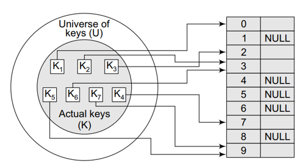

# $\fbox{Chapter 7: HASHING}$

### <u>Introduction</u>

- Hash table is same as hash map.
- Has unique key.
- Pairs are randomly distributed.

### <u>Usecase</u>

- Database
- Caching mechanism
- Compilers
- Sets/ dictionaries

### <u>Index-Key Relationship</u>

### <u>Hash Function</u>

- Are mathematical formulae used in hashing.
- **<u>Collision</u>:** Hash keys storing identical values.
- Good hash table causes less collision.
- Less collision is achieved by uniform pair distribution.
- **<u>Hash value</u>:** Unique numeric value identifying data.

### <u>Hash Function Methods</u>

#### Division method ($h(x) = x \% M$):

- Let's say we have to calculate the hash values of keys $1234$ & $5642$.
- We will set $M$ as $97$, though we can keep it anything else too.
- So let's calculate the hash value using $M$.

$$ h(x)\;=\;x\;mod\;M $$
$$ h(1234)\;=\;1234\;\%\;97\;=\;70 $$
$$ h(5642)\;=\;5642\;\%\;97\;=\;16 $$

#### Multiplication method:

- Let's say we are given a hash table of size $1000$.
- We have to map the key $12345$ to an appropriate location in the hash table.
- For now, we will use $A$ as $0.618033$, $m$ as $1000$ & $k$ as $12345$.

$$ h(k)\;=\;\lfloor\;m\;(kA\;mod\;1)\;\rfloor $$
$$ h(12345)\;=\;1000\;(12345\;\times\;0.1618033\;\%\;1) $$
$$ h(12345)\;=\;1000\;(7629.617385\;\%\;1) $$
$$ h(12345)\;=\;1000\;(0.617385) $$
$$ h(12345)\;=\;617.385 $$
$$ h(12345)\;=\;617 $$

>**<u>HISTORY</u>:**
>Value of $A$ is suggested by **Knuth**.

### <u>Other Hashing Techniques</u>

- MurmurHash (3 variants)
- CityHash
- Secure Hash Algorithm – 1
- Secure Hash Algorithm 256
- Cyclic Redundancy Check 32
- Universal Hashing
- Fowler Noll Vo

### <u>Properties of Good Hash Function</u>

- **<u>Low cost</u>:** Fast algorithm
- **<u>Determinism</u>:** Can determine based on conditions.
- **<u>Uniformity</u>:** Low collision
- **<u>Bucketed</u>:** Storing same keys in same bucket.

### <u>Terminologies</u>

- **<u>Probing</u>:** Techniques used in avoiding collisions by finding alternative slots.
- **<u>Hashing</u>:** Encryption of values into certain unique string or number.

### <u>Collision Handling Techniques</u>

- **<u>Chaining</u>:** Each bucket contains a linked-list containing pairs with same key value.
- **<u>Open addressing</u>:** Algorithm searches for available slot via probing.
- **<u>Robin hood hashing</u>:** Balances bucket lengths moving heavy to light ones.
- **<u>Cuckoo Hashing</u>:** Stores keys in one of the many possible locations.

### <u>Load Factor</u>

- Shows how much a hash table is filled.
- Ratio is $(Total\;key-value\;pairs):\;(Total\;buckets)$
- High load causes collisions & bad performance.
- Low load causes memory wastage.
- Hash-map sizes are reshaped when it reaches threshold.

### <u>Resizing Hash Tables</u>

- Hash-maps are resized as said before.
- Rearranges hashes into new buckets.
- Costly but effective.

### <u>Nature of Hash-Maps</u>

- Non-linear as linear functions have clear order/sequence.

### <u>Static & Dynamic Hashing</u>

#### Static hashing properties:

- Fixed size throughout life
- No auto-resizing
- Predictable

#### Dynamic hashing properties:

- Variable size
- Balanced load
- More efficient

---
