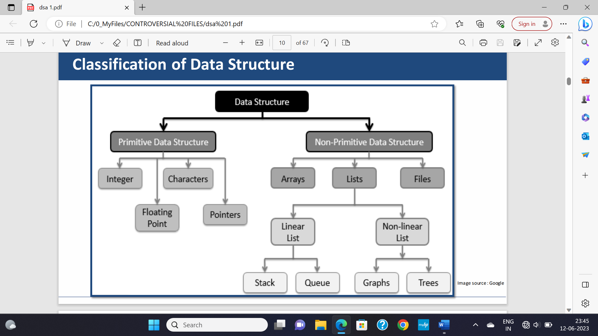
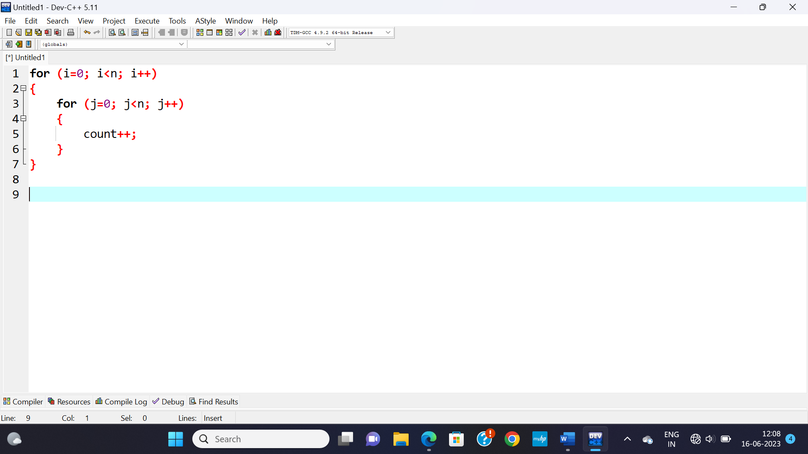
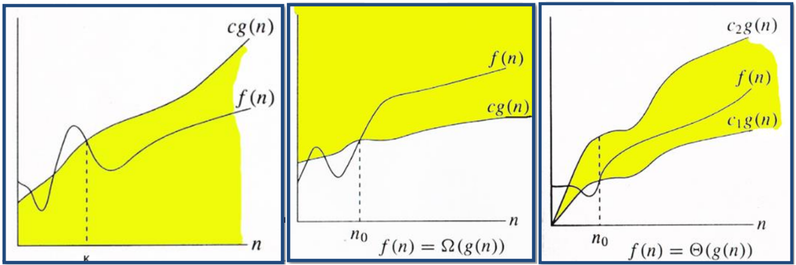

**HASHING**

**<u>Introduction</u>**

- Hash table = Hash map

- Has **unique** key.

- Pairs are **randomly** distributed.

**<u>Usecase</u>**

- Database

- Caching mechanism

- Compilers

- Sets/ dictionaries

**<u>Index-Key Relationship</u>**

**<u>Hash Function</u>**

- Are mathematical formulae used in hashing.

- **<u>Collision</u>:** Hash keys storing identical values.

- Good hash table = Less collision

- Less collision is achieved by **uniform** pair distribution.

- **<u>Hash value</u>:** Unique numeric value identifying data.

**<u>Hash Function Methods</u>**

- Division method **\[h(x) = x % M\]**:-

- **Multiplication method:-**

(Value of A is suggested by Knuth)

**<u>Other Hashing Techniques</u>**

- MurmurHash (3 variants)

- CityHash

- Secure Hash Algorithm – 1

- Secure Hash Algorithm 256

- Cyclic Redundancy Check 32

- Universal Hashing

- Fowler Noll Vo

**<u>Properties of Good Hash Function</u>**

- Low cost (fast algorithm)

- Determinism (can determine based on conditions)

- Uniformity (low collision)

- Bucketed (storing same keys in same bucket)

**<u>Terminologies</u>**

- **<u>Probing</u>:** Techniques used in avoiding collisions by finding
  alternative slots.

- **<u>Hashing</u>:** Encryption of values into certain unique string or
  number.

**<u>Collision Handling Techniques</u>**

- **<u>Chaining</u>:** Each bucket contains a linked-list containing
  pairs with same key value.

- **<u>Open addressing</u>:** Algorithm searches for available slot via
  **probing**.

- **<u>Robin hood hashing</u>:** Balances bucket lengths moving **heavy
  to light** ones.

- **<u>Cuckoo Hashing</u>:** Stores keys in one of the many possible
  locations.

**<u>Load Factor</u>**

- Shows how much a hash table is filled.

- Ratio of: **Total key-value pairs: Total buckets**

- High load = Collisions + Bad performance

- Low load = Memory wastage

- Hash-map sizes are reshaped when it reaches threshold.

**<u>Resizing Hash Tables</u>**

- Hash-maps are resized as said before.

- Rearranges hashes into new buckets.

- Costly but effective.

**<u>Nature of Hash-Maps</u>**

- Non-linear as linear functions have clear order/ sequence.

**<u>Static & Dynamic Hashing</u>**

- **Static hashing properties:-**

  - Fixed size throughout life

  - No auto-resizing

  - Predictable

- **Dynamic hashing properties:-**

  - Variable size

  - Balanced load

  - More efficient
