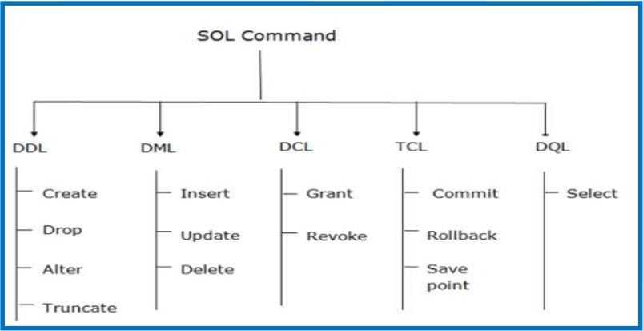

# $\fbox{Chapter 2: STRUCTURED QUERY LANGUAGE}$


## **Topic – 1: Introductory Concepts**

### <u>Introduction</u>

- <u>ANSI</u>: American National Standard Institutes
- <u>ISO</u>: International Organization for Standardization


### <u>SQL Commands</u>




## **Topic – 2: Data Definition Language**

### <u>Introduction</u>

- All changes are saved permanently.
- `VARCHAR2` is not any kind of keyword.
- `DROP` deletes both structure and records both.
- `ALTER` is used to modify existing/ or add new attribute.
- `TRUNCATE` deletes all rows, not the structure and frees space.


### <u>DDL Syntaxes</u>

```sql
DROP TABLE employee;
ALTER TABLE students ADD (ADDRESS VARCHAR(20));
ALTER TABLE students MODIFY (NAME VARCHAR(20));
TRUNCATE TABLE employee;
```


## **Topic – 3: Data Manipulation Language**

### <u>Introduction</u>

- Not auto-committed, thus can be rolled back.


### <u>DML Syntaxes</u>

```sql
UPDATE students SET id = 4, name = 'Gourav' WHERE roll_no = '1';
DELETE FROM book WHERE author = 'Gourav';
```


## **Topic – 4: Data Control Language**

### <u>DCL Syntaxes</u>

```sql
GRANT SELECT, UPDATE ON students TO user1,user2;
REVOKE SELECT, UPDATE ON students FROM user1,user2;
```


## **Topic – 5: Transaction Control Language**

### <u>Transaction Control Language</u>

- Used along DML commands only.
- Are auto-committed.
- Always use the word transaction while mentioning DCL commands.


### <u>TCL Syntaxes</u>

```sql
COMMIT;
ROLLBACK;
SAVEPOINT savepoint_name;
```


## **Topic – 6: Special Operations**

### <u>Logical Operators</u>

```sql
SELECT * FROM employee WHERE salary >= ALL(25000,60000);
SELECT * FROM students WHERE job = 'manager' AND salary > 70000;
SELECT name FROM customers UNION SELECT name FROM investors;
```


### <u>Like Queries</u>

```sql
SELECT * FROM people WHERE name LIKE 'G%';
SELECT * FROM people WHERE name LIKE '%v';
SELECT * FROM people WHERE name LIKE '_______%';
SELECT * FROM people WHERE name LIKE '__u%';
```


### <u>Aggregate Functions</u>

- Falls under DML category.

```sql
SELECT SUM(salary) FROM employee;
SELECT AVG(salary) FROM employee;
SELECT MAX(salary) FROM employee;
SELECT MIN(salary) FROM employee;
SELECT COUNT(salary) FROM employee;
SELECT COUNT(DISTINCT(salary)) FROM employee;
```


### <u>Renaming Temporary Column, Temporarily</u>

```sql
SELECT price * 1.5 AS “new_price” FROM product;
```


### <u>Join Queries</u>

```sql
SELECT students.s_name FROM students INNER JOIN interns ON
students.s_ID = interns.i_ID;
```


- Write keywords in commands accordingly.
- In SELF JOIN, take both tables as same table.

---
