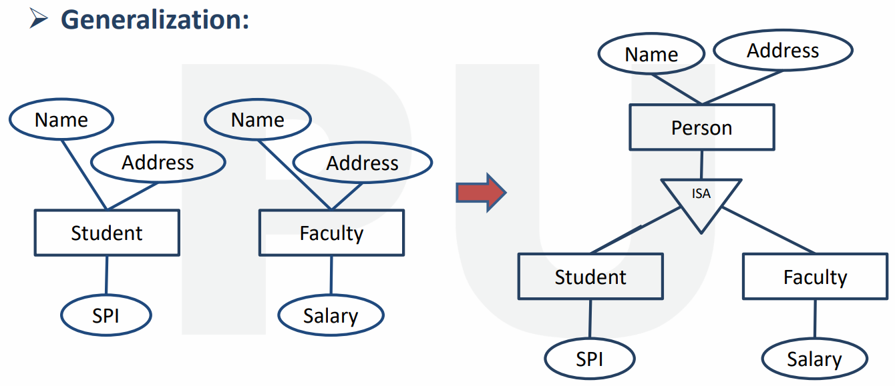
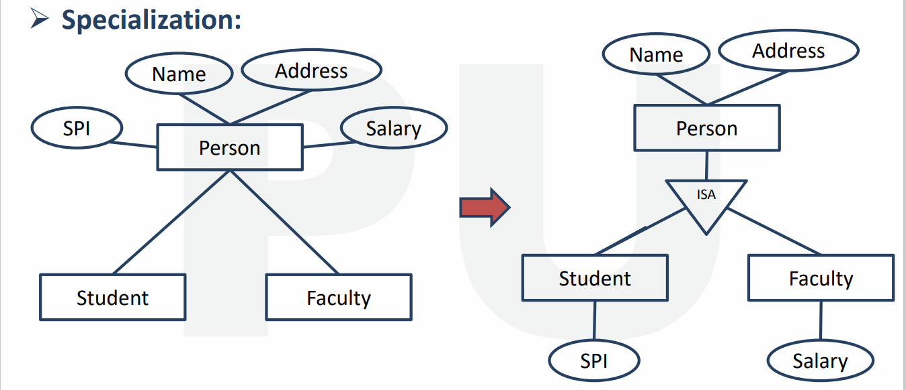
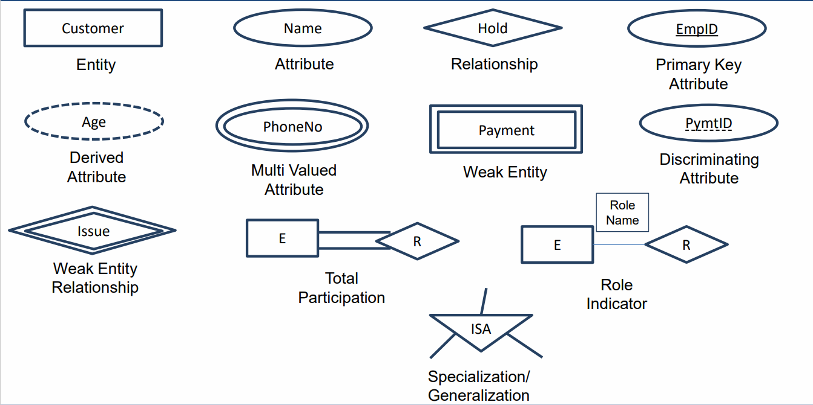

# $\fbox{Chapter 3: DATA MODELS}$

## **Topic - 1: Models**

### <u>Data Models</u>

- Represents logical structure of database.
- Are blueprints for DBMS abstraction.

### <u>DBMS Models</u>

- Entity relationship model (ER)
- Relational model
- Network model
- Object oriented model

### <u>ER Model</u>

- ER diagram is graphical representation of database.
- Creates – Entity set, relationship set, general attributes & constraints.

## **Topic - 2: Relationship Diagram**

### <u>Entity</u>

- Real world object/place/person.
- Represented by rectangle.

### <u>Attributes</u>

- Properties of an entity.
- Represented by oval.

### <u>Relationship</u>

- Represented by diamond.
- Is drawn between two entities.

## **Topic - 3: Types Of Attributes**

### <u>Introduction</u>

- Simple and composite
- Single-valued and multi-valued
- Stored attribute and derived attribute
- Complex attribute
- Key attribute

### <u>Simple & Composite Attributes</u>

- **<u>Simple</u>:** Can’t be divided into subparts.
- **<u>Composite</u>:** Can be divided into subparts.

### <u>Single & Multi-Valued Attributes</u>

- **<u>Single</u>:** Have single value.
- **<u>Multi</u>:** Represented by double oval.

### <u>Stored & Derived Attributes</u>

- **<u>Stored</u>:** Have to be entered manually.
- **<u>Derived</u>:** Can be calculated by pre-existing attributes, represented by dashed oval.

### <u>Complex Attributes</u>

- Derived by joining composite and multi-valued attribute.

### <u>Key Attribute</u>

- Attribute which is unique to each entity.

### <u>Descriptive Attributes</u>

- Attribute of a relation.

## **Topic - 4: Relationship Sets**

### <u>Recursive Relationship Set</u>

- An entity participating in multiple relations.

### <u>Degree Of Relationship Set</u>

- It is the number of entity sets in a relationship.
- **<u>Unary relationship</u>:** One entity relation like marriage & represented with two lines.
- **<u>Binary relationship</u>:** Two entity relationship
- **<u>N-ary/ternary relationship</u>:** Three ternary or more $N$-ary entity relation.

### <u>Cardinality Constraints</u>

- Also known as mapping constraints.
- Number of times an entity of another set participates in a relationship.
- Helps in defining binary relations.

#### Binary relationships mappings:

- **<u>One-to-one</u>:** An entity in $A$ is related to one entity in $B$.
- **<u>One-to-many</u>:** An entity in $A$ is related to multiple entities in $B$.
- **<u>Many-to-one</u>:** *\*Opposite of previous*
- **<u>Many-to-many</u>:** Cross connections

### <u>Weak Entity Set</u>

- Doesn’t have a primary key.
- Also called dependent entity.
- Represented by double rectangle.

### <u>Weak Entity Relationship</u>

- Involves at least one weak entity.
- Represented by double diamond.

### <u>Super Class & Sub Class</u>

- Other entities can be derived from superclass.

## **Topic - 5: Constraints & Features**

### <u>Generalization</u>

- Selects common attributes from two or more entities, and makes a separate entity out of it.
- Same triangle representation is involved as was in generalization.

### <u>Specialization</u>

- Splits an entity, and makes multiple entities.
- The newly created entities inherit some attributes of the entity that split.

### <u>Constraints On Generalization & Specialization</u>

#### Disjoint constraints:

- Disjoint constraint
- Non-disjoint constraint (overlapping)

#### Participation constraint:

- Total participation (mandatory)
- Partial participation (optional)

### <u>Disjoint Constraint</u>

- Entity of a superclass can belong to one subclass entity set.
- Represented by writing d or disjoint between superclass and ISA triangle.

### <u>Non-Disjoint Constraint</u>

- Same as previous, but could belong to multiple subclasses.

### <u>Total Participation</u>

- Every entity in entity set participates in at least one relationship.
- Every superclass entity must be a subclass member.
- Represented by double line.

## **Topic - 6: ER Diagrams**

### <u>Partial Participation</u>

- Some entities in entity set may not participate.
- Every superclass entity is not a subclass member.
- Represented by single line.

### <u>Aggregation</u>

- Abstraction of ER models.
- Defining an entity briefly in diagramming.

### <u>Models</u>

- Hierarchical (one to many)
- Network (many to many)

### <u>Relational Models</u>

- Two-dimensional tables.
- Stores common attributes.
- Column is also known as an attribute.
- **<u>Relational instance</u>:** Set of tuples.
- **<u>Attribute domain</u>:** Value constraint of attributes.

### <u>Object Oriented Model</u>

- Object properties are called attributes.
- Object behaviour are called methods.

### <u>Integrity Constraints</u>

- Makes sure that changes doesn’t affect the integrity of data.
- We discuss about keys in this.
- These are - `check`, `not null`, `unique`, `primary key`, `foreign key`.

#### Check:

- Applied on columns.
- For example, CGPA column (between `0` and `10` only)

#### Unique:

- Could be `null` but unique.

### <u>Keys</u>

#### Primary key:

- Unique + `not null`

#### Foreign key:

- Also called referential integrity.
- Must be null when initialized.
- Not unique in other table.

#### Super key:

- Identifies each tuple uniquely.
- Can be one or more.

#### Candidate key:

- Subset of super key.
- Doesn’t repeat attributes.
- Also called minimal super key.
- Every table has at least one candidate key.

#### Alternate key:

- Non-candidate key.

---
