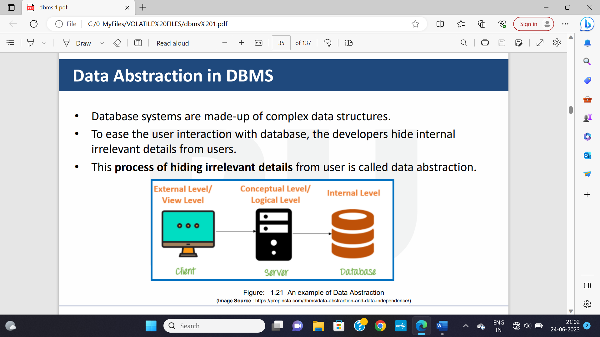

**<u>Chapter 4</u>: RELATIONAL DATA MODELS**

**Topic – 1: Relational Algebra Operations**

**<u>Basic Operations</u>**

- Selection

- Projection

- Cross product

- Rename

**<u>Joins</u>**

- Natural join

- Outer join

**<u>Set Operators</u>**

- Union

- Intersection

- Set Difference

**<u>Note</u>!**

**🡪 Aggregate functions is also a type of operation.**

**Topic – 2: Constraints**

**<u>Introduction</u>**

- Relational model says that database is collection of **relations**.

- Rows represent real world **entities**.

- Have nothing to do with **physical storage** of data.

- Table is also called ***relation***.

**<u>Terms</u>**

- **<u>Cardinality</u>:** Number of rows.

- **<u>Relation instance</u>:** Predefined tuples in RDBMS with no
  duplicates.

- **<u>Relation key</u>:** Attribute of a row.

- **<u>Attribute domain</u>:** Integrity constraint of an attribute.

**<u>Attribute Types</u>**

- There is never a **set** of attributes.

**All atomic members = Atomic domain**

- Null is member of each domain.

**<u>RDBMS Constraints</u>**

- Domain constraints

- Key constraints

- Referential integrity constrains

**<u>Domain Constraints</u>**

- Value of each tuple must be unique.

- **Key of the table** identifies a tuple uniquely.

- Key is helpful in finding unique row from the table.

- Foreign key is used to create relationship among tables.

**Topic – 3: Syntax**

**<u>Making An Existing Column NOT NULL</u>**

***ALTER TABLE Employee MODIFY Name VARCHAR(50) NOT NULL;***

**<u>Check Constraint</u>**

***CHECK (value not NULL);***

***CHECK (age\>=18)***

***ALTER TABLE Persons ADD CHECK (age\>=18);***

***ALTER TABLE Person DROP CHECK age;***

- **CHECK** is replaced by **CONSTRAINT** in SQL server/ Oracle/ MS
  Access.

**<u>Relational Algebra Operation</u>**

- Procedural query language.

- Relational algebra is theoretical only.

**<u>Relational Algebra Operations From Set Theory</u>**

• DIFFERENCE ( **-** )

• CARTESIAN PRODUCT ( **x** )

**<u>Binary Relational Operations</u>**

• JOIN

• DIVISION

**<u>Facts</u>**

- **pi** eliminates attribute values.

**Cross product = Student x Employee**

**<u>Examples</u>**

***σsubject = "database"(Books)***

***σsubject = "database" and price = "450"(Books)***

***σsubject = "database" and price = "450" or year \> "2010"(Books)***

***ρ\<New_Relation_Name\> (Existing_Relation_name)***

***select distinct T.name***

***from instructor as T, instructor as S***

***where T.salary \> S.salary and S.dept_name = ‘Comp. Sci.’***

- Keyword **as** can be omitted.

**Topic – 4: Types Of Joins**

**<u>Inner joins</u>**

- Theta join

- EQUI join

- Natural join (joining column)

**<u>Outer joins</u>**

- Left outer join

- Right outer join

- Full outer join

**Topic – 5: Set Operators**

- In union (U), duplicate tuples are removed.

- **Aggregate functions –** avg, min, max, sum, count

- For only **null** values, output returns 0.
