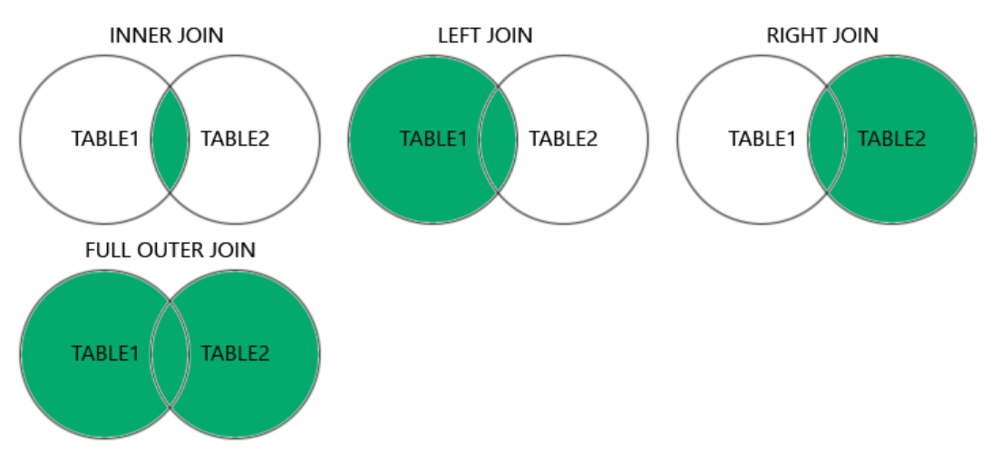

**<u>Chapter 5</u>: RELATIONAL DATABASE DESIGN**

**<u>Domain And Data Dependency</u>**

- **<u>Domain</u>:** Unique set of values (like string can have string
  values).

- **<u>Dependencies</u>:** Relation between 2 or more attributes.

- **<u>Prime attribute</u>:** Dependent on candidate key.

- **<u>Non-prime attribute</u>:** \*now you know\*

- **<u>Super key</u>:** Group of keys identifying rows in table.

**<u>Types Of Dependencies</u>**

- Functional dependency

- Transitive dependency: **If A -\> B, B -\> C then indirectly A -\>
  C.**

- Partial dependency

**<u>Functional Dependency</u>**

- Set of constraints between two attributes.

- Let X and Y be **subsets** of attributes.

- For a tuple, if values of attributes under X determine value of
  attributes under Y in some way.

- Then Y is functionally dependent on X, or X functionally determines Y.

- **X -\> Y** (X at left is determinant, Y on right is dependent).

- For each **Sid**, there exists a unique **Sname** (**many to one**
  relation).

**<u>Normalization</u>**

- Systematic decomposition of tables.

- Process of reducing redundancy of data.

- Improves data integrity.

**<u>Advantages of Normalization</u>**

- Eliminates duplicate data.

- Makes transaction faster.

**<u>Different Anomalies</u>**

- **<u>Anomalies</u>:** Problem that raises during certain operation.

- **Types of anomalies:-**

  - Data anomaly

  - Updation anomaly

  - Deletion anomaly

**<u>Types of Normal Form</u>**

- 1st normal form (1NF)

- 2nd normal form (2NF)

- 3rd normal form (3NF)

- Boyce Codd normal form (BCNF)

**<u>1st Normal Form</u>**

- Removes **composite** and **multi-valued** attribute cells.

- Creates separate table for related data.

- Identifies separate data by **primary keys**.

**<u>2nd Normal Form</u>**

- It has to be in 1st normal form.

- Table **can’t** contain **partial dependency**.

- To solve this, table is split.

**<u>2NF Example</u>**

- Here, **“Office Location”** is partially dependent on **“Employee
  ID”**.

**<u>3rd Normal Form</u>**

- Must be in 2nd normal form.

- **No** transitive dependency for **non-prime** attributes.

**<u>3NF Example</u>**

- Here, **Student Id -\> Subject Id** and **Subject Id -\> Subject**.

**<u>Boyce Codd Normal Form</u>**

- Must be in 3rd normal form.

- For every functional dependency, **non-dependent** attribute **must be
  super key** of the table.

- For example, if **A -\> B** then **A** must be super key of the table.

- To solve it, a new column is created which is attached to each split
  part of the given table.
