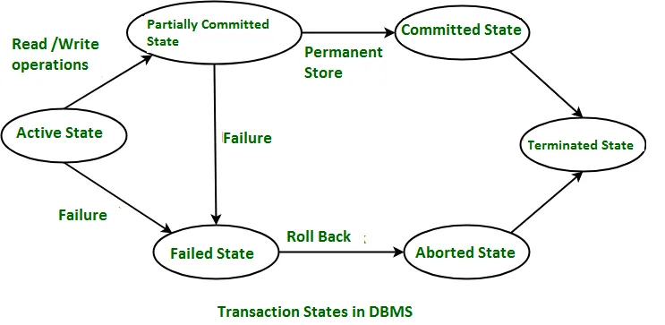
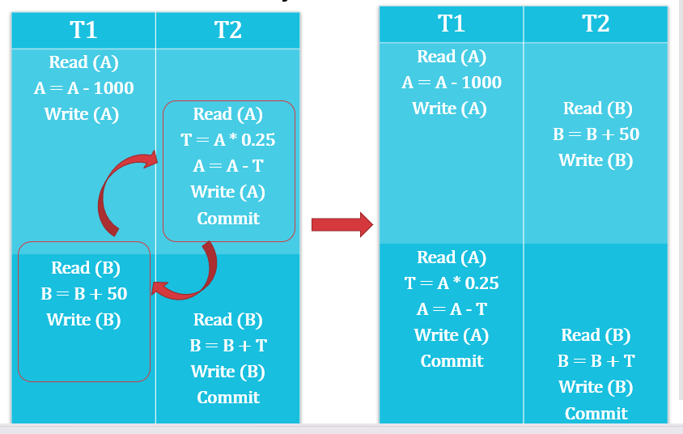
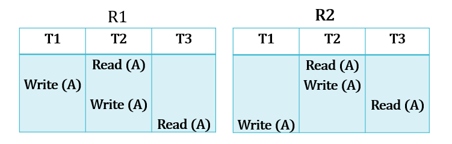
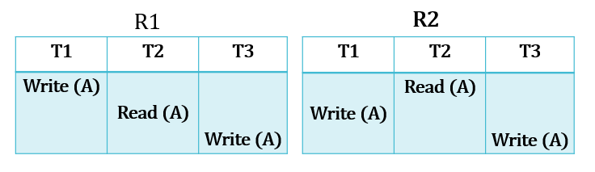
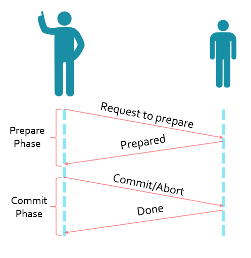
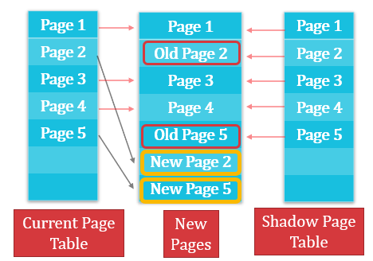
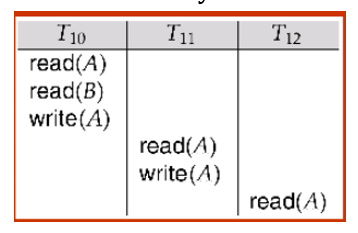
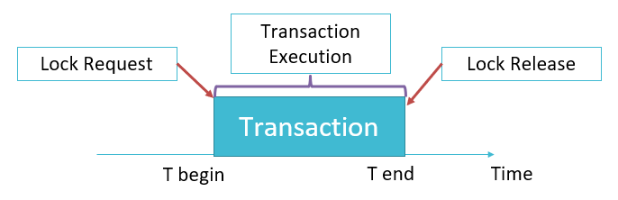
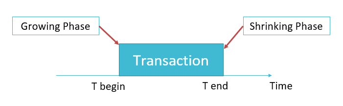
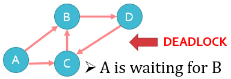

# $\fbox{Chapter 6: TRANSACTION}$

## **Topic - 1: Transaction**

### <u>Transaction</u>

- In simple terms, anything under execution can be known as transaction.
- Note how the definition matches to that of a process.
- In broader terms, transaction is a group of SQL statements that are executed in sequence.

### <u>ACID Properties of Transaction</u>

- Atomicity
- <u>Consistency</u>: The database works stable & is not negatively affected by transactions.
- <u>Isolation</u>: One transaction doesn’t affect another running transaction.
- <u>Durability</u>: The affects of transactions must be saved to the database.

#### Atomicity:

- For example, consider a transaction from account $A$ to account $B$.
- Account $A$ sends $\$100$ to account $B$, which results in $\$100$ being deducted from $A$.
- But some error occurred & account B didn’t received money.
- So, $\$100$ is added back to account $A$.

#### Consistency:

- The variables involved during transaction must be updated.
- Database must have maintained consistency after & before each transaction.
- Maintaining consistency means being in stable state.
- It must show the effect of transaction in all the involved accounts.
- For example, the sender’s balance after deduction & receiver’s balance after addition must be updated.

#### Isolation:

- Transactions have no information about other transactions running with them.
- Suppose many transactions named A, B, C & D are running parallelly.
- None of them have information about any other while they are transacting.
- But C got committed after completing its transaction, then A, B & D are updated with this information only during their transaction.

#### Durability:

- Changes made to database after a transaction must be saved.
- Changes must remain saved even if the system fails (reliability).

### <u>Transaction State Diagram/ Life Cycle</u>

- We can’t rollback after a transaction is committed.

### <u>Transactional Operations</u>

#### Read (X):

- Used for accessing the requested data.
- The requested data is first accessed & then loaded into the main memory before being shown to the user.
#### Write (X):

- Used for modifying the data.

### <u>Transaction Scheduling</u>

- Operations of a transaction are grouped & ordered.
- <u>Schedule</u>: A sequence in which a group of operations are to be executed.
- They are sequenced because they can affect each other otherwise.
- For example, updating & then reading a data, or reading & then updating a data.
- The sequence of what to do first among the two is programmed as per the requirements.

### <u>Types of Transaction Scheduling</u>

- Serial schedule
- Interleaved schedule
- Serializable schedule

#### Serial schedule:

- Transactions are executed serially.
- A transaction can’t start until its previous transaction is active & hasn’t committed.

#### Interleaved schedule:

- Active transactions can be interrupted by other transaction.

### <u>Serializability</u>

- Transactions are executed concurrently/parallelly.
- But they maintain the consistency of database.

### <u>Types of Serializability</u>

- Conflict serializability
- View serializability

#### Conflict serializability:

- An operation each from two different transaction are executing.
- Let’s call these operations as o1 and o2 respectively.

$$ o1=read(T),\;o2=read(T)\;\implies\;o2\;and\;o2\;don't\;conflict $$
$$ o1=read(T),\;o2=write(T)\;\implies\;o2\;and\;o2\;conflict $$
$$ o1=write(T),\;o2=read(T)\;\implies\;o2\;and\;o2\;conflict $$
$$ o1=write(T),\;o2=write(T)\;\implies\;o2\;and\;o2\;conflict $$

- So, a conflict exists only when at least one of the multiple operations is write.
- But if they are working on separate data, then it is not conflicting.
- If two non-conflicting group of operations can be swapped & that makes it serially scheduled, then we call it conflict serializability.

#### View serializability:

- Let there be two schedules with same set of transactions.
- They are called view serialized when they satisfying some conditions.

#### Conditions:

- Initial read
- Updated read
- Final write

>**<u>NOTE</u>:**
>These operations are done on same data variable.

#### Initial read:

$$ R1\;\implies\;T1:Read(T),\;T2:Write(T) $$
$$ R2\;\implies\;T1:Write(T),\;T2:Read(T) $$
$$ R3\;\implies\;T1:Read(T),\;T2:Read(T) $$

- <u>View equivalent</u>: Following view serializability protocols.
- $R1$ and $R2$ are not view equivalent because in $R1$, $T1$ is reading initially & in $R2$, $T2$ starts reading initially.
- But $R1$ and $R3$ are view equivalent because in $T1$ reads in both initially & at ending.

##### Updated read:

- In a schedule $R1$, if a transaction let’s say $T1$ reads a data $X$ most recently updated by another transaction $T2$.
- And in $R1$, if transaction $T1$ reads the same data $D$ again most recently produced by transaction $T2$, then schedule $R1$ & $R2$ are view equivalent.

- For example, see above how in schedule $R1$, $T3$ reads $A$ which was most recently updated by $T2$.
- And the same is happening in schedule $R2$.

#### Final write:

- In a schedule $R1$, if transaction let’s say $T1$ performs the final write operation on data $X$.
- And in schedule $R2$, if same transaction $T1$ performs the final write operation on same data $X$, then schedule $R1$ & $R2$ are view equivalent.

- In the example above, $R1$ and $R2$ are view equivalent.

### <u>Two Phase Commit Protocol (TPCP)</u>

- **TPCP** ensures that all nodes, each having a database are synchronized together.
- And thus, the data are updated altogether being synced.
- In TPCP, there is a coordinator/ controlling node & rest are known as **cohorts/ participants/ slaves**.
- Coordinator sends request to commit a transaction.
- Cohorts tell if transaction must be committed or not & acknowledge commits.
- Here, 2 phases are involved.

#### Involved phases:

  - Prepare phase (preparation for commit)
  - Commit or abort phase

#### Prepare phase:

- After each cohort is done with their transactions, each of them sends a `DONE` message to the coordinator.
- After receiving it from each of them, coordinator sends a `PREPARE` message to each cohort.
- This `PREPARE` message means `"prepare to commit"`.
- If a cohort wants to commit, it sends a `READY` message.
- Else, it sends a `NOT READY` message.

#### Commit phase:

- After the coordinator receives commit message from all cohorts, coordinator sends a `GLOBAL COMMIT` message to all the cohorts.
- Then the cohorts commit the transaction & send `COMMIT ACK` message back to the coordinator.
- If the coordinator has received `COMMIT ACK` message from each cohort, then the transaction can be said to be completed.
- When the coordinator receives `NOT READY` message from even a single cohort, then it sends `GLOBAL ABORT` message to all the cohorts.
- Then the cohorts abort the transaction & send `ABORT ACK` message back to the coordinator.
- If the coordinator has received `ABORT ACK` message from each cohort, then the transaction can be said to be aborted.

### <u>Database Recovery</u>

- In some situations, a transaction might not commit or abort successfully.
- These situations include - Disk failure, DBMS crash, OS crash, power failure.
- It leads to data inconsistency (data loss) as when partial SQL script is executed, all the changes are not saved.

### <u>Log Based Recovery</u>

- **<u>Log</u>:** Record of all the activities or operations performed on the database.

#### Contents in log:

- Start of transaction
- Transaction ID
- Record ID
- Type of operation (insert, update & delete etc)
- Old value
- New value
- Transaction status (committed/aborted)

#### Example:

$$ T1\;transaction\;starts\;=\;<T1\;Start> $$
$$ Write\;operation\;by\;T1\;=\;<T1,\;X,\;D1,\;D2> $$
$$ X\;=\;Variable\;name $$
$$ D1\;=\;X’s\;value\;before\;transaction $$
$$ D2\;=X’s\;value\;after\;transaction $$

### <u>Types of Log-Based Recovery</u>

- Immediate database modification
- Deferred database modification

#### Immediate database modification:

- Auto committed, so done without the commit command.
- In case the transaction fails, the transaction is restarted.

#### Deferred database modification:

- Commit command must be written explicitly.

### <u>Checkpoints</u>

- In checkpoint-based systems, you know what happens very well.
- And it has nothing to do with commit command.

### <u>Shadow Paging</u>

- Another database recovery method.
- Used in case of serial transactions only.
- There are two page-tables in this system.
- They are called current page table (CPT) & shadow page table (SPT).
- Database is divided into various fragments/pages.
- CPT contains the current fragment/page of database.
- Whereas SPT contains all fragments of database.
- Basically, CPT is the one user makes changes on & SPT just points all of them.
- When a change is made on a fragment/page, a new copy with changes is created.
- And the CPT points to new copies & SPT continues pointing old pages.
- Thus, in case of recovery, the old pages can be recovered via SPT.

### <u>Cascading Rollback</u>

- It’s a rollback performed when a transaction fails.
- This causes other transactions to rollback too which are related to the rolled transaction.

#### For example:

- Notice how $T^{11}$ & $T^{12}$ are dependent on $T^{10}$.
- **<u>Cascadeless schedule</u>:** A schedule in which a transaction isn’t allowed to make operation on data which was used in another transaction but not committed.

### <u>Concurrency Control</u>

- Required in multi-user system.
- Manages simultaneous operations on same data by different transactions.
- When multiple transactions make operation on same data, then concurrency control decides which transaction’s operation will be accepted (mutual exclusion).
- This conflict is either read-write or write-write.

### <u>Lock Based Protocols</u>

- <u>Locking protocol</u>: Protocol followed by all transactions while locking & releasing locks on themselves.
- <u>Lock</u>: A variable used to provide concurrent access to transactions on a data item.
- These are of two types – `Exclusive(X)` mode & `Shared(X)` mode
- <u>Exclusive (X) mode</u>: Data item can be both read & written but by only one transaction at a time.
- Uses `lock-X` instruction.
- <u>Shared (S) mode</u>: Data item can only be read but by multiple transactions simultaneously.
- Uses `lock-S` instruction.
- In a system of transactions where all hold a lock, all can have a shared lock.
- But if even a single of them have an exclusive lock, no other transaction can have any lock on it.
- If a transaction is not being granted lock, then it waits until locks that are blocking its access release themselves.

$$ T2:\;lock-S(A); $$
$$ read(A); $$
$$ unlock(A); $$
$$ lock-S(B) $$
$$ read(B); $$
$$ unlock(B); $$
$$ display(A+B) $$

- Before execution, two separate lists are created.
- $L^{1}$ containing data items & list $L^{2}$ containing types of locks.
- Then during the transaction, as per the codes; one-to-many relations are made between $L^{1}$ and $L^{2}$.
- Once its first lock gets released, then no other lock is granted until all of the remaining locks are released.

### <u>Two Phase Lock Protocol</u>

- <u>Growing phase</u>: Transactions can acquire lock, but can’t release them.
- <u>Shrinking phase</u>: Transactions can release lock, but can’t acquire them.
- This protocol ensures that locks are serially acquired & released.
- <u>Lock point</u>: A point where a lock was made.

- During growing phase, when a transaction with `lock-S` tries acquiring `lock-X`, then `lock-S` is converted into `lock-X`.
- And during shrinking phase, when a transaction with `lock-X` releases the lock, then `lock-X` is converted back to `lock-S`.

#### Strict two phase locking protocol:

- Exclusive locks can’t be released until committed or aborted.
- Other transactions can only acquire shared lock on common data item.

#### Rigorous two phase locking protocol:

- Neither exclusive nor shared locks can be released until committed or aborted.
- Other transactions can’t acquire even a shared lock on common data item.

#### Drawbacks of two phase lock based protocol:

- Programming error can cause a deadlock.
- And deadlock causes starvation.

### <u>Intention Locking</u>

*\*In reference to tree shaped database*

- <u>Intention-shared (IS)</u>: Shared locking around root node of the tree.
- Intension-exclusive (IX)
- <u>Shared and intention-exclusive (SIX)</u>: Mixed

### <u>Multiple Granularity</u>

- A concept in concurrency control.
- Data items are represented in form of tree.
- When a parent is locked, its children are automatically locked too.
- To get lock on a child, none of its parent node must be locked.

#### Lock implementation:

- <u>Lock manager</u>: Manages lock requests.
- It responds saying either `LOCK GRANTED` or `WAIT`.
- Lock manager stores all the records of locks (granted & to be granted) in a lock table.
- This record is in the form of a queue.

#### Time stamp-based protocol:

- Each transaction is issued a timestamp when they enter a system.
- For example, timestamp for T1 will be $TS(T1)$.
- Older timestamps are given priority for being executed.
- <u>W-timestamp(Q)</u>: Largest write timestamp out of all transactions.
- <u>R-timestamp(Q)</u>: Largest read timestamp out of all transactions.

#### Suppose $Read(Q)$ by $T1$:

- If $TS(T1) \leq W\text{-}timestamp(Q)$, then read operation is rejected because write operation is active.
- If $TS(T1) \geq W\text{-}timestamp(Q)$, then read operation is granted because write operation is done executing.
- If $TS(T1) \leq R\text{-}timestamp(Q)$, then write operation is rejected because read operation is active.
- If $TS(T1) \geq R\text{-}timestamp(Q)$, then write operation is granted because read operation is done executing.

### <u>Deadlock</u>

- A solution to deadlock is to roll back transaction when resource is not available & come back later to check the availability of the resource.

#### Deadlock conditions:

- <u>Mutual exclusion</u>: One process/transaction accesses a resource at a time.
- <u>Hold and wait</u>: A transaction holds one resource & waits of other resources which are held by other processes.
- <u>Non-preemption</u>: No process to pre-empt a process stuck in a deadlock.
- <u>Circular wait</u>: A deadlock in which all transactions are circularly waiting for each other.
- For example, in ${T1,\;T2,\;T3}$, $T1$ waits for $T2$, $T2$ waits for $T3$ & $T3$ waits for $T1$.

#### Deadlock detection:

- It can be done using wait-for graph.

- Directed edge, for example from $A$ to $B$ means that $A$ is waiting for a resource held by $B$.
- Any cyclic pattern observed means a deadlock is formed (refer to figures above).

#### Deadlock recovery:

- As discussed earlier, a simple way to recover from deadlock is by rolling back.
- **<u>Victim</u>:** Transaction which incurs minimum loss & thus rolled back.

#### 3 roll back conditions:

- Transaction has minimum locks.
- Transaction has executed very less amount of work.
- Transaction won’t be completing sooner.

### <u>Deadlock Prevention</u>

#### Wait-die approach:

- An older transaction waits for the younger transaction to release the resource.
- But if younger transaction waits for an older transaction to release the resource, then the younger transaction is rolled back.

#### Wound-wait approach:

- An older transaction forces the younger transaction to release the resource.
- But the younger transaction waits for the older transaction to release the resource.

#### Timeout-based approach:

- A transaction is given the resource only for a fixed duration of time.
- After the time expires, it is rolled back.

---
