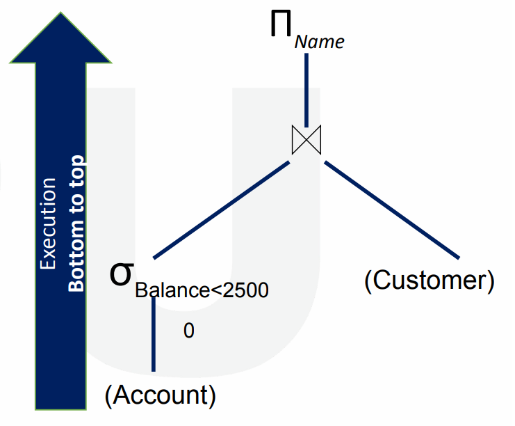

# $\fbox{Chapter 7: QUERY PROCESSING \& OPTIMIZATION}$

## **Topic - 1: Query Processing**

### <u>Query Processing</u>

- Conversion of high-level queries into low-level machine instructions.

### <u>Steps in Query Processing (Summary)</u>

- Parsing & translation
- Optimization
- Evaluation

### <u>Steps in Query Processing (Brief)</u>

#### Parsing and translation:

- SQL is human readable, while relational algebra is machine readable.
- So, we first convert SQL statements to relational algebra.
- It involves use of parser and translator.

#### Optimization:

- Uses a program called optimizer.
- Optimizer selects the best way to evaluate a given query.
- **<u>Query evaluation plan</u>:** Query tree & algorithm combined.

#### Evaluation engine:

- Evaluates all query plans & selects the best one from it.
- Then performs its operation on the database.
- And fetches/stores requested data from database.

### <u>Measures of Query Cost</u>

- **<u>Query cost</u>:** Total time taken to execute & fetch/store data from database.

#### Factors affecting:

- Communication cost (bandwidth/electricity)
- CPU cycles (clock cycles)
- Disk access (covers most of total time taken)
- Disk access cost (number of bytes read/written)

>**<u>NOTE</u>:**
>Cost of writing is more than reading.

  
### <u>Selection Operation</u>

- **<u>File scan</u>:** The search algorithm used to find & fetch a data.
- Symbol for selection operator is $\sigma$.

#### Example:

$$ \sigma^{condition}(relation) $$

- Searching algorithms used in selection operations are linear search & binary search.

#### Linear search:

- **<u>Key attributes</u>:** Primary attributes with only single instance in record.
- For key attributes, the search can stop immediately if the record is found.
- This costs $\frac{B^{R}}{2}$ in best case ($B^{R}$ is the number of blocks).
- Otherwise, for non-key attributes the linear search keeps running with average case.

#### Binary search:

- Relations are ordered as per their attributes.
- This costs $\log^{2}(B^{R})$ on average case.

### <u>Evaluation of Expressions</u>

- Query & expression are the same thing.
- Methods to evaluate multiple operations in expression - Materialization & pipelining.

### <u>Materialization</u>

- Starts from the bottom of the expression & does operations one-by-one.
- Small parts of the equation are solved & stored before moving to bigger part.

$$ \text{Materialization cost = Cost of individual eq}^{n} + \text{Cost of writing each small part of that eq}^{n} $$

#### Disadvantages:

- High cost in general.
- Creates too many relations for intermediate results (small parts of the $eq^{n}$).

### <u>Pipelining</u>

- An output of an operation is used as an input in another operation.
- Thus, it reduces the number of temporary relations.
- And that results in reduction in total cost.

#### Ways to execute pipelining:

- Demand driven
- Producer driven

#### Demand driven:

- Also known as lazy driven.
- Requests for tuple/queue at top with final inputs of pipeline.

#### Producer driven:

- Also known as eager driven.
- Operations produce tuple/queue without waiting for requests.

### <u>Query Optimization</u>

- A better optimization plan has lower cost.

#### Optimization approaches:

- Cost-based approaches
- Heuristic-based approaches

#### Cost-based optimization:

- This approach lists all possible plans & chooses the one with least cost.
- Also known as exhaustive search optimization.

#### Heuristic-based optimization:

- Comparatively less expensive method.

#### Three heuristic rules:

1. Make early selection to reduce the number of tuples/queues.
2. Make early projection to reduce the number of attributes.
3. Make smallest operations first.

  
### <u>Transformation of Relational Expression</u>

- Two relational algebra expressions are equal if they produce same set of tuples.

 
### <u>Cost Based Optimization Approach</u>

- We call a plan optimal if it answers fast or occupies low space.
- The cost of an algorithm also depends on cardinality of the input.
- **<u>Query tree</u>:** A tree data structure containing all operation which when linked, perform the query the ordered way.
- Cardinality is important because it provides the output as input in pipelining.

#### Dependencies of cost-based optimization:

- **<u>Cardinality</u>:** Number of rows returned as per the chosen optimal plan.
- **<u>Selectivity</u>:** Number of rows selected as per the given condition.
- Cost

#### Cost components of query execution:

- Secondary memory access cost
- **<u>Memory usage cost</u>:** Number of memory buffers used.
- **<u>Storage cost</u>:** Files/data produced when producing final results (intermediate results).
- Computational cost
- **<u>Communication cost</u>:** Communicating results across system & transfer on internet etc.

---
