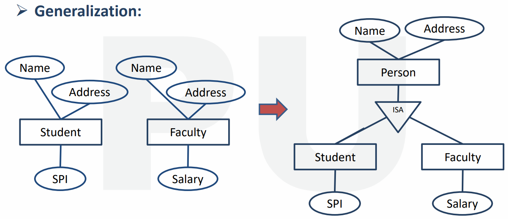

**<u>Chapter 10</u>: BASICS OF TRANSACTION PROCESSING**

**<u>Transaction</u>**

- Set of instructions and operations.

- It accesses and updates certain data.

- Similar to functions.

- Written in DML or high-level language.

**<u>ACID Properties</u>**

- **Atomicity**

- **<u>Consistency</u>:** No parallel/concurrent executions + maintain
  of data integrity.

- **<u>Isolation</u>:** Multiple transactions done in series, not
  parallel.

- **<u>Durability</u>:** Changes are saves even if system fails.

**<u>Atomicity Example</u>**

**<u>Consistency Example</u>**

**<u>Isolation Example</u>**

- Can be called as atomicity of each individual statement.

**<u>Durability</u>**

***\*Same example as the isolation example\****

**<u>Transaction State</u>**

- **Aborted**

- **Rolled back**

- **Committed**

- **<u>Compensating transaction</u>:** Undo committed transactions.

**<u>Transaction State Diagram</u>**

**<u>Transaction State In Brief</u>**

***\*All states shown in diagram above\****

**<u>Transaction Log</u>**

- Keeps record of all past transactions.

- **These records include:**

  - Type of operations done.

  - Data affected by it.

  - Before and after values of data.

  - Commit points of transaction.

- **<u>Advantage</u>:** Ability to search for corrupt point in data.

- **<u>Disadvantage</u>:** Load and storage of too much information.
