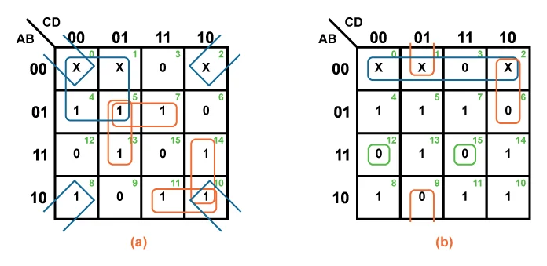

# $\fbox{Mocule 2: COMBINATIONAL LOGIC}$

>**Purpose**
>Understand combinational circuits as **pure input → output mappings**, with **no memory and no time**.

---

## 1. What “Combinational” Means

- Output depends **only on current inputs**
- No storage, no feedback, no history

#### Formally:

$$ Y = f(X_1, X_2, ..., X_n) $$

> Same inputs → same output, always.

---

## 2. Mapping View (Core Idea)

A combinational circuit is a **mapping**:

$$ {0,1}^n \rightarrow {0,1}^m $$

- Input space → output space
- Circuit **implements a function**, nothing more

---

## 3. Truth Tables = Complete Specification

- Truth table lists **every possible input state**
- Output column defines the mapping

This is the **ground truth**.  
Everything else (expressions, gates) is derived from it.

---

## 4. Boolean Expressions = Compressed Mappings

- Boolean expressions are **compressed representations** of truth tables
- Multiple expressions can represent the **same mapping**

#### Important:

> Different-looking logic can implement the **same function**.

---

## 5. Canonical Forms (Why They Exist)

### SOP (Sum of Products)

- OR of AND terms
- Directly built from truth table rows with output = 1

### POS (Product of Sums)

- AND of OR terms
- Built from rows with output = 0

#### Canonical forms guarantee:

- No ambiguity
- Always implementable

---

## 6. Minimization (Not Algebra — Geometry)

- Logic minimization removes **redundant constraints**
- Goal: same mapping, fewer resources

K-maps are **visual compression tools**, not math tricks.

---

## 7. Don’t Care Conditions

- Some input combinations **never occur**
- Marked as X (don’t care)
- Used to **simplify logic**, not define behavior

#### Key rule:

> Don’t cares help optimization, never correctness.

---

## 8. Hardware Reality

- Gates enforce the mapping physically
- Propagation delay exists, but **does not affect logic correctness**
- Combinational logic has **no notion of time**

---

## Mental Model (Use This)

> **Combinational logic is a lookup table burned into hardware.**

If you can define the mapping, the circuit already exists conceptually.

---

## Module 2 End

**Invariant learned:** Combinational circuits implement **pure functions**, independent of time or history.