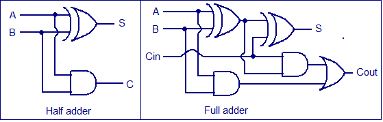
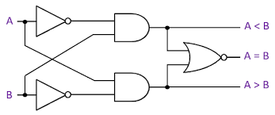

# $\fbox{Module 3: ARITHMETIC LOGIC}$

>**Purpose**
>Understand arithmetic circuits as **constraint-preserving machines**, not number crunchers.

---

## 1. What Arithmetic Logic Really Is

- Arithmetic circuits operate on **bit patterns**, not numbers
- Meaning (signed/unsigned) is an **interpretation layer**

> Hardware moves bits; humans assign meaning.

---

## 2. Binary Addition (Core Primitive)

- Addition is **bit-wise constraint propagation**

#### Each bit position enforces:

- Sum constraint
- Carry constraint

#### Half adder:

- Inputs: A, B
- Outputs: Sum, Carry

#### Full adder:

- Inputs: A, B, Cin
- Outputs: Sum, Cout

---

## 3. Ripple Carry Adder

- Full adders chained
- Carry **propagates sequentially**

#### Key invariant:

> Correctness is independent of speed; delay only affects timing.

---

## 4. Overflow (Not an Error)

### Unsigned overflow

- Carry out of MSB is discarded
- Wrap-around is **expected behavior**

### Signed overflow

- Occurs when sign invariant is violated

#### Rule:

> Overflow means **representation limit exceeded**, not arithmetic failure.

---

## 5. Subtraction via Addition

- Subtraction implemented using **2’s complement**

$$ A - B = A + (\overline{B} + 1) $$

#### Why it works:

- Single adder does both operations
- No separate subtraction hardware

---

## 6. Comparators

- Comparison is **bit-priority resolution**
- MSB decides first

#### Outputs:

- A > B
- A = B
- A < B

---

## 7. Arithmetic Logic Unit (ALU)

- ALU = shared arithmetic hardware + control signals

#### Same adder reused for:

- Add    
- Subtract
- Increment    
- Compare

#### Key idea:

> Control selects **interpretation**, not structure.

---

## Mental Model (Use This)

> **Arithmetic circuits enforce bit-level invariants; numbers are a story layered on top.**

Once constraints are right, arithmetic is automatic.

---

## Module 3 End

**Invariant learned:** Arithmetic hardware preserves **bit constraints**, not numerical meaning.