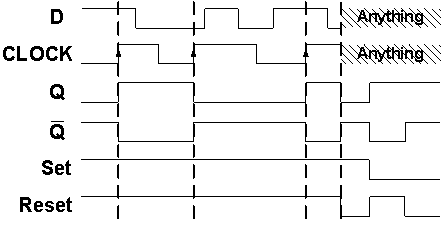
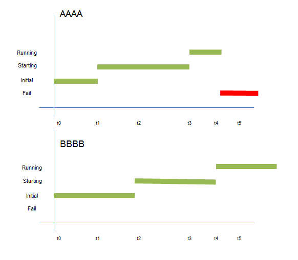

# $\fbox{Module 4: SEQUENTIAL LOGIC}$

>**Purpose**
>Understand sequential logic as **state + transition**, where output depends on **history**, not just inputs.

---

## 1. What Changes from Combinational Logic

- Output depends on **current input + past state**
- Circuit has **memory**

#### Formally:

$$\text{Next State} = f(\text{Current State}, \text{Input})$$
$$ \text{Output} = g(\text{State}, \text{Input}) $$

---

## 2. The Idea of State (Core Concept)

- **State** = information preserved across time
- Stored physically using **feedback**

> Memory exists because feedback exists.

---

## 3. Latches (Level-Sensitive Memory)

- Output follows input **while enable is active**
- When enable is removed, value is **held**

#### Used when:

- Timing is informal
- Speed matters more than precision

---

## 4. Flip-Flops (Edge-Triggered Memory)

- State changes only on **clock edge**
- Eliminates ambiguity of continuous enable

#### Common types:

- D flip-flop
- JK flip-flop
- T flip-flop

---

## 5. Clock (Why Time Becomes Discrete)

- Clock divides time into **decision points**
- State updates happen only at clock edges

#### Key rule:

> Between clocks, state must remain stable.

---

## 6. State Transition

#### Each clock edge:

- Old state is discarded
- New state is latched

No gradual change — **state jumps**.

---

## 7. Why Sequential Logic Is Harder

- Timing matters
- Feedback exists
- Incorrect timing causes **invalid states**

This is where most real failures occur.

---

## Mental Model (Use This)

> **Sequential circuits are machines that remember and update rules at fixed moments in time.**

Memory is not magic — it is controlled feedback.

---

## Module 4 End

**Invariant learned:** State changes only at **defined time boundaries**, never continuously.