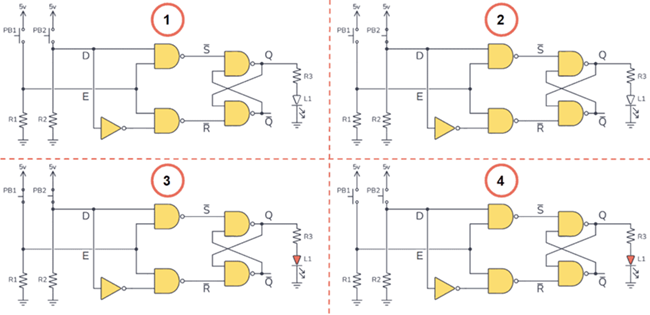
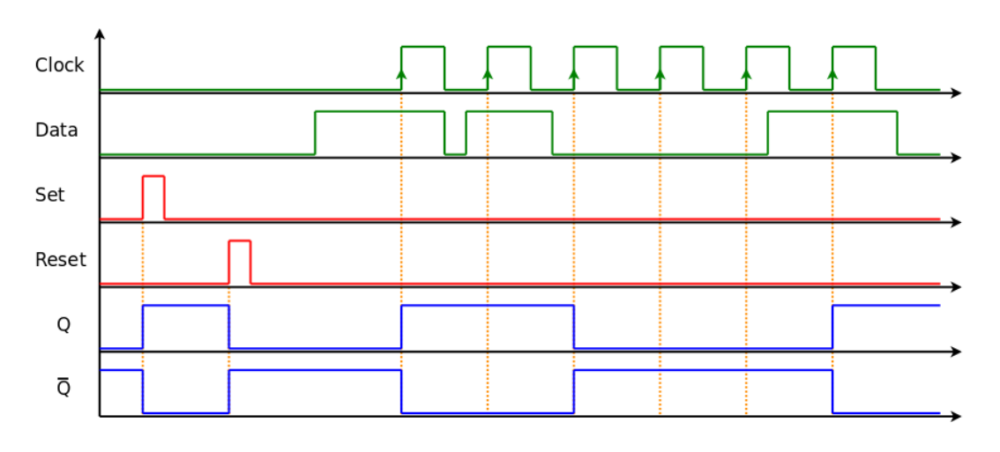

# $\fbox{Module 5: FLIP-FLOP \& LATCHES}$

>**Purpose**
>Understand **how memory is physically realized** in digital systems, before timing, FSMs, or control logic.

---

## 1. Why This Module Exists

- Combinational logic has **no memory**
- Sequential logic **requires storage**
- Latches and flip-flops are the **only reason state exists**

> No latches → no flip-flops → no memory → no computer.

---

## 2. Latches (Level-Sensitive Storage)

### Core idea

- Latch stores a bit **while enable is active**
- Output follows input when enabled
- Output freezes when disabled

### SR Latch

- Built using cross-coupled gates
- Invalid state exists (S = R = 1)

### D Latch

- Eliminates invalid state
- Data passes only when **Enable = 1**

#### Key rule:

> Latches are simple but **timing-sensitive**.

---

## 3. Why Latches Are Dangerous

- Transparent while enabled
- Small glitches can pass through
- Difficult to control in large systems

#### Therefore:

> Latches are avoided unless explicitly required.

---

## 4. Flip-Flops (Edge-Triggered Storage)

### Core idea

- State changes **only at clock edge**
- Immune to input changes between edges

### D Flip-Flop

- Most widely used
- One-bit memory cell

---

## 5. Other Flip-Flop Types

### JK Flip-Flop

- No invalid state
- Can toggle

### T Flip-Flop

- Toggles when T = 1

These are **behavioral variations** of D flip-flops.

---

## 6. Clocking Discipline

- Clock defines **when memory updates**
- All flip-flops obey same timing reference

#### Key invariant:

> Memory changes only on clock edges.

---

## 7. Asynchronous Set and Reset

- Force state regardless of clock
- Used for initialization

#### Danger:

- Can violate timing if misused

---

## 8. Relationship to Higher Modules

- Registers = collections of flip-flops
- FSMs = flip-flops + logic
- CPUs = massive structured flip-flop arrays

---

## Mental Model (Use This)

> **Latches leak state; flip-flops lock it to time.**

That single sentence explains their entire existence.

---

## Module End

**Invariant learned:** Digital memory exists because **feedback is controlled by time**.