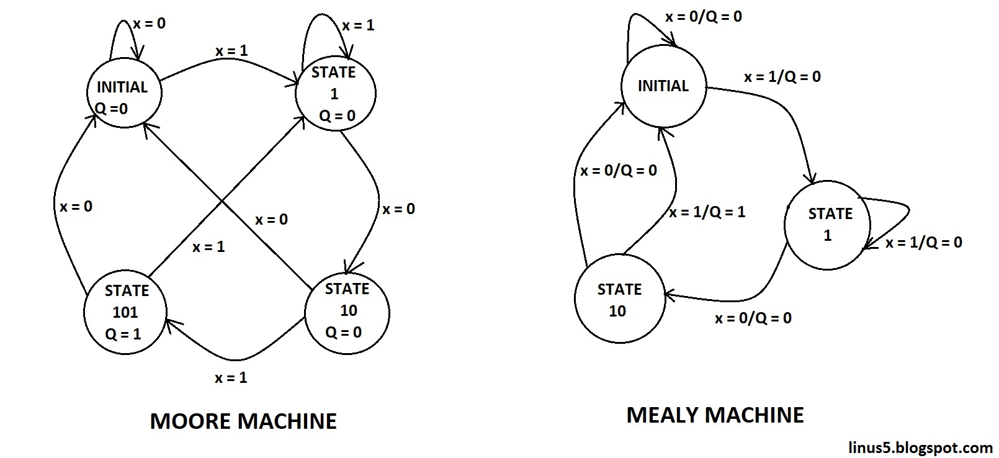

# $\fbox{Module 6: FINITE STATE MACHINES}$

>**Purpose**
>Understand FSMs as **explicit control logic**, not diagram-heavy rituals.

---

## 1. What an FSM Is

#### A system with:

- **Finite states**
- **Defined transitions**
- **Deterministic behavior**

#### Formally:  

$$ \text{Next State} = f(\text{Current State}, \text{Input}) $$

FSMs are **control structures**, not data processors.

---

## 2. Why FSMs Exist

- To control **sequence**, not computation
- To encode **policy** (what is allowed next)

#### Examples:

- CPU control unit
- Traffic lights
- Communication protocols

---

## 3. State Encoding

- Each state is encoded in **flip-flops**

#### Encoding choices:

- Binary
- One-hot

#### Key idea:

> Encoding changes hardware cost, not behavior.

---

## 4. Moore vs Mealy Machines

### Moore Machine

- Output depends only on **state**
- More stable

### Mealy Machine

- Output depends on **state + input**
- Faster response

---

## 5. State Transition Logic

- Combinational logic decides **next state**
- Flip-flops store **current state**

$$ \text{FSM = Combinational logic + Registers} $$

---

## 6. Reset and Initialization

- FSM must start in a **known state**
- Reset enforces this

#### Without reset:

- System behavior is undefined

---

## 7. Common FSM Failures

- Missing transitions
- Illegal states
- Asynchronous resets

#### Rule:

> Every state-input combination must be defined.

---

## Mental Model (Use This)

> **FSMs are rulebooks that decide what happens next.**

They do not compute — they **govern**.

---

## Module 6 End

**Invariant learned:** Control is implemented as **explicit state transition rules**.