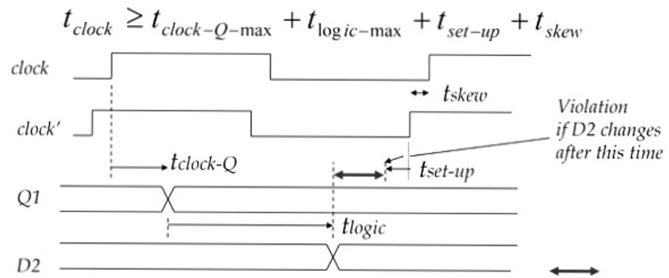
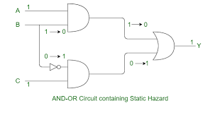
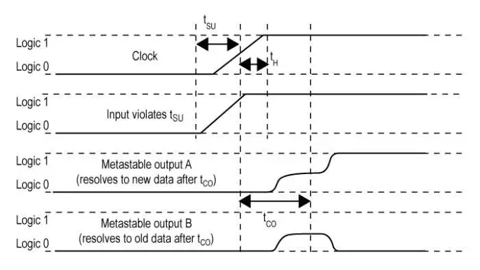
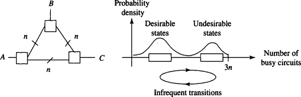

# $\fbox{Module 7: TIMING \& HAZARDS}$

>**Purpose**
>Understand why correct logic can still **fail in time**, and how timing rules keep digital systems reliable.

---

## 1. Why Timing Exists at All

- Gates are **not instantaneous**
- Signals take **finite time** to propagate
- Different paths → different delays

> Logic can be correct and still break because of time.

---

## 2. Propagation Delay

- **Propagation delay** = time for output to respond to input change
- Exists for every gate and wire

#### Key idea:

> Outputs change **after**, not at, input change.

---

## 3. Setup and Hold Time

### Setup Time

- Input must be stable **before** clock edge

### Hold Time

- Input must remain stable **after** clock edge

Violation → **undefined state**

---

## 4. Hazards (Temporary Wrong Outputs)

### Static Hazard

- Output briefly glitches when it should not

### Dynamic Hazard

- Output oscillates before settling

#### Cause:

- Unequal path delays

---

## 5. Why Hazards Matter

#### Can trigger:

- Wrong state transitions
- False clocking
- Unintended resets

Hazards are **real failures**, not cosmetic glitches.

---

## 6. Synchronization Problem

- External signals are **not clock-aligned**
- Sampling them directly causes errors

#### Result:

- **Metastability** (neither 0 nor 1 temporarily)

---

## 7. Synchronizers

- Use **multiple flip-flops in series**
- Give metastability time to resolve

#### Rule:

> You cannot eliminate metastability, only reduce probability.

---

## 8. Design Rules (Non-Negotiable)

- One clock domain where possible
- Register all inputs
- Avoid combinational feedback
- Never trust asynchronous signals

---

## Mental Model (Use This)

> **Timing rules protect logic from physics.**

Digital systems work by **respecting delays**, not ignoring them.

---

## Module 5 End

**Invariant learned:** Correct logic requires **correct timing**.