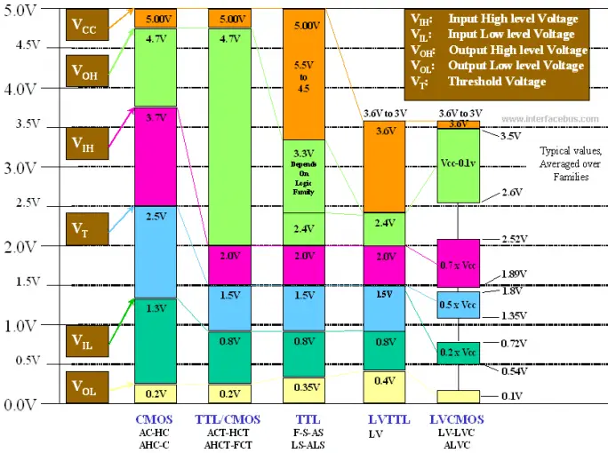
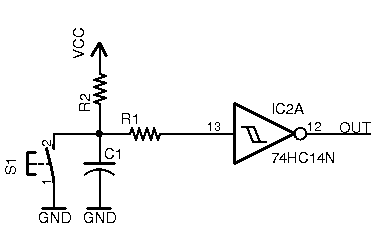
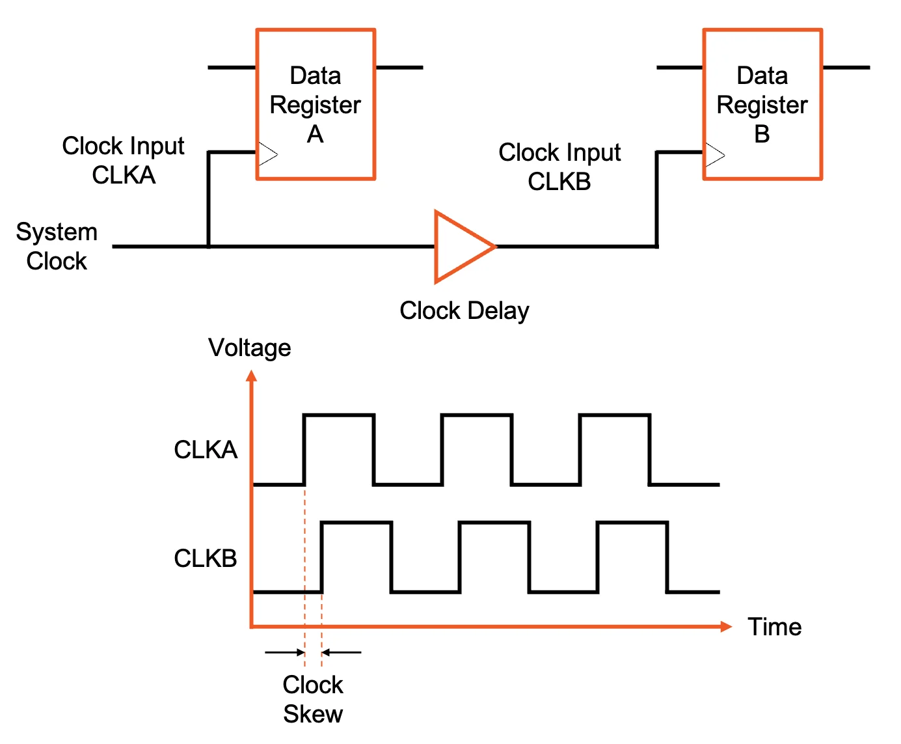

# $\fbox{Module 8: INTERFACING \& ABSTRACTION}$

>**Purpose**
>Understand where digital logic meets the real world, and why abstraction layers exist.

---

## 1. Why Interfacing Exists

- Digital logic is **idealized**
- Real world signals are **analog, noisy, asynchronous**

#### Interfacing translates:

> messy reality → clean digital states

---

## 2. Voltage Levels and Noise Margins

- Logic 0 and 1 are **ranges**, not exact values
- Noise margin ensures correct interpretation

#### Key idea:

> Digital robustness comes from tolerance, not precision.

---

## 3. Input Conditioning

- Pull-up / pull-down resistors
- Debouncing (switches)
- Schmitt triggers

#### Goal:

> Prevent undefined or oscillating inputs

---

## 4. Output Driving

- Outputs have **current limits**
- Loads matter

#### Use:

- Buffers
- Drivers
- Transistors

#### Rule:

> Logic decides; drivers deliver.

---

## 5. Fan-in and Fan-out

- Fan-in: number of inputs a gate can accept
- Fan-out: number of inputs a gate can drive

#### Violations cause:

- Slow edges
- Wrong logic levels

---

## 6. Clock and Reset Distribution

#### Clocks must be:

- Clean
- Synchronous

#### Poor distribution causes:

- Skew
- Race conditions

---

## 7. Abstraction Layers

- Boolean logic
- Gates
- Registers
- FSMs
- Systems

#### Each layer:

- Hides complexity
- Enforces constraints

> Abstraction is survival, not laziness.

---

## 8. Failure Reality

- Most failures occur at **interfaces**
- Not in pure logic

#### Rule:

> If logic is correct but system fails, inspect interfaces first.

---

## Mental Model (Use This)

> **Digital electronics works because abstraction is carefully guarded at boundaries.**

---

## Module 7 End

**Invariant learned:** Interfaces protect digital logic from analog reality.