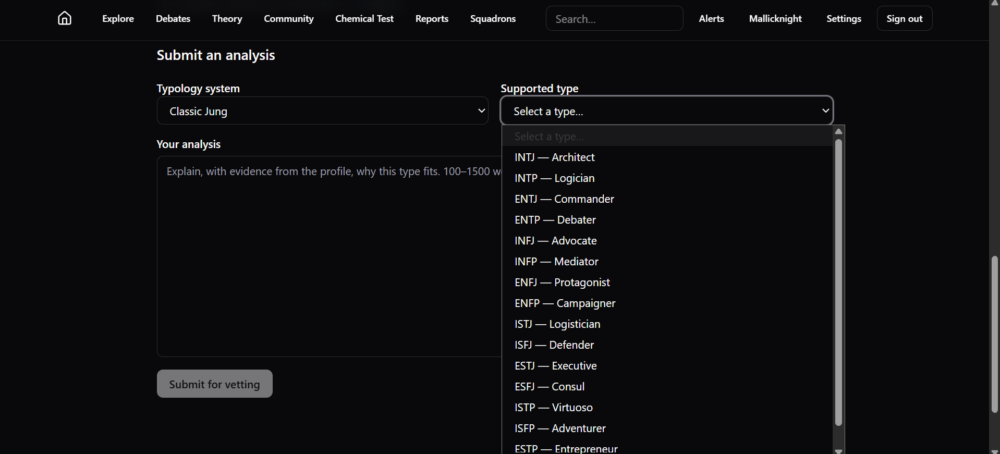

# $\fbox{TYPOLOGY ATLAS TEAM}$


## I. Differentiating Platforms


#### *i. Personality Database (PDB)*

- Initiated as a platform to store typological data of various people/characters.
- Relies on voting consensus and moderators, now its rogue platform with no active central authority.
- Sooner it became a dating-like website where instead of typology discussion, people started using it to make new friends.
- Current situation is such that it is dominated by mostly vibe typers, and a few genuine people.
- Votes on character profile are very unreliable, and opaque moderation.
- **Supported systems:** MBTI, Enneagram (wing), Instinctual Variant, Tritype, Classic Jungian, Socionics, Attitudinal Psyche, Temperaments, Big 5 (SLOAN), Moral Alignment.


#### *ii. Typology Atlas (TA)*

- Engineered very specifically to attract genuine typologists, and solve issues on PDB.
- Relies on AI-vetting process for assessing analysis comment which is its backbone and primary feature.
- Other added features are of dedicated debate chambers with virtual coin wagers, chemical test (beta), and transparent moderation.
- Analysis equal or above of $50/100$ are accepted.
- **Supported systems:** Classic Jung (MBTI-styled), Enneagram (subtypes), Socionics, Temperaments, Big 5 (SLOAN), Moral Alignment.
- Deliberately only key systems with most reliable theories are kept here.


## II. Member Roles Mode


#### *i. Regular*

A *regular role* is unique role assigned to each of the four members (Amiera, DD, Tanay, Gourav). These roles will be explained soon in next section, but I will draw how the pipeline looks like. And this role is performed everyday of the week except the Sundays.

```graph
(BEGIN)
   |
   v
Amiera -> Locate profiles & best comments to target there
	    |
	    v
DD -> Generate those profile in Typology Atlas if they don't exist yet
		|
		v
Gouraav -> Correct the issues in database as reported by DD
		|
		v
Tanay -> Generate the relevant content using shared custom GPT model
   |
   v
(REPEAT)
```


#### *ii. Common*

This role is common to all of us, i.e. posting or commenting the soft advertisement on PDB. Each person on 6 days a week, for 1 profile, 5 targets as spotted by Amiera.


#### *iii. Periodic*

This role is periodic and performed once a week on Sunday. This is again unique to each of us, as explained simplified below:

- **Amiera:** Hiring friends as volunteers to *Typology Atlas*.
- **DD:** Creating videos related to *Typology Atlas* or typology in general.
- **Gourav:** Periodic maintenance of codebase and the server.
- **Tanay:** Post online on *Instagram*, *X*, and *Reddit* using *Typology Atlas* accounts.

And yes, you all have full autonomy here, doing as per how you all feel the best. And yes, feel free to consult me if there is any doubt regarding that.


## III. Regular Duties


#### *i. Amiera*

Amiera's regular duty (non-Sundays) is to find out the most heated profiles with frequent debates or community engagement, specially the violent ones. And then find best 5 comments or sub-comments in them to be targeted. She has to do so for 4 profiles each day, so each of us can handle one profile (posting our comments against them). But each of us posting starts after the cycle of responsibility is over (Amiera to Tanay).

After understanding the heated profiles and targets in them, craft a message in this format in group:

```txt
Amiera (link_to_profile_1):
1. link_to_comment_1
2. link_to_comment_2
3. link_to_comment_3
4. link_to_comment_4
5. link_to_comment_5

DD (link_to_profile_2):
1. link_to_comment_1
2. link_to_comment_2
3. link_to_comment_3
4. link_to_comment_4
5. link_to_comment_5

Gourav (link_to_profile_3):
1. link_to_comment_1
2. link_to_comment_2
3. link_to_comment_3
4. link_to_comment_4
5. link_to_comment_5

Tanay (link_to_profile_4):
1. link_to_comment_1
2. link_to_comment_2
3. link_to_comment_3
4. link_to_comment_4
5. link_to_comment_5
```

Now work for Amiera for the day would be done, and next job has to be performed by DD.


#### *ii. DD*

DD has to follow these steps:

1. Open each of the profile link.
2. Check if that profile for that particular list exists in TA or not.
3. Consult Gourav if in any kind of doubt.
4. Create category/list/profile for those which doesn't exist in TA.
5. Report Gourav about the problems with ccreations.

DD's job is complete for the day here. Now comes responsibility for Gourav. But yeah, report in this format:

```txt
1. link_to_element_1 (mention_issue)
2. link_to_element_2 (mention_issue)
3. link_to_element_3 (mention_issue)
...
n. link_to_element_N (mention_issue)
```


#### *iii. Gourav*

Gourav will follow these steps:

1. Monitor the day's flow of control across members.
2. Go through each of the issues sent by DD.
3. Cross-check and consult DD about the issues.
4. Replace the faulty entries as send by DD to the database.

Follow this format to acknowledge about error correction:

```txt
1. link_to_element_1 (profile_TA_link_1) {CORRECTED / ERROR}
2. link_to_element_2 (profile_TA_link_2) {CORRECTED / ERROR}
3. link_to_element_3 (profile_TA_link_3) {CORRECTED / ERROR}
...
n. link_to_element_N (profile_TA_link_N) {CORRECTED / ERROR}
```


#### *iv. Tanay*

Tanay will use the GPT model to create analysis and type each of the 4 characters (referring to links provided by Gourav after reviewing) in the given format of prompt below:

```gpt
Please type PROFILE_NAME (LIST_NAME) using classic Jungian typology as per rules based on Psycholical Type's chapter X, as attached to you as your custom corpus. And keep it of around 750 words, but use the 4 letter MBTI notation to represent that type.
```

After generating, Tanay will now submit their analysis on TA to provided link after selecting their correct type, as shown below:




## IV. Common Duty


For common duty, this is what we have to do in sequence after the regular duty is over:

1. For each of the five link provided to each member (20 in total), focus on yours only.
2. For each five, open the link and copy the comment.
3. Paste the comment to custom GPT provided and ask it to make a comment in this format:

```gpt
PASTE_COMMENT_HERE

This is a comment by a user on PDB about PROFILE_NAME (LIST_NAME). Generate a comment from my side, keep it reasonably small and short. Argue that the type for this profile is AS_TYPED_ON_TA. And try injecting the link to website and mention about its debate chamber subtly, without making it too obvious.
```

---
