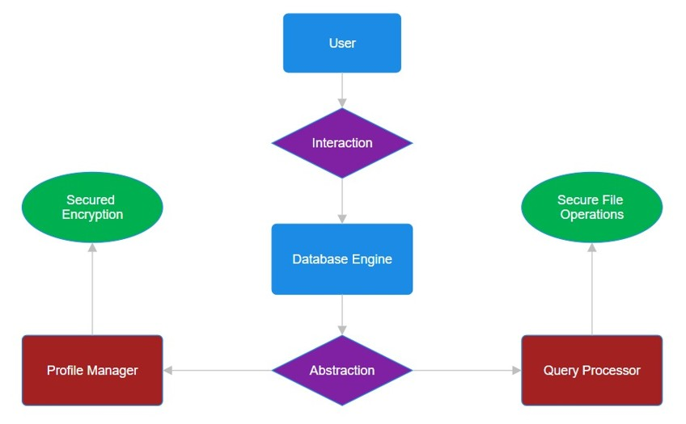

# $\fbox{TOSBIT - USER MANUAL}$


## **Topic - 1: Introduction**

### <u>Overview</u>

- ***Tosbit*** is an open-source relational database under continuous development & maintainance on **GitHub**.
- It aims at providing a **good performance**, **compressed media file storage**, **easy server setup** & many more features.
- The file system follows a CSV-like storage pattern, with extension of `.tosbit`.
- This pattern contains the data separated by commas & spaces, which can be skipped during various operations, thus saving computation time.
- Also ***Tosbit*** relies on operating system's buffers, Linux in this case, for high performance.
- This makes it very portable across various architectures.


### <u>Target Users</u>

- **Embedded system vendors** relying on **Linux** for their products.
- Bodies which want to **store files** while not descarding relational properties.
- Also those who prefer to use an **open-source relational database** for security reasons.
- This also targets at new **learners** due to its simple syntax grammar which are easier to grasp than other databases.


### <u>Limitations</u>

- Because this project is currently in prototype phase, there are some important functionalities missing which would be added soon as we progress.
- These include selective `SELECT`, `UPDATE` & `DELETE` operations.
- Though non-selective operations are there in prototype version.
- Other functionalities which are missing includes `JOIN` & aggregate functionalities.
- Feature for storing compressed media file is available, but only on client side without transfer over server.
- These all absence will be addressed soon one-by-one, as this project is under continuous development & this prototype is just showcase of its fraction of abilities in future.


## **Topic - 2: System Requirements**

### <u>Hardware Requirements</u>

- Hardware requirements are currently limited to the **x86** and **x86_64** architecture currently.
- Very soon it will include **ARM** & **RISC-V** support for users.


### <u>Software Requirements</u>

- Currently, ***Tosbit*** is limited to **Debian derived Linux systems**.
- For example, ***Debian***, ***Ubuntu***, ***Mint***, ***Pop!_OS*** & ***Zorin OS*** etc.
- Soon, packages for other Linux distros will be available.
- However, there are currently no plan for **Windows** & **MacOS**.
- Software in Linux required for running ***Tosbit*** is just **xz Compressor** & **GCC**.
- But developers have to install **CMake** & **GNU Debugger** (optional but advised) too.


### <u>Third-Party Tools</u>

- Right now, no third-party tool is required to run ***Tosbit***.
- Its made too lightweight with all natively crafted components from scratch, not requiring any heavy imported tool.


## **Topic - 3: Installation & Setup**
### <u>For Release Users</u>

These installation steps are for those who are willing to download the release:

1. Get the `.tar.gz` file from **GitHub**.

```sh
wget https://github.com/Gourav-334/Tosbit/releases/download/Tosbit-v0.1.0/Tosbit-v0.1.0-Linux.tar.gz
```

2. Extract this `.tar.gz` file.

```sh
tar -xzvf Tosbit-v0.1.0-Linux.tar.gz
```

3. Allow permission to it.

```sh
chmod +x Tosbit-v0.1.0-Linux/*
```

4. Navigate inside the directory.

```sh
cd Tosbit-v0.1.0-Linux
```

5. Try running engine or server.

```sh
./engine
./server 8080           # Create account in engine first before running server.
```


### <u>For Developers</u>

For installation by developers having cloned the repository, follow the given steps (assuming you to be in parent directory of repository):

1. Install required tools for our database:

```sh
bash scripts/alpinelinux.sh         # Only for Alpine Linux.
bash scripts/arch.sh                # Only for Arch, Manjero & EndeavourOS.
bash scripts/fedora.sh              # Only for Fedora, RHEL, Rocky & AlmaLinux.
bash scripts/opensuse.sh            # Only for openSUSE.
bash scripts/ubuntu.sh              # Only for Debian & Ubuntu.
bash scripts/voidlinux.sh           # Only for Void Linux.
```

2. Set up environment using CMake:

```sh
cd exec
bash remake.sh 0
bash remake.sh 1
cd build
cmake ..
make
cd ../..
```

$$ OR $$

2. Alternatively (but discouraged), use Bash scripts for compilation & linking:

```sh
cd scripts
bash compileAll.sh
bash linkAll.sh
cd ..
```

3. ***(Optional)*** Run the server component with an argument telling what port to run it on:

```sh
cd exec/build
./server 8080
cd ../..
```

4. Try running Tosbit engine now:

```sh
cd exec/build
./engine
cd ../..
```


## **Topic - 4: Database Schema**

### <u>Entity-Relationship Diagram</u>



- As the diagram above shows, the user interacts with the **engine**.
- And an abstraction is provided for various components like the **profile manager**, **syntax parser** (query processor) & **driver manager** (if used).


### <u>File System</u>

- `data/`
    - `db_name/`
    - `tbl_name/`
        - `details.tosbit`
        - `rows.tosbit`
        - `metadata.tosbit`
    - `tables.tosbit`
    - `metadata.tosbit`
- `databases.tosbit`
- `metadata.tosbit`
- `logs/`
- `users/`
    - `user.tosbit`

>**<u>NOTE</u>:** Dots (`.`) in code sections below are spaces, added for clarity.

#### 1. `details.tosbit` (`data/db_name/tbl_name/`)

```tosbit
name............................,string,unique.,5.\n
age.............................,int...,regular,4.
```
1. Attribute name
2. Data type
3. Key type
4. Length of largest value in an attribute.

#### 2. `metadata.tosbit` (`data/db_name/tbl_name/`)

```tosbit
10,10,6.
```
1. Length of largest attribute name (larger than 10)
2. Length of largest data type name (larger than 10)
3. Length of largest key type (larger than 6)

#### 3. `tables.tosbit` (`data/db_name/`)

```tosbit
table1..........................\n
table2..........................
```
1. Table's name

#### 4. `metadata.tosbit` (`data/db_name/`)

```tosbit
6.
```
1. Length of largest table.

#### 5. `database.tosbit` (`data/`)

```tosbit
db1.............................\n
db2.............................\n
mydb............................
```
1. Name of database
2. Name of its largest tables.

#### 6. `metadata.tosbit` (`data/`)

```tosbit
10
```
1. Length of largest database name (larger than 10).

#### 7. `logs/`

- `logs/` directory contains all the log history in **JSON** format.
- These are easy to access in the local file system.

#### 8. `user.tosbit` (`users/`)

- `user/tosbit` contains all the user credential in encrypted form.


### <u>Case-Insensitive Syntax</u>

- ***Tosbit*** supports writing case-insensitive commands.
- But that is considered only for its own keywords.
- For user defined entities like databases,tables & attributes etc, the parser considers each ASCII character different.
- This insensitivity comes from the fact that ***Tosbit*** consists of **DFA-based parsers**, which can be easily mapped to same states.

#### Full uppercase:

```tosbit
MAKE DB mydb
```

#### Full lowercase:

```tosbit
make db mydb
```

#### Mixed:

```tosbit
mAkE dB mydb
```


### <u>Unrestrictive Spaces</u>

- There can be multiple spaces between two keywords or written entities.
- But whole command (including) spaces must be under `512` bytes or characters.
- There can be spaces around operators (`=`, `<`, `>`, `<=`, `>=`, `|`, `&`) & dots (`.`) too.
- Spaces aren't required between keywords or entities written around paranthesis.

#### Common way:

```
SELECT tbl2.(@) WHERE (score>7)
```

#### Sticked:

```
SELECT tbl2.(@)WHERE(score>7)
```

#### Space around operators:

```
SELECT tbl2.(@) WHERE (score > 7)
```

#### All together:

```
SELECT tbl2.(@)WHERE(score > 7)
```


### <u>Data Types</u>

- ***Tosbit*** currently supports 5 data types as following.

#### Current data types:

1. `INT` - Integer (upto 32-digited)
2. `FLOAT` - Floating point number (upto 32-digit with decimal point)
3. `STRING` - String (upto 32-bytes)
4. `BOOL` - Boolean (either `true` or `false`)
5. `MEDIA` - A file in user file system


### <u>Key Types</u>

- Currently, ***Tosbit*** supports three types of keys.

#### Current key types:

- **<u>Regular key</u>:** The default key type to each attribute.
- **<u>Unique key</u>:** Limited to one attribute in a table, defined with `$` suffix to attribute's name.
- **<u>File key</u>:** For media files, unique too but not limited to one attribute in a table.


### <u>Relationship Among Tables</u>

- After implementation of `JOIN` operations, we will see relationships among tables soon.
- Currently, there is no strong relation among tables, other than being under same database.


### <u>Log Information</u>

- Logs present in `logs/` in clusters.
- Individual log files contain main five information.

#### Information stored in logs:

1. Username
2. Time stamp
3. Longitude & latitude
4. Command executed


## **Topic - 5: Query Commands**

### <u>Comments</u>

- Comments are useful for helping log readers know what the database user was doing.
- Whatever is written between two `@` is considered a comment.
- But it mustn't interfere with another command, else expect an error or strange behaviour.

```tosbit
@ This is a comment! @
```

- In the case above, ` This is a comment ` is our comment (with all the spaces).
- And this command is stored in log along with other user information.


### <u>Opening Database</u>

- In order to access tables in a database, one has to open it.
- This is because otherwise one has to always explicitly mention in commands what database they are referring to.
- Such a repetitive process makes passing command very cumbersome.
- That's why we tell the engine just once, which database to use.

```tosbit
OPEN DB db_name
```

- Here, `db_name` is the sample name of a database.
- Database can contain a set of tables.


### <u>Table Structure</u>

- User can check out structure of a table using the command given below.

```tosbit
SHOW STRUCT tbl_name
```

- `tbl_name` here is sample name of a table.
- This will display all the attributes contained in the table with their data type & key types.


### <u>All Databases</u>

- We can see name of all databases listed using the `SHOW` command.

```tosbit
SHOW ALL DB
```


### <u>All Tables</u>

- Like previous one, this command is for listing all tables in an opened database.

```tosbit
SHOW ALL TABLES
```


### <u>Making Table</u>

- For creating a new table in a database, we pass all its attribute names with their respective data types.

```tosbit
MAKE TABLE tbl_name(INT $sno, STRING name, MEDIA photo)
```

- Here, `tbl_name` is sample name of a table.
- The `$` prefix in `sno` declared attribute `sno` as **unique**.
- So, `sno` is linked to a **unique key**.
- Even the data types we defined above can be written *case-insensitively*.

```tosbit
MAKE TABLE tbl_name(int $sno, stRiNg name, medIa photo)
```

- The command will still work as alternative to previous command.


### <u>Making Database</u>

- Similar to previous command we discussed, this one doesn't require any argument.
- By using this command, we tell engine to define a container for a different set of tables.

```tosbit
MAKE DB db_name
```

- Here, `db_name` is sample name of the database.


### <u>Deleting Table</u>

- As the name says, this command is used for deleting a table, including every row it contains & its properties.

```tosbit
DELETE TABLE tbl_name
```

- Here, `tbl_name` is sample name of a table.


### <u>Deleting Database</u>

- Similar to previous command, this command deletes a whole database.
- This removes all the tables it contained, all the rows those tables contained & properties of those tables.

```tosbit
DELETE DB db_name
```

- Here, `db_name` is sample name of a database.


### <u>Clearing Table</u>

- Using this command clears a table of all the rows it contains.
- But preserves the properties & structure of the table.

```tosbit
CLEAR TABLE tbl_name
```

- Here, `tbl_name` is sample name of a table.


### <u>Clearing Database</u>

- Like the previous command, it clears a database of all its contained tables.
- But it preverves the database as a container.

```tosbit
CLEAR DB db_name
```

- Here, `db_name` is sample name of a database.


### <u>Pushing Row</u>

- We push rows to table using the `PUSH` command.
- Inside the paranthesis, we pass value for each attribute in order of their definition.

```tosbit
PUSH TO tbl_name(1, User, 7.5)
```

- In sample command above, we are assuming that table `tbl_name` contains three attributes.
- Where the first one is an integer, second is string & third one is a floating point decimal number.
- If we would be having a media attribute (`MEDIA`), the terminal asks user prompt to enter file's address (absolute or relative).
- For multiple media files multiple prompts are asked.


### <u>Display Of Rows</u>

- We can check out all the contained rows in a table using `SELECT` command.

```
SELECT tbl_name.(@)
```

- `tbl_name` is name of table.
- `@` means we are requesting to display all attributes/columns.
- In future there will be integration with the `WHERE` clause for more dynamic & flexible usage.


### <u>Updating Rows</u>

- We can update all the rows for some selected attributes with `UPDATE` command.

```
UPDATE tbl_name.(rank=Colonel, pay=100000)
```

- In command above, table `tbl_name` is updated with its attribute `rank` & `pay` changed to mentioned values.
- It makes changes to all the rows, but sooner there will be integration with `WHERE` clause for selective control.
- Also, the mention of attributes to change can be written in any order.

```tosbit
UPDATE tbl_name.(pay=1000000, rank=Colonel)
```

- The command above will still work alternative to previous one.


## **Topic - 6: Tosbit API**

### <u>Introduction</u>

- A user can very painlessly connect to a ***Tosbit*** server through `libtosbitAPI.a`, a static library for Tosbit's driver manager.
- This doesn't discriminate with any kind of application **C** (with **GCC**) uses.
- Sooner, Tosbit's APIs will be available for other compilers targetting many other languages too.

### <u>Example Usage</u>

Follow the given steps for using in-code Tosbit in C:

1. Navigate to `exec/build/` & create a C source (`.c`) file:

```sh
cd exec/build
touch myfile.c
```

2. Open this file with your favorite code editor, I would be using **GNU Nano**:

```sh
nano myfile.c
```


3. Write the following code in it:

```c
#include "../../include/driver_manager.h"

int main(void)
{
    /* Enter 'Username', 'Password' & 'Hostname' as per your entered credentials. */

    setConnection("Username", "Password", "Hostname", 8080, "Username", "Password", FALSE);

    interpret("SHOW ALL DB");
    interpret("MAKE DB mydb");
    interpret("SHOW ALL DB");

    endConnection();

    return 0;
}
```

4. Link against `tosbitAPI.a` static library:

```sh
gcc myfile.c -I../include -L../lib -ltosbitAPI -o myfile
```

5. Run the server:

```sh
./server 8080
```

>**<u>NOTE</u>:** If it doesn't work, try changing port number argument here & in code too.

6. Run the created executable:

```sh
./myfile
```

- This was a very basic tutorial on very painlessly using in-code **Tosbit** using **GCC**.
- Users should take note that they are free to modify the directory structure & customize their way of usage.
- And there is no worry of space in **embedded systems** regarding it, because linking is just a one time process.


## **Topic - 7: Limitations & Future Plan**

### <u>Limitations</u>

- Selective operations
- Join operations
- Serverless C connection
- Unrestrictive strings
- No aggregation function
- Absence of B+ tree
- No role-based access control
- No server backup function
- Non-standard encryption


### <u>Future Plan</u>

- In future the plan is to add more operations to ***Tosbit***.
- Make it more dynamic than it is right now.
- Also make it more secured with better techniques.
- Fine tuning for embedded systems & other architectures like **RISC-V**.


### <u>Bottlenecks</u>

- There are no major bottleneck noticed so far in ***Tosbit***.
- But the performance might be little inconsistent for not directly writing data to disk.
- So, the performance for using Linux's buffers is better, but inconsistent.


## **Topic - 8: Conclusion**

### <u>Current Key Features</u>

- Commenting
- Listing entities
- Making/creation of entities
- Clearing & deleting of entities
- Writing data to tables
- Updating entries


### <u>Full Documentation</u>

- [GitHub](https://github.com/Gourav-334/Tosbit)

---