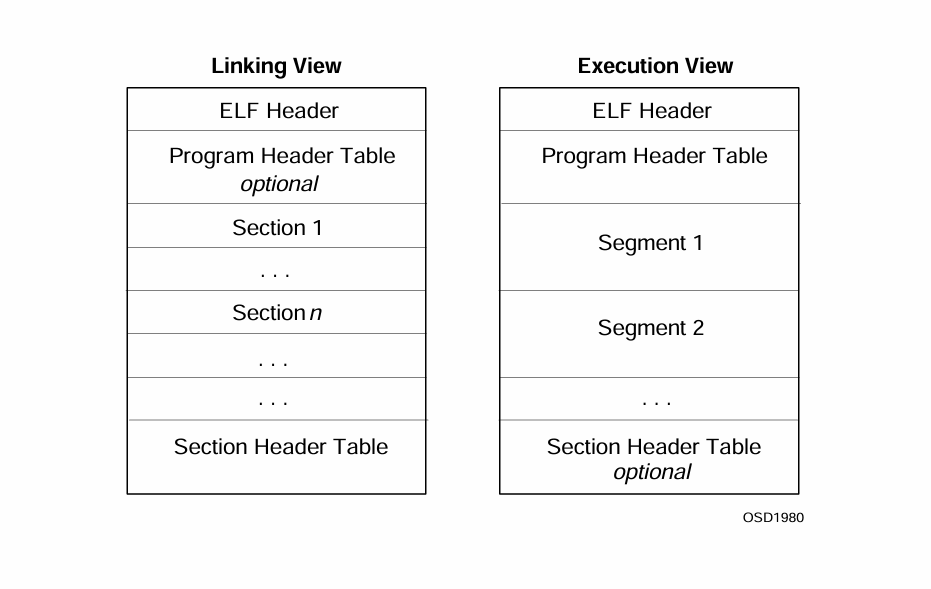

# $\fbox{Chapter 1: OBJECT FILES}$


## **Topic - 1: Introduction To Object Files**

### <u>Introduction</u>

- ELF is an object file format.

#### Types of object files:

1. **<u>Relocatable file</u>:** Object file which with other object files can be linked to form an executable.
2. **Executable file**
3. **<u>Shared object file</u>:** Aids other object files to create another object file, or integrates with them and an executable to form single process image.


### <u>File Format</u>



- As we can see, an ELF header is compulsory in all object files.
- While sections hold most information like instructions, data, relocation information etc.
- **<u>Program header table</u>:** Tells system how to create a process image i.e. how to execute a program.
- **<u>Section header table</u>:** Contains information about each section.
- Moreover, for each section or segment in diagram, the ordering may vary.


### <u>Data Representation</u>

- Object files support all architectures, from 8-bit to 64-bit.
- This is because its format is machine independent.

|      Name       | Size | Alignment | Purpose                  |
| :-------------: | :--: | :-------: | :----------------------- |
|  `Elf32_Addr`   |  4   |     4     | Unsigned program address |
|  `Elf32_Half`   |  2   |     2     | Unsigned medium integer  |
|   `Elf32_Off`   |  4   |     4     | Unsigned file offset     |
|  `Elf32_Sword`  |  4   |     4     | Signed large integer     |
|  `Elf32_Word`   |  4   |     4     | Unsigned large integer   |
| `unsigned char` |  1   |     1     | Unsigned small integer   |

- These are size of variables using these data types with natural padding.


### <u>Character Representation</u>

- ELF represents characters in 7-bit ASCII form.
- **<u>Multibyte character</u>:** Characters outside range of $[0,127]$ that may occupy multiple bytes.
- Multibyte characters mustn't include any 7-bit pattern than resembles an existing character.
- They must also be self-identifying, meaning they don't change if we insert them among two other characters for example.
- ELF might follow some naming conventions as per processor.


## **Topic - 2: ELF Header**

### <u>Introduction</u>

- Parts of object files may grow or shrink as per condition.

```c
#define EI_NIDENT        16

typedef struct
{
	unsigned char        e_ident[EI_NIDENT];
	Elf32_Half           e_type;
	Elf32_Half           e_machine;
	Elf32_Word           e_version;
	Elf32_Addr           e_entry;
	Elf32_Off            e_phoff;
	Elf32_Off            e_shoff;
	Elf32_Word           e_flags;
	Elf32_Half           e_ehsize;
	Elf32_Half           e_phentsize;
	Elf32_Half           e_phnum;
	Elf32_Half           e_shentsize;
	Elf32_Half           e_shnum;
	Elf32_Half           e_shstrndx;
} Elf32_Ehdr;
```

#### `e_ident`: 

- `e_ident` represents the initial bytes in file identifying it as object file.

#### `e_type`:

- `e_type` tells the type of object file.

|    Name     |  Value   | Meaning            |
| :---------: | :------: | :----------------- |
|  `ET_NONE`  |   `0`    | No file type       |
|  `ET_REL`   |   `1`    | Relocatable file   |
|  `ET_EXEC`  |   `2`    | Executable file    |
|  `ET_DYN`   |   `3`    | Shared object file |
|  `ET_CORE`  |   `4`    | Core file          |
| `ET_LOPROC` | `0xff00` | Processor-specific |
| `ET_HIPROC` | `0xffff` | Processor-specific |
