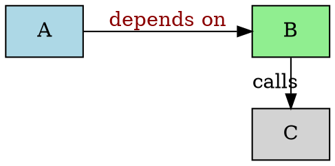

# $\fbox{DOT ENGINE}$


## **Topic - 1: Basic Layout**

### <u>Script</u>




### <u>Quick Reference Note</u>

```dot
// 1. Graph
digraph G { rankdir=LR; }

// 2. Node
N [label="Text", shape=box, fillcolor=lightblue, style=filled];

// 3. Edge
N1 -> N2 [label="edge", color=red, style=dashed];

// 4. Cluster
subgraph cluster_0 { label="Group"; style=dashed; A; B; }

// 5. Same rank
{rank=same; X Y Z}

// 6. HTML label
N [label=<<B>Bold</B><BR/><FONT COLOR="gray">small</FONT>>];
```


### <u>Conversion</u>

```sh
dot -Tpng example.dot -o example.png
```


## **Topic - 2: Core Syntax**

### <u>Structuring</u>

| Meaning              | Syntax                                    |
| :------------------- | :---------------------------------------- |
| Undirected graph     | `graph G {...}`                           |
| Directed graph       | `digraph G {...}`                         |
| Add node `n1`        | `n1 [label="Foo", shape=box];`            |
| Directed edge        | `n1 -> n2 [label="Calls"];`               |
| Undirected edge      | `n1 -- n2;`                               |
| Grouping with border | `subgraph my_cluster {label="DB"; A; B;}` |
| Inline comment       | `# My comment`, `// My comment`           |
| Multiline comment    | `/* My comment */`                        |


### <u>Shapes & Styles</u>

| Shape                | Code        |
| :------------------- | :---------- |
| Box                  | `box`       |
| Ellipse              | `ellipse`   |
| Circle               | `circle`    |
| Structure with ports | `record`    |
| No border            | `plaintext` |
| Rounded corners      | `Mrecord`   |


### <u>Edge Attributes</u>

| Attribute   | Style/Values                               |
| :---------- | :----------------------------------------- |
| `label`     | `"depends on"`, use `\n` for line-breakers |
| `color`     | `red`, `#RRGGBB` style                     |
| `penwidth`  | `2.5`                                      |
| `style`     | `solid`, `dashed`, `dotted`, `bold`        |
| `fontcolor` | `darkred`                                  |
| `arrowhead` | `normal`, `vee`, `box`, `crow`, `diamond`  |


### <u>Layout Control</u>

| Effect                          | Directive            |
| :------------------------------ | :------------------- |
| Left-to-right                   | `{rank=same; A B C}` |
| Separation between ranks        | `ranksep=1.5`        |
| Horizontal distance among nodes | `nodesep=0.8`        |
| Cluster paddin                  | `margin=0.5`         |
| Merge parallel edges            | `concentrate=true`   |
| Curved edges                    | `splines=curved`     |


## **Topic - 3: Common Pitfalls**

| Symptom                  | Fix                                                  |
| :----------------------- | :--------------------------------------------------- |
| Nodes overlap            | `nodesep=1.0; ranksep=1.5` or switch to `neato`      |
| Text too small           | `fontsize=14`                                        |
| Unicode for **Devnagri** | `fontname="Noto Sans Devnagri"; dot -Gcharset=UTF-8` |
| Too many crossing edges  | `splines=ortho`                                      |
| Graph too wide           | `size="8,10!"; ratio=fill;`                          |

---
