# $\fbox{Chapter 1: KEYBOARDS}$

## **Topic - 1: Membrane Keyboard**

### <u>Basic Information</u>

- **<u>Membrane Keyboard</u>:** Most commonly used keyboard which contains rubber sheets.
- Contains mostly around 148 parts.
- Very cheap when compared to the mechanical keyboard.

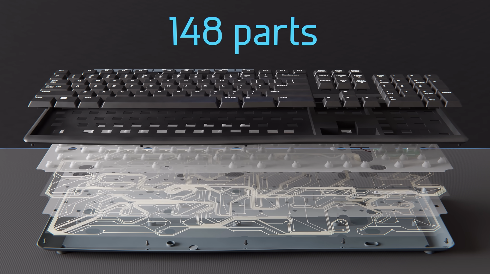

- About 140 of these parts are just *keys*, *screws*, and both *plastic casings*.

### <u>8 Critical Parts</u>

- 4 of these 8 parts are sheets.
- Topmost layer is the rubber sheet, with other three layers below it being plastic cutouts.

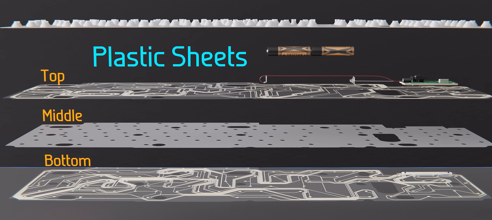

- The top and bottom plastic cutouts containing conductive wires printed, with dots on axis of every key.
- Middle sheet just acts as a separator.

### <u>Electrical Components</u>

- Electrical components come on top of top plastic sheet.
- They contain two batteries, a *clamping bracket* connecting board with keyboard's circuit lines.
- This board is connected to the pair of batteries with wires.

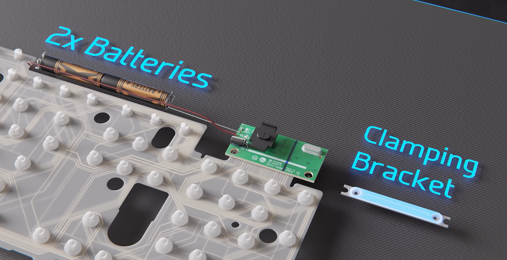

- The large black part on the board is *switch*, and white capsule-like part is *crystal oscillator*.

### <u>Below The Board</u>

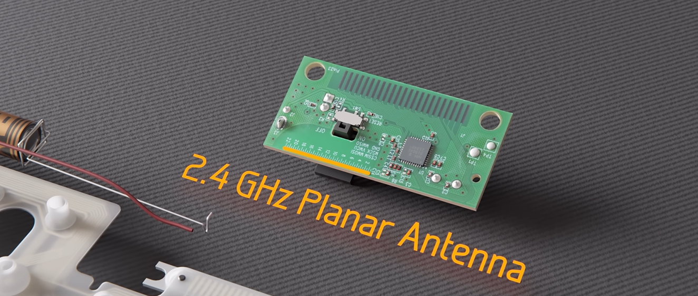

- It contains a small microprocessor, planar antenna (marked in orange), and circuit lines to connect with keyboard.
- The circuit lines on this board connects to the top and bottom of the conductive sheets.

### <u>Working</u>

- The bottom plastic sheet receives a voltage of $3V$, while top plastic sheet is unconnected.
- When a key is pressed, the top sheet presses against the bottom sheet to come in contact with it and detect which key was pressed.

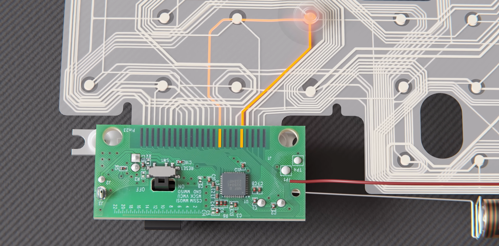

- These connecting lines with board are called *traces*.
- Top sheet contains 12 traces (on left & right), while bottom sheet contains 8 traces.

### <u>Keyboard Matrix</u>

- **<u>Keyboard matrix</u>:** Explanation behind how keyboard knows which key was pressed.

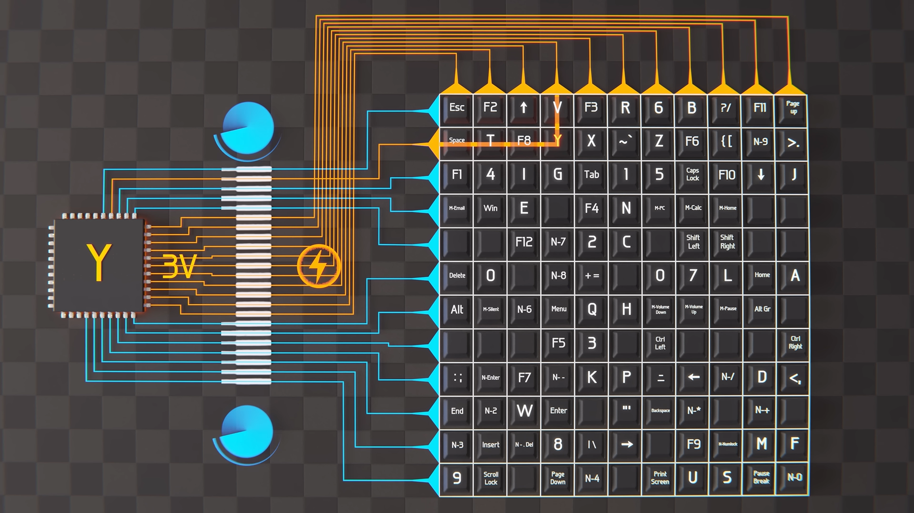

- In this given figure, the row denotes *bottom sheet*, while column denotes *top sheet*.
- When a key is pressed, the combination of two dots from both sheets tell which key was pressed.
- For example, look at how $Y$ is detected using same mechanics.
- Continuously scanning with $3V$ which key was pressed will drain battery faster.
- So voltage is scanned only when a key is pressed, and its result tells where the signal came from, as shown below.

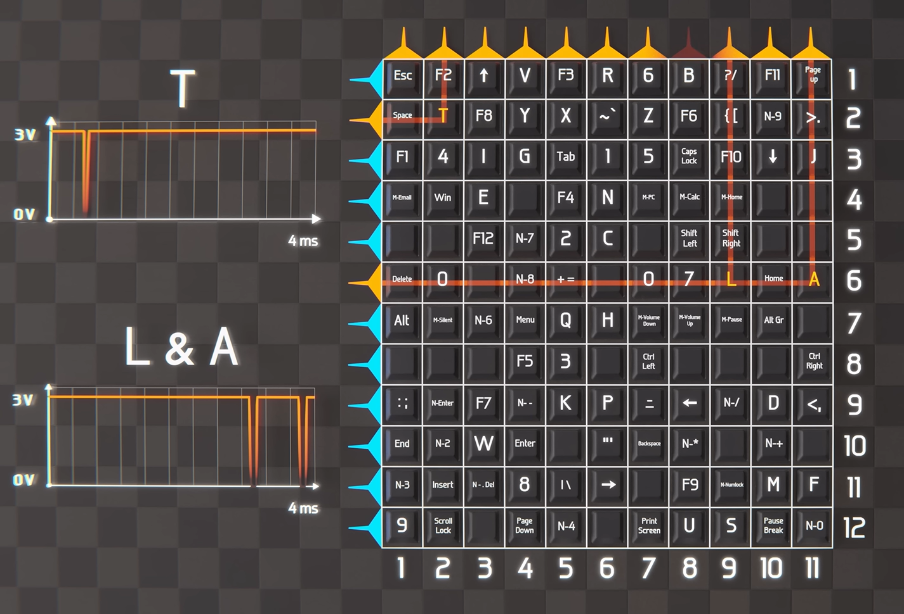

- After a signal is received, they are caught by receiver on PCB, and sent to the CPU through connected USB cable.

## **Topic - 2: Mechanical Keyboard**

### <u>Basic Information</u>

- It is usually $50x$ more expensive than the *membrane keyboard*.

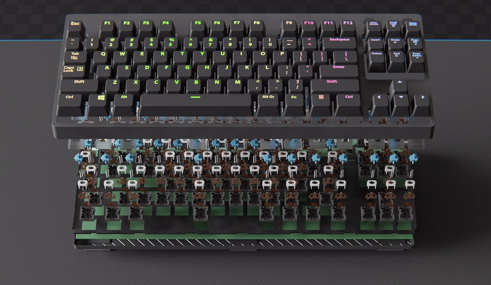

- The bottom layer (above plastic casing) contains large PCB board, as shown below.

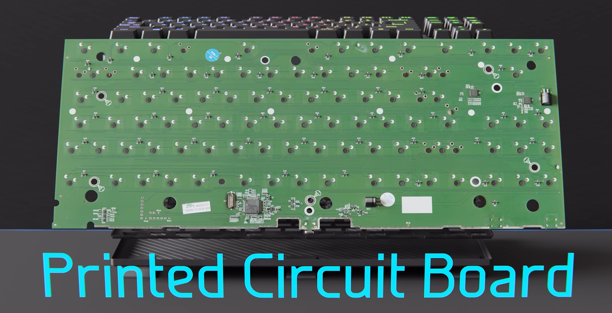

- And as one can see, keys directly come in contact with the board.

### <u>Key Build</u>

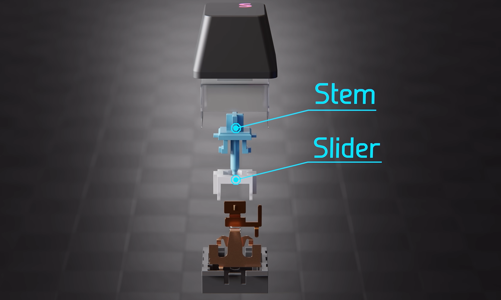

- The black part is *keycap*, blue one is *stem*, white is *slider*.
- Top part of stem & bottommost part are called *switch housing*.
- The metal parts together are called *metal contact leaves* or *gold cross-point contacts*.

- And there is a *sprint* involved in their lockings.

### <u>Working Mechanism</u>

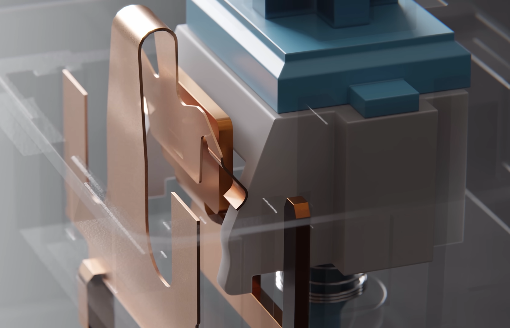

- When a key is pressed, the stem and slider move down pressing the spring.
- And the build is such that when pressed, both metals come in contact of each other to detect a press.
- This contact is what created the clicking sound in mechanical keyboards.

## **Topic - 3: Laptop Keyboards**

- Each key contains a *scissor switch* & a *rubber dome*.
- Its design is very similar to the *membrane keyboard*.

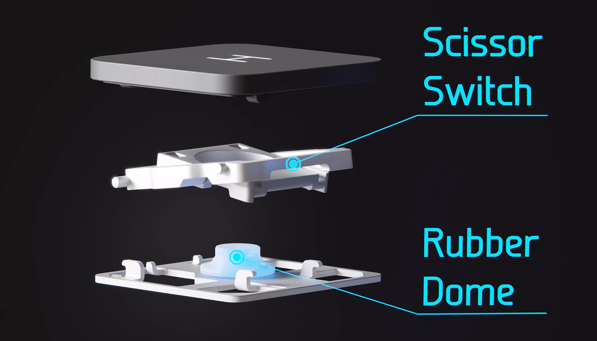

---
