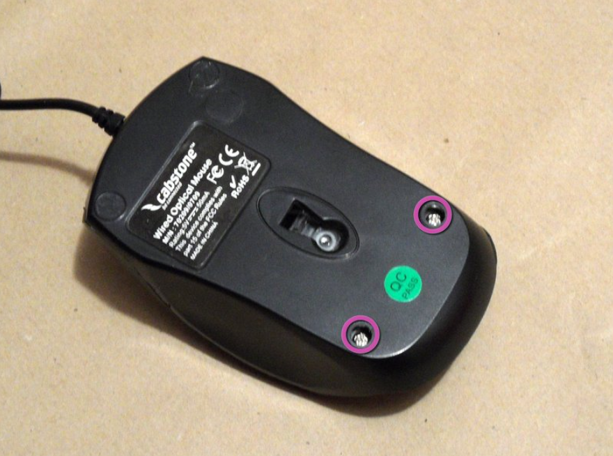
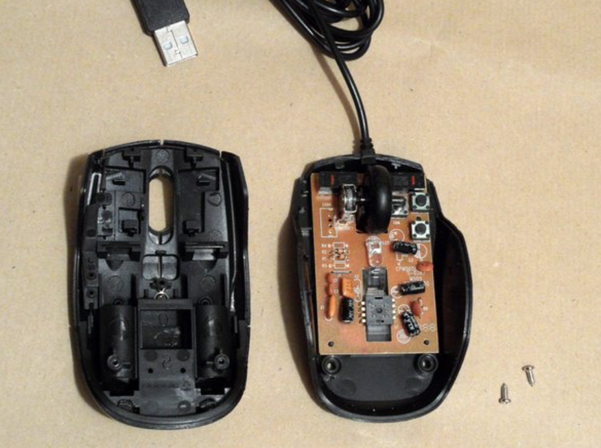
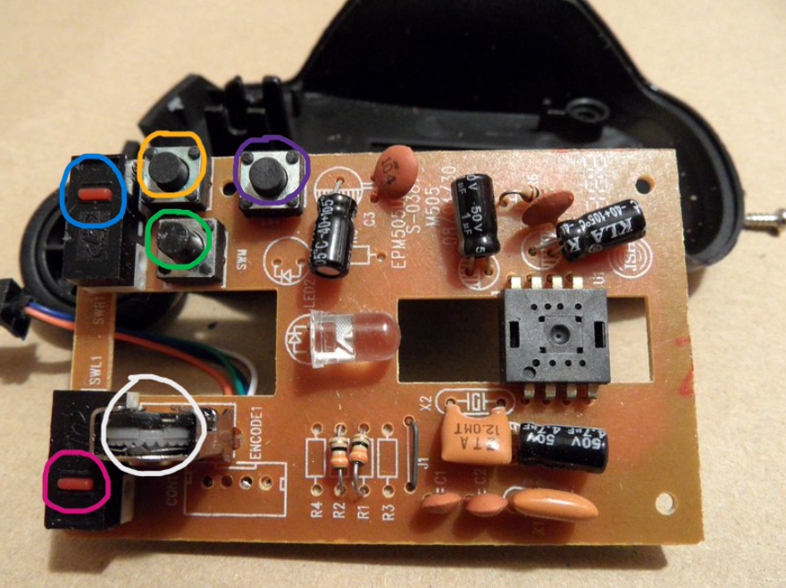
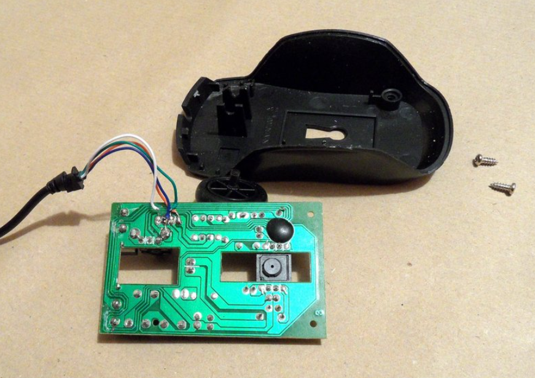

# $\fbox{Chapter 2: OPTICAL MOUSES (WIRED)}$

## **Topic - 1: Cabstone Mouse Teardown**

### <u>Glide Pads Removal</u>

- The highlighted parts in pink show screws, which are beneath the small plates known as *glide pads*.
- *Glide pads* are similar in looks as the unhighlighted small circular parts on the top of mouse.
- Once removed, the screws are exposed to us as shown in the figure.

### <u>Uncovering</u>

### <u>Components Within</u>

- *Left mouse button* (marked **pink**)
- *Right mouse button* (marked **blue**)
- *Middle mouse button* (marked **yellow**)
- *Additional mouse buttons* (**green** & **violet**)
- *Rotary encoder* (marked **white**)
- *Sensing LED*
- *Sensor* (microprocessor-like shape)

>**<u>NOTE</u>:**
>*Rotary encoder* converts physical rotations into digital signals.

### <u>Lower PCB Part</u>

---
