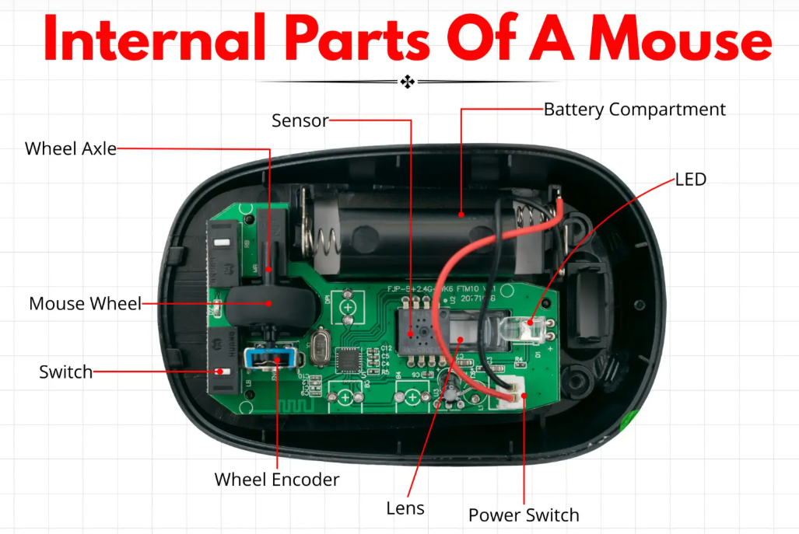
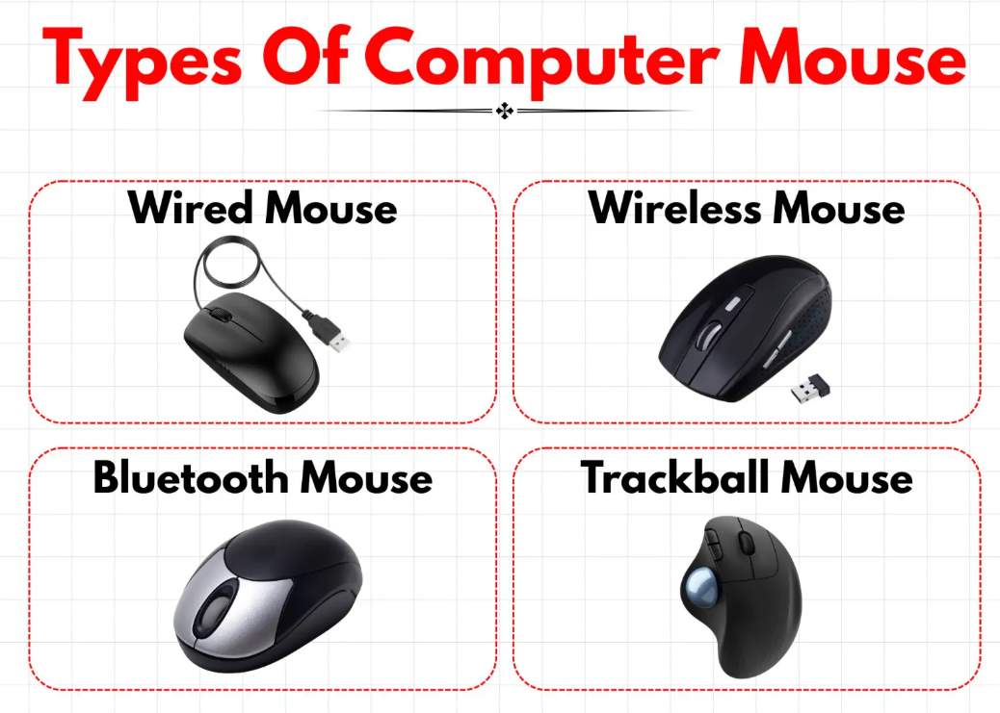

# $\fbox{Chapter 3: OPTICAL MOUSES (WIRELESS)}$

## **Topic - 1: External Parts**

### <u>Anatomy Of External Parts</u>

### <u>Side Buttons</u>

- Used usually for page navigation without keyboard.
- And customized assignment of command.

## **Topic - 2: Internal Parts**

### <u>Anatomy Of Internal Parts</u>

### <u>Sensor</u>

- *Sensor* tracks movement by rapidly sampling images of surface *mouse* is kept on.
- These images are tracked using optic laser, which exposes irregularities on the surface.

### <u>Lens</u>

- *Lens* focuses the light reflected from surface onto the sensor.
- It is placed directly above the sensor component.

### <u>Wheel Axle</u>

- *Wheel axle* is used to properly align the wheel with the *wheel encoder*.
- Inconsistent scrolling might be attributed to malfunctioning *wheel axle*.
- It goes through the *wheel hub* (center of the wheel).

## **Topic - 3: Types Of Mouses**

- **<u>Wired mouse</u>:** Draws power directly from the computer.
- **<u>Wireless mouse</u>:** Communicates using radio frequency signals.
- **<u>Bluetooth mouse</u>:** Connects without separate receiver.
- **<u>Trackball mouse</u>:** Controls cursor's movement using a rolling ball.

---
