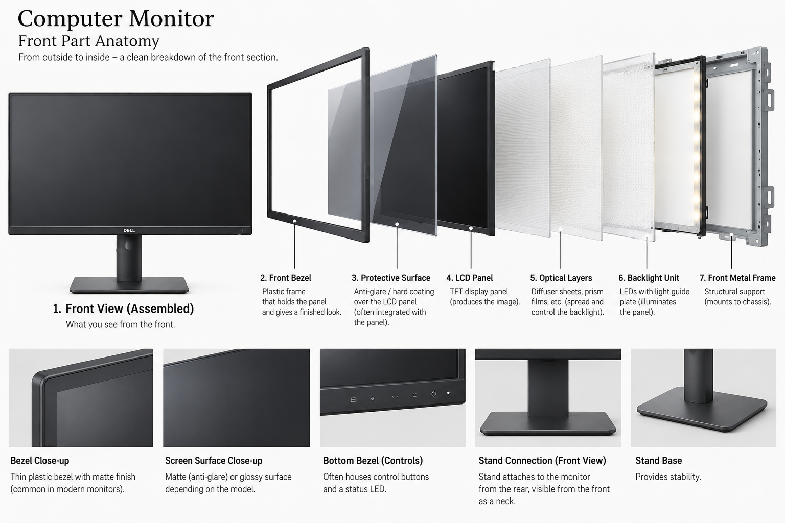
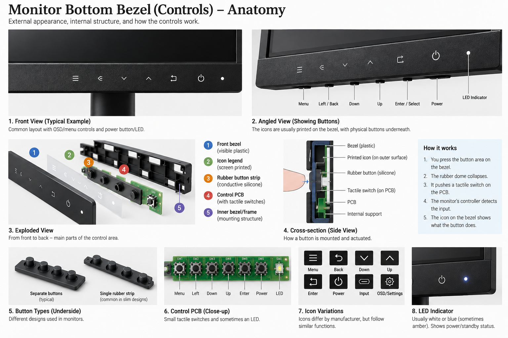
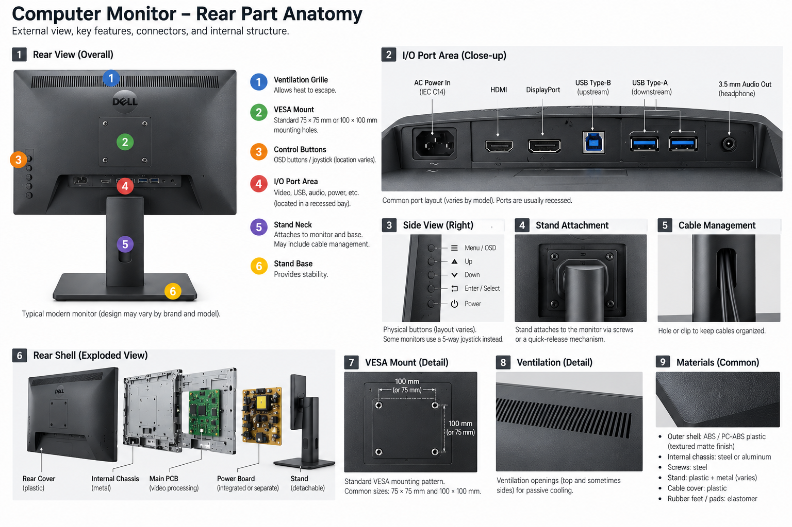
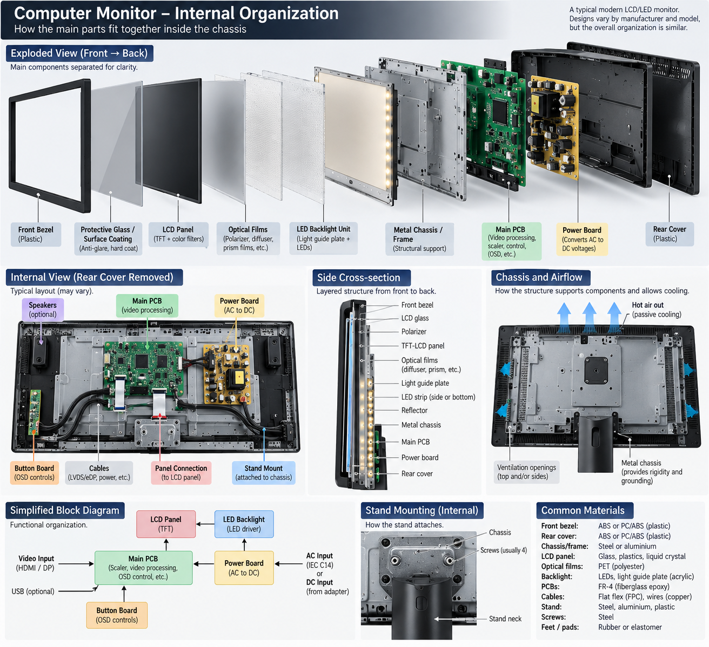
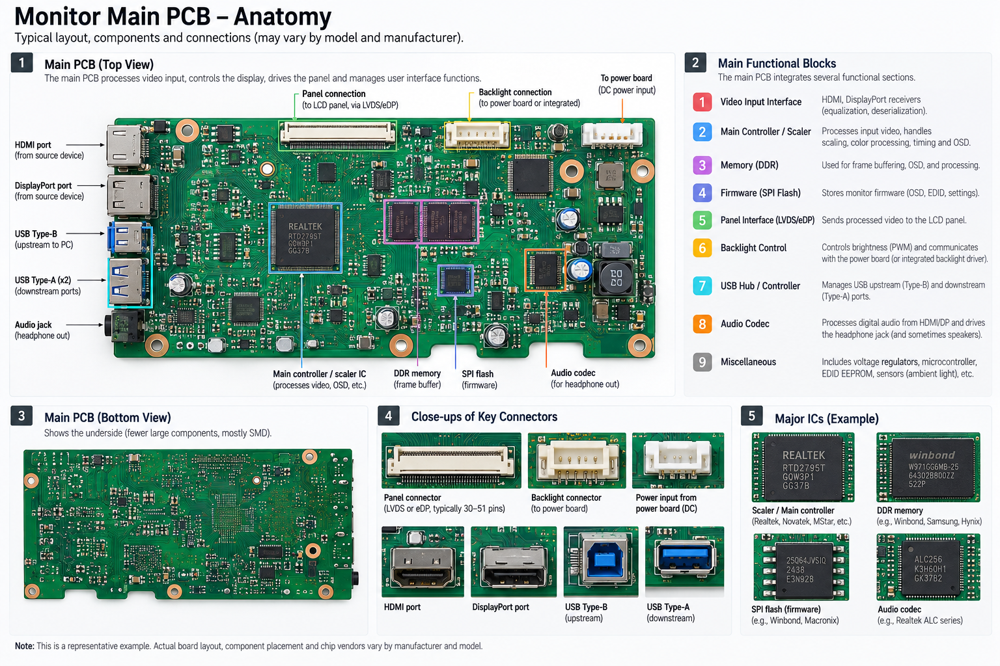
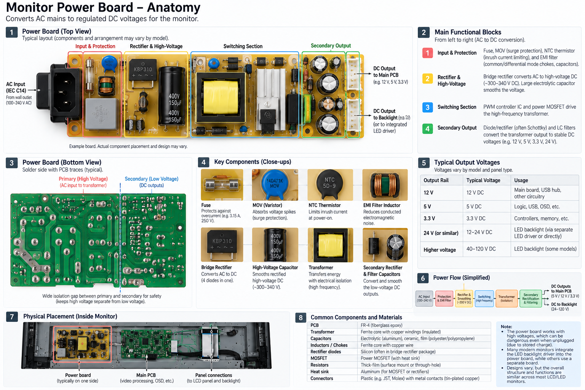

# $\fbox{Chapter 4: MONITORS}$


## **Topic - 1: External Structure**

### <u>Front Part</u>




### <u>Bottom Bezel (Controls)</u>




### <u>Rear Part</u>



- **<u>VESA</u>:** *Video Electronics Standards Association*, is a mounting-hole standard which becomes useful when purchasing consumer stands.
- **<u>OSD</u>:** *On-Screen Display*
- **<u>C14</u>:** Appliance inlet/socket
- **<u>C13</u>:** Cable connector that *C14* connects to.

```
      ┌─────────────┐        "C14"
      │   ●     ●   │        L = Line/live
      │      ●      │        N = Neutral
      └─────────────┘        PE = Protective earth
        L     N
          PE
```

- **<u>HDMI</u>:** *High-Definition Multimedia Interface*, carries digital audio & video streams.
- **<u>DP</u>:** *DisplayPort*, does same work as *HDMI*, but more optimized & standardized for PC monitors.
- **<u>USB Type-B</u>:** The other side of the USB cable, which is connected to another device.
- **<u>USB Type-A</u>:** The traditionally known side of the USB cable.


## **Topic - 2: Internal Organization**

### <u>Overview</u>



- **<u>Panel connection</u>:** Usually a *flexible flat cable* (FFC/FPC) made using protective film, copper traces, and plastic substrate.


### <u>Main PCB</u>




### <u>Power Board</u>



---
