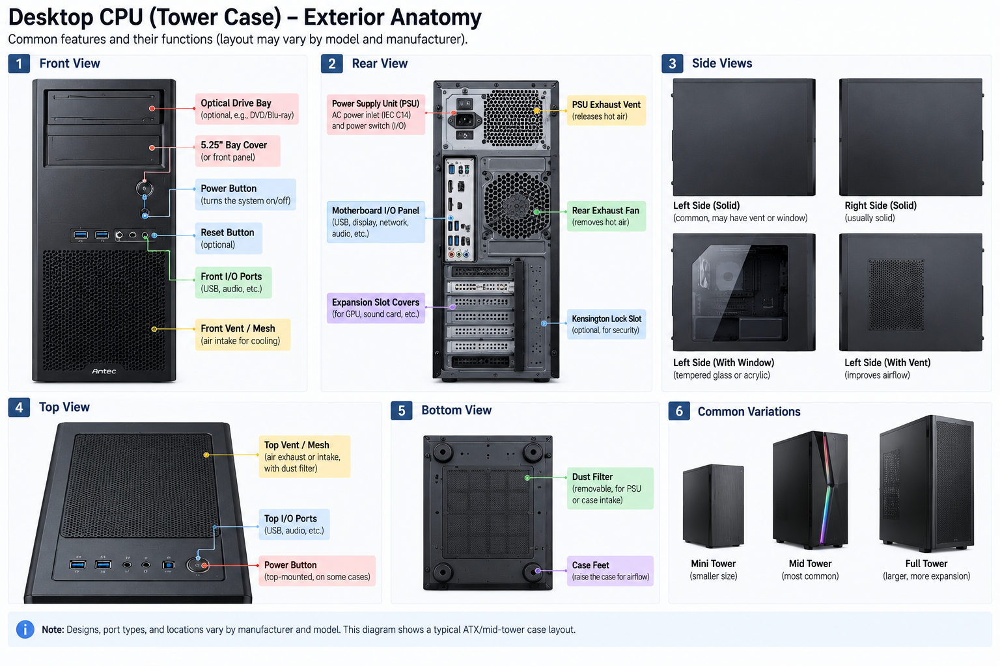
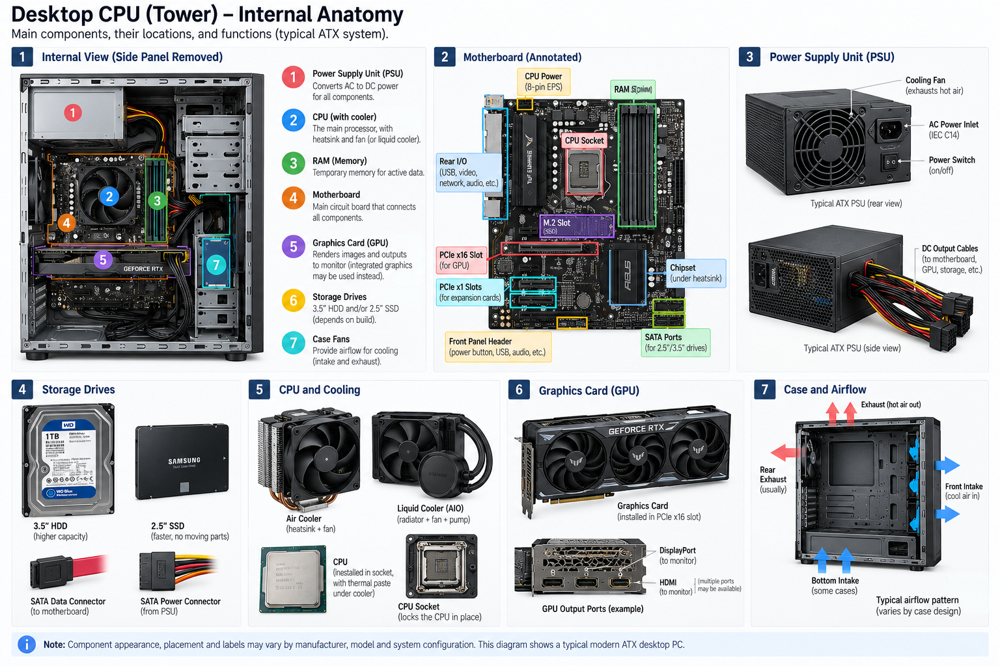
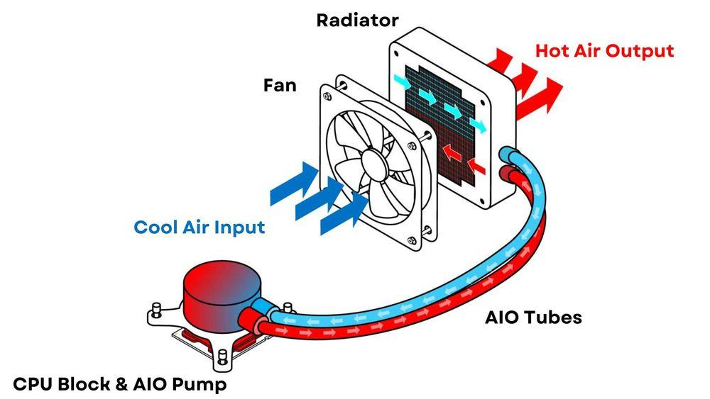

# $\fbox{Chapter 5: CENTRAL PROCESSING UNIT}$


## **Topic - 1: Exterior Design**




## **Topic - 2: CPU Internals**



- **<u>PCIe</u>:** *Peripheral Component Interconnect Express*, is a high-speed interface in CPU to connect components.
- **<u>SATA</u>:** *Serial Advanced Technology Attachment*, used for connecting storage drives with motherboard for communication.
- **<u>SATA data connector</u>:** Used for transferring data from driver to the motherboard.
- **<u>SATA power connector</u>:** Used for supplying data from *PSU* to the driver.
- **<u>Chipset</u>:** A set of I/O ports for PCIe devices.
- **<u>Heatsink</u>:** Copper & aluminum device used for transferring heat produced in CPU.
- **<u>Liquid cooler</u>:** Liquid coolant mechanism to transfer heat from CPU to the radiator.


### <u>PCIe Slots</u>

- PCIe connection is divided into lanes of different kind of slots.

```
                 CPU / Chipset
                      │
          ┌───────────┼───────────┐
          │           │           │
        x16          x4          x1
          │           │           │
        GPU        NVMe SSD    Wi-Fi card
```

- **<u>PCIe slots</u>:** Size tells the maximum lane width.

| Slot    | Typical use                                 |
| ------- | ------------------------------------------- |
| **x1**  | Wi-Fi, sound, small expansion cards         |
| **x4**  | NVMe adapters, storage/controllers          |
| **x8**  | High-bandwidth cards, some GPUs/storage     |
| **x16** | Graphics cards, high-bandwidth accelerators |

- A physically longer PCIe slot may sometimes support smaller devices.


### <u>Liquid Cooler</u>



---
