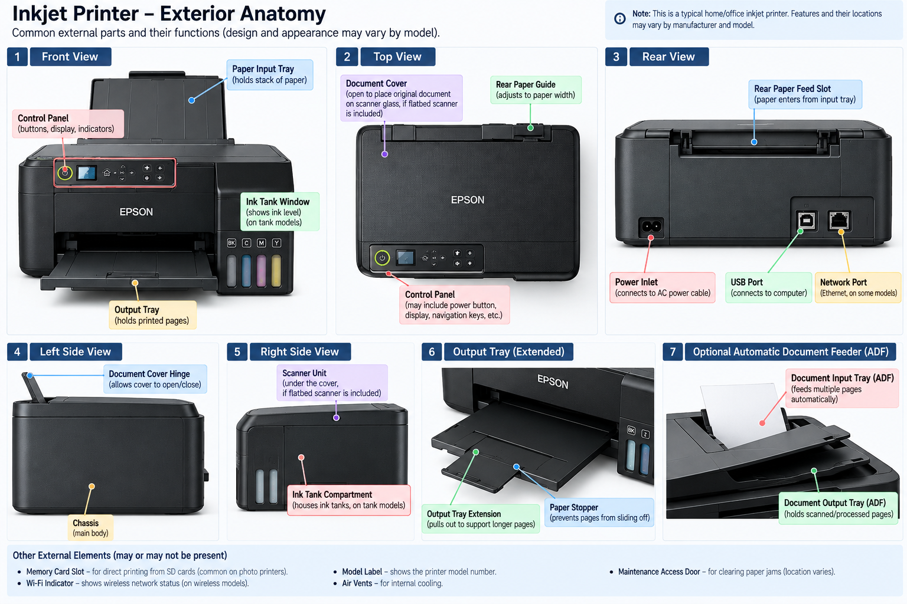
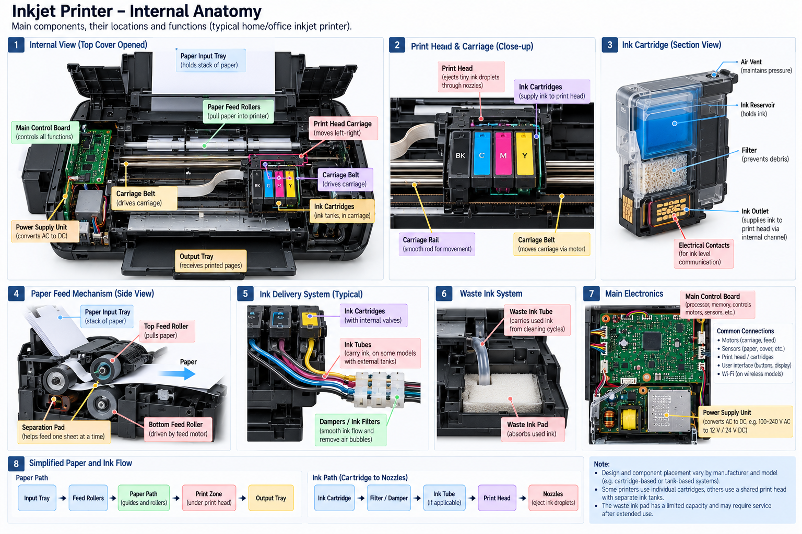

# $\fbox{Chapter 6: PRINTERS (INKJET)}$

## **Topic - 1: Exterior Anatomy**

## **Topic - 2: Internal Organization**

- **<u>Separation pad</u>:** Separates papers by keeping them in touch with its high-friction surface, sliding front paper with force less than that friction.
- **<u>Waste ink pad</u>:** Absorbs ink that is used during maintenance operations like forcing ink out of blocked holes, or removing air after cartridge is refilled.

---
