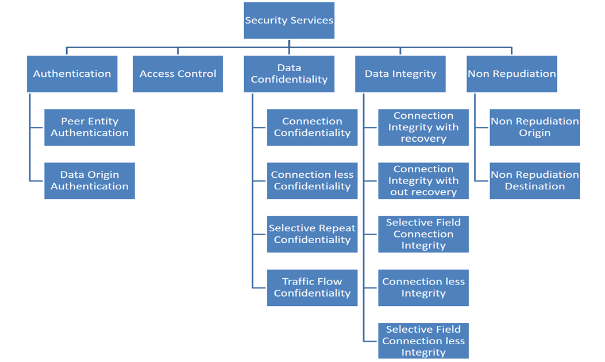
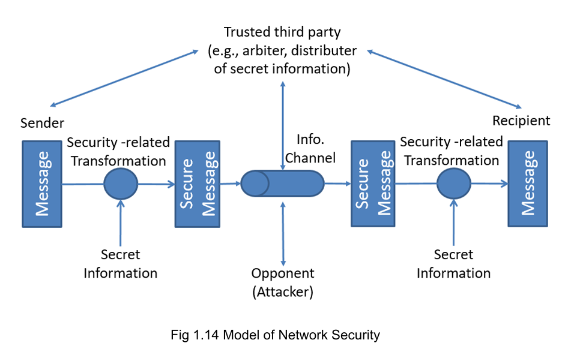

# $\fbox{Chapter 1: COMPUTER SECURITY BASICS}$

## **Topic - 1: Computer Security Concept**

### <u>Introduction</u>

- **<u>Information</u>:** Processed form of data/ meaningful data.

### <u>Objectives Of Security</u>

1. **<u>Confidentiality</u>:** Not letting unauthorized person access information.
2. **<u>Integrity</u>:** No third-party between sender & receiver.
3. **<u>Availability</u>:** Making sure that authorized users get access to information.
4. Authenticity
5. **<u>Accountability</u>:** Storing details about actions by an entity, to make sure that the consequences are clearly tied to it only.

### <u>Impact Of Security Breach</u>

- **Reduced effectiveness of primary operation -** Like leaking exam papers.
- **Financial loss -** Like cost of repairing database is very expensive.
- **Damage to assets -** Mostly when demands are not fulfilled by the victim.
- **Harm to individuals -** For personal vendetta or callousness/psychopathy.

### <u>Security Architecture</u>

- OSI focuses on security attacks, mechanisms & related services.
- **<u>OSI</u>:** Open Systems Interconnection
- **<u>Security mechanism</u>:** Preventive & recovery mechanism against attacks.
- **<u>Security services</u>:** Communication feature that allows security handlers to communicate effectively.

## **Topic - 2: Security Attacks**

### <u>Passive Attack</u>

- **<u>Passive attack</u>:** Hacker accesses the resources of system but doesn't affect anything.
- Its goal can be of accessing message, conversation or any transmission information.
- Or it could be about analyzing traffic from the victim device & judge the nature of communication.

### <u>Active Attack</u>

- **<u>Active attack</u>:** Hacker tries to make changes to the resources of system.
- **<u>Masquerade attack</u>:** An attack where attacker pretends to be an authorized user to gain unauthorized access.
- **<u>Replay attack</u>:** An attack where hacker tries to mimic transmission signature of victim, gained from its previous passive attack.
- **<u>Denial of service</u>:** In this attack, a large number of requests are made to server, blocking users from its service. Meanwhile, hackers penetrate it.

## **Topic - 3: Security Services**

### <u>Standards</u>

- ***X.8000*** standard defines all the measurements for system security.
- It is implemented of protocol layer.
- Also it ensures integrity in inter-component communication.

### <u>Services Provided</u>

## **Topic - 4: Security Mechanism**

### <u>Introduction</u>

- There are multiple mechanisms that altogether provide security.
- Cryptography is performed in each of those mechanisms.
- **<u>Specific security mechanism</u>:** Applied at specific protocol layer.
- **<u>Pervasive security mechanism</u>:** Not particularly integrated at any layer.
- **<u>Encipherment</u>:** Applying ciphers on data.
- **<u>Signature</u>:** Verifying users with electronic signatures.
- **<u>Authentication exchange</u>:** Communicators exchange some information to prove their identity.
- **<u>Traffic padding</u>:** Insertion of additional unrequired bits to confuse hackers.
- **<u>Routing control</u>:** Continuous change of communication routes to confuse hackers.
- **<u>Notarization</u>:** Using third-party services to ensure controlled communication.

### <u>Notarization Model</u>

### <u>Network Security Model</u>

- Network security model diagram represents encrypted communication between two entities.
- **<u>Plaintext</u>:** Original message
- **<u>Ciphertext</u>:** Encrypted message
- Encryption is also known as **enciphering**.
- Decryption is also known as **deciphering**.
- **<u>Cipher</u>:** Any algorithm used for encryption & decryption.
- This is also known as cryptographic system.
- **<u>Cryptanalysis</u>:** Study of decoding encrypted text without plaintext.
- **<u>Cryptology</u>:** Using both cryptography & cryptanalysis.

---
