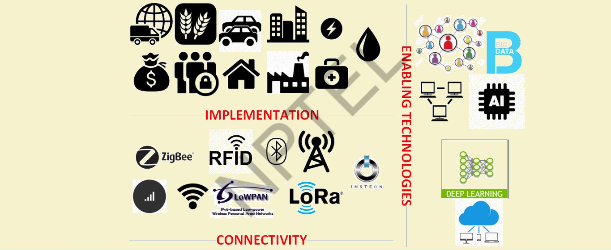

# $\fbox{Chapter 1:INRTODUCTION TO IoT}$

## **Topic - 1: Definition & Overview**

- IoT → network of devices, machines, tools connected to internet using wireless technologies  
- Scale → 9+ billion devices, expected >20 billion  
- Essence → integration of low-power embedded systems, cloud computing, big data, AI/ML, networking  
- Objective → enable communication, sensing, control across physical & digital environments

## **Topic - 2: Origin of the Term**

- Coined early 2000s (ITU Internet Report 2005)  
- Era where devices generate most internet traffic  
- Enabling technologies → RFID, Nanotechnology, Sensors, Smart Networks

## **Topic - 3: Alternative Definition (Gartner)**

- IoT → network of physical objects with embedded tech to communicate and sense/interact with internal states or external environment.

## **Topic - 4: Characteristics**

- Efficient, scalable architectures
- Unique naming & addressing
- Many sleeping, mobile, non-IP devices
- Intermittent connectivity

## **Topic - 5: IoT Market Segments**

- Business/Manufacturing → real-time analytics, automation, robotics  
- Healthcare → remote monitoring, EHR  
- Retail → smart inventory, customer analytics  
- Security → biometric locks, surveillance sensors

## **Topic - 6: Evolution of Connected Devices**

| Device           | Era      | Description                                         |
| ---------------- | -------- | --------------------------------------------------- |
| ATM              | 1974     | First online financial machine                      |
| Web              | 1991     | Revolutionized global communication                 |
| Smart Meters     | 2000s    | Remote power grid communication                     |
| Digital Locks    | 2010s    | Smartphone-based access control                     |
| Smart Healthcare | Present  | Health monitoring, emergency alerts                 |
| Smart Vehicles   | Present  | Self-diagnostics, connected systems                 |
| Smart Cities     | Emerging | Coordinated urban infrastructure                    |
| Smart Dust       | Future   | Microscopic sensors for biomedical/agricultural use |

## **Topic - 7: Modern IoT Applications**

- Urban Infrastructure → smart parking, lighting, roads, congestion control  
- Environmental Monitoring → air pollution, forest fires, radiation, floods  
- Industrial Systems → smart grid, tank level, stock monitoring  
- Public Utilities → waste management, water flow detection  
- Consumer Systems → NFC payments, smart shopping, product tracking

## **Topic - 8: IoT Enablers**

- Sensors → collect data  
- Connectivity → communication between nodes  
- Analytics → extract insights  
- Actuators → respond to sensed data  
- Cloud/Edge → process and store data

## **Topic - 9: Related Technologies**

- M2M → device-to-device communication via telecom (3G/4G/5G, satellite)  
- CPS → integration of computation with physical processes  
- WoT → integrate IoT with web using RESTful APIs, web technologies (HTML5, JS, PHP, Ruby)

## **Topic - 10: IoT vs M2M**
| Aspect | IoT | M2M |
|--------|-----|-----|
| Scope | devices, people, applications | machine-to-machine only |
| Connectivity | internet-based | telecom networks |
| Data Interaction | device↔device, device↔human | machine↔machine |
| Example | smart home system | industrial control systems |

## **Topic - 11: IoT vs WoT**

| Aspect | IoT                          | WoT                            |
| ------ | ---------------------------- | ------------------------------ |
| Focus  | networking physical entities | web integration of IoT systems |
| Layer  | network & device layer       | application/web layer          |
| Access | may not be web accessible    | RESTful API, web protocols     |

## **Topic - 12: Terminological Interdependence**

- IoT encompasses M2M, CPS, WoT  
- WoT → application-layer extension of IoT  
- M2M → device-to-device communication within IoT ecosystem

## **Topic - 13: IPv6 and Addressing**

### <u>Introduction</u>

- 20–50 billion devices → IPv4 exhaustion  
- Solution → IPv6 (128-bit, huge address space)  
- Local addressing → gateways assign LU/ULA  
- Mobility → network prefix changes handled by anchor points (Mobile IPv6)

### <u>Address Management</u>

- IoT Node → device in LAN, possibly non-IP  
- IoT Gateway → connects LAN ↔ WAN ↔ Internet  
- IoT Proxy → handles application-level translation

## **Topic - 14: IPv4 vs IPv6 Summary**

| Feature    | IPv4     | IPv6         |
| ---------- | -------- | ------------ |
| Bits       | 32       | 128          |
| Addresses  | $2^{32}$ | $2^{128}$    |
| Allocation | DHCP     | SLAAC/DHCPv6 |
| IPSec      | optional | mandatory    |
| Header     | variable | fixed        |
| Broadcast  | yes      | no           |
| Multicast  | no       | yes          |

## **Topic - 15: IoT Networking Concepts**

- IoT LAN/WAN → local/global networks  
- Gateway prefix allotment → manage local address domains  
- Multi-homing → node connected to multiple networks for redundancy  
- Transition → IPv6-over-IPv4 tunnels, translation, proxies

---
