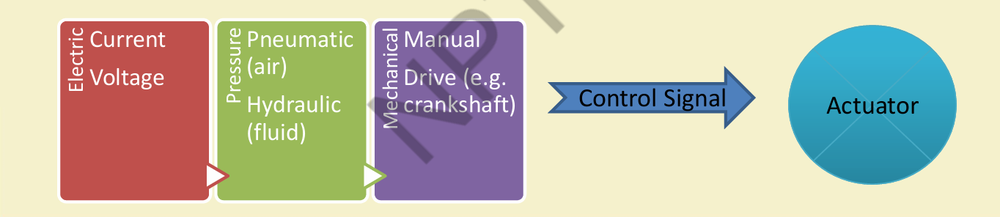

# $\fbox{Chapter 2: SENSORS, ACTUATION \& IoT NETWORKING}$

## **Topic - 1: Sensing**

- **Sensor**: Device that detects or measures a physical property and records, indicates, or responds to it.
- Converts ambient or system changes into electrical signals.
- Example: Temperature sensor converts heat → electrical signal.

## **Topic - 2: Transducers**

- Convert energy from one form to another.
- Example: In sound system – microphone (sound → electrical), amplifier (process), loudspeaker (electrical → sound).

## **Topic - 3: Sensor vs Transducer**

- **Transducer**: General term including both **sensors** (input devices) and **actuators** (output devices).
- Sensors sense energy (movement, radiation, thermal, magnetic, etc.).
- Actuators convert electrical energy to mechanical/other forms.

## **Topic - 4: Sensor Features**

- Sensitive only to measured property.
- Insensitive to unrelated properties.
- Does not affect the measured property.
- Example: Temperature sensor measures temperature only, unaffected by light/pressure.

## **Topic - 5: Sensor Resolution**

- **Resolution**: Smallest detectable change in measured quantity.
- Digital sensors: resolution limited by digital output precision.
- Higher resolution ⇒ higher precision.
- Note: Accuracy ≠ Resolution.

## **Topic - 6: Sensor Classification**

### <u>Introduction</u>

| Basis     | Types   | Description                                             |
| --------- | ------- | ------------------------------------------------------- |
| Output    | Analog  | Continuous voltage proportional to input.               |
| Output    | Digital | Discrete ON/OFF, logic 0/1 signals.                     |
| Data Type | Scalar  | Magnitude only (e.g., temperature, pressure).           |
| Data Type | Vector  | Magnitude + direction/orientation (e.g., acceleration). |

### <u>Analog Sensors</u>

- Output is continuous.
- Example: Thermocouple, thermometer.

### <u>Digital Sensors</u>

- Output is discrete (binary or byte stream).
- Example: Proximity switch, infrared detector.

### <u>Scalar Sensors</u>

- Measure magnitude only.
- Example: Thermometer, pressure gauge.

### <u>Vector Sensors</u>

- Measure magnitude + Direction.
- Example: Accelerometer (x, y, z components).

## **Topic - 7: Common Sensor Types**

| Property    | Example Sensors                  |
| ----------- | -------------------------------- |
| Light       | LDR, Photodiode                  |
| Temperature | Thermistor, Thermocouple         |
| Force       | Strain Gauge, Pressure Switch    |
| Position    | Potentiometer, Encoder           |
| Speed       | Doppler Sensor, Opto-coupler     |
| Sound       | Microphone, Piezoelectric Sensor |
| Chemical    | Gas Sensor, Liquid Sensor        |

## **Topic - 8: Sensorial Deviations**

### <u>Introduction</u>

- **Full-scale range**: Min–max measurable values.
- **Sensitivity error**: Actual sensitivity ≠ specified.
- **Offset (bias)**: Constant deviation in output.

### <u>Other Errors</u>

- **Non-linearity**: Output deviates from ideal straight line.
- **Drift**: Slow change in output independent of input (long-term aging).
- **Noise**: Random signal fluctuations.
- **Hysteresis**: Output depends on previous input values.
- **Quantization error**: Due to discrete digital output.
- **Dynamic error**: From low sampling rate.
- **Aliasing**: Input or noise frequency ≈ sampling frequency.
- **Cross-sensitivity**: Response to non-measured parameters (e.g., temperature influence).

## **Topic - 9: Actuation**

### <u>Definition</u>

- **Actuator**: Device converting control signals + energy → mechanical motion.
- Executes control system decisions physically.

### <u>Key Elements</u>

- Control signal (input)
- Power source (energy)
- Mechanical motion (output)

## **Topic - 10: Actuator Types**

| Type | Working Principle | Example |
|-------|--------------------|----------|
| Hydraulic | Liquid pressure → motion | Hydraulic press, engine piston |
| Pneumatic | Compressed air → motion | Air brakes, valve control |
| Electrical | Motor/solenoid → motion | Electric bell, motor valve |
| Thermal/Magnetic | Energy via heat/magnetic field | SMA coil gun, piezomotor |
| Mechanical | Gear/pulley motion | Rack & pinion, crankshaft |
| Soft Actuators | Polymer-based flexible motion | Agricultural/biomedical tools |

## **Topic - 11: Specialized Actuator Materials**

### <u>Shape Memory Polymers (SMP)</u>

- Respond to light, heat, pH, or moisture.
- Lightweight, biocompatible, biodegradable.

### <u>Light Activated Polymers (LAP)</u>

  - Subtype of SMPs triggered by light.
  - Enable remote, contactless control.

## **Topic - 12: Basics of IoT Networking – Part I**

### <u>IoT Components</u>

1. **Device (Thing)** – Sensor/actuator nodes.
2. **Local Network** – Connects things to gateway.
3. **Internet** – Transmits data globally.
4. **Backend Services** – Processing and storage.
5. **Applications** – User-facing systems.

### <u>Functional Components</u>

- Interaction/communication among IoT devices.
- Data processing and analysis.
- Internet interaction and web service handling.
- Application service integration.
- User interface.

### <u>Example IoT Implementation</u>

$$ \text{Sensor mote → Gateway → Proxy server → Cloud → Analytics → Actuation} $$

## **Topic - 13: IoT Categories**

- **Industrial IoT (IIoT)**: Uses global IP communication.
- **Consumer IoT (CIoT)**: Local networks (Bluetooth, Zigbee, WiFi) with gateways.

## **Topic - 14: Related IoT Technologies**

- Big Data, Cloud, Smart Grid, Internet of Vehicles (IoV), M2M, Telemedicine, Cyber-Physical Systems (CPS), SDN, 5G.

## **Topic - 15: IoT Challenges**

- Interfacing, Interoperability, Data Storage, Data Analytics.
- Complexity management (e.g., SDN).
- Security, Scalability, Energy Efficiency, Bandwidth management.
- Modeling and Analysis.

## **Topic - 16: Network Complexity Considerations**

### <u>Introduction</u>

- Communication tech defines hardware/cost.
- No single paradigm fits all IoT use cases.

### <u>Network Challenges</u>

- Growth of nodes
- Device interference
- Network heterogeneity
- Protocol standardization

## **Topic - 17: Wireless Networks in IoT**

- Management of traffic & load.
- Support for PANs, WBANs.
- Address interoperability and overlay networks.

## **Topic - 18: Scalability**

- Flexibility within Internet.
- Integration of IoT.
- Large-scale deployment and real-time connection of billions of devices.

---
