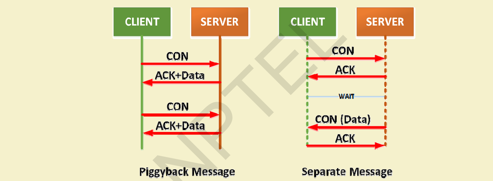
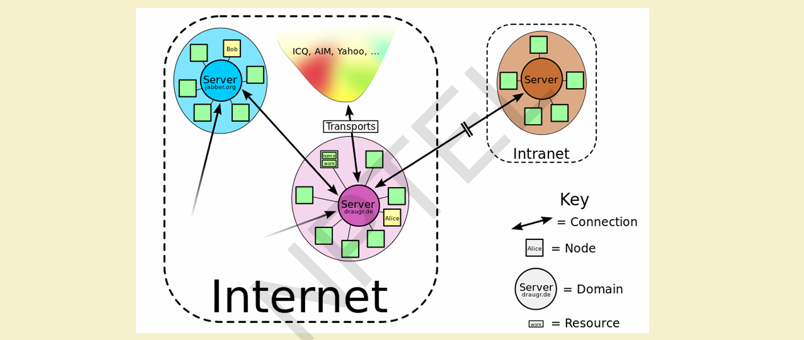
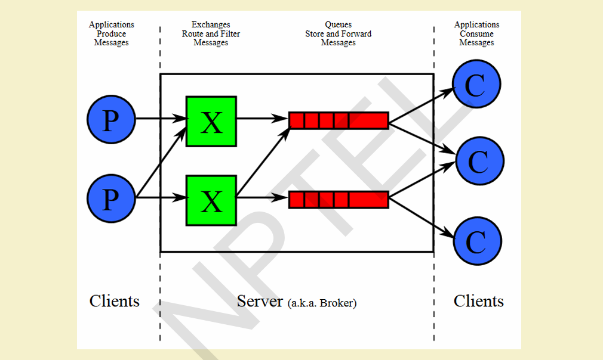

# $\fbox{Chapter 3: IoT CONNECTIVITY TECH \& PROTOCOLS}$

## **Topic - 1: IEEE 802.15.4**

### <u>Overview</u>

- Low‐data‐rate Wireless Personal Area Network (WPAN) standard.
- Targeted for low‐power, short‐range communication (10m–75m typical).
- Operates in **ISM band**.
- Layers used: PHY, MAC, LLC, SSCS.

### <u>Key Features</u>

- DSSS modulation → noise‐tolerant
- **Low duty cycle (<1%)** ⇒ power efficient
- **BPSK** for low data rate; **O‐QPSK** for high data rate.
- **CSMA/CA** → collision avoidance.
- Topologies supported: **Star, Mesh**.
- **Variants**: A/B (base), C (China), D (Japan), E (Industrial), F (Active RFID), G (Smart Grid).

## **Topic - 2: ZigBee**

### <u>Core Concept</u>

- Extension of IEEE 802.15.4 (adds upper layers: network & application).
- Focus: **mesh-based wireless sensor networks**.

### <u>Components</u>

- **ZigBee Device Object (ZDO)** – device management, security.
- **Application Support Sub-layer (APS)** – interfacing between layers.

### <u>Topologies</u>

- **Star**, **Tree**, and **Mesh** (self-healing, self-configuring).

### <u>Node Types</u>

| Type                 | Role                                             |
| -------------------- | ------------------------------------------------ |
| **Coordinator (ZC)** | Root, forms network, stores routing info & keys. |
| **Router (ZR)**      | Relays data, runs applications.                  |
| **End Device (ZED)** | Talks only to parent, low power, minimal memory. |

### <u>Network Layer</u>

- Uses **AODV routing** (Ad Hoc On-Demand Distance Vector).
- Broadcasts route requests → low-cost unicast path formation.

### <u>Applications</u>

- Smart homes, energy systems, building automation, healthcare, lighting control.

## **Topic - 3: 6LoWPAN**

### <u>Introduction</u>

- IPv6 over Low-Power Wireless Personal Area Networks.
- Designed by IETF (RFC 4919, RFC 5933).
- Enables IPv6 packets over IEEE 802.15.4 links via header compression.

### <u>Features</u>

- Transports **128-bit IPv6 addresses** over constrained networks.
- Uses **header compression + address translation**.
- Common uses: IoT, Smart Grids, M2M systems.

### <u>Addressing</u>

- **64-bit Extended Address**: globally unique.
- **16-bit Short Address**: PAN-specific.
- IPv6 multicast unsupported → uses link-layer broadcasts.

### <u>Packet & Header Types</u>

| Header Type                | Description                  |
| -------------------------- | ---------------------------- |
| **Dispatch Header**        | Identifies next header type. |
| **Mesh Addressing Header** | Supports hop-by-hop routing. |
| **Fragmentation Header**   | Splits long datagrams.       |

### <u>Routing Protocols</u>

- **LOADng** (AODV-derived, route discovery & error reporting).
- **RPL** (Routing Protocol for Low Power and Lossy Networks)
  - Distance-vector, proactive + reactive.
  - Supports confidentiality, loop detection, optimization by energy/latency.

## **Topic - 4: RFID (Radio Frequency Identification)**

### <u>Concept</u>

- Identification using encoded **RF signals**.
- Similar to barcodes, but no line-of-sight required.

### <u>Components</u>

- **Tag** (with IC + antenna).
- **Reader** (interrogator).
- **Database** (data storage and processing).

### <u>Types of Tags</u>

| Type        | Power Source             | Example          |
| ----------- | ------------------------ | ---------------- |
| **Passive** | Powered by reader signal | Inventory, cards |
| **Active**  | Own power supply         | Asset tracking   |

### <u>Applications</u>

- Inventory & asset tracking, access control, ID badges, supply chain, anti-counterfeiting.

## **Topic - 5: MQTT (Message Queue Telemetry Transport)**

### <u>Overview</u>

- Lightweight **publish–subscribe** protocol over TCP/IP.
- Designed for low-bandwidth, high-latency networks.
- Introduced by IBM (1999), standardized by OASIS (2013).

### <u>Components</u>

| Component      | Role                                              |
| -------------- | ------------------------------------------------- |
| **Publisher**  | Sends messages on a topic.                        |
| **Subscriber** | Receives messages of subscribed topics.           |
| **Broker**     | Routes messages between publishers & subscribers. |

### <u>Methods</u>

- `CONNECT`, `DISCONNECT`, `PUBLISH`, `SUBSCRIBE`, `UNSUBSCRIBE`.

### <u>Topics</u>

- Hierarchical structure: e.g., `home/livingroom/temp`.
- Supports wildcards: `+` (single level), `#` (multi-level).

### <u>Security</u>

- **SMQTT**: Secure MQTT – encryption with attribute-based encryption (setup, encrypt, publish, decrypt stages).

### <u>Applications</u>

- Used in **Facebook Messenger**, **AWS IoT**, **Azure IoT Hub**, **Adafruit IO**.

## **Topic - 6: CoAP (Constrained Application Protocol)**

### <u>Overview</u>

- Lightweight **RESTful protocol** over **UDP** for M2M communication.
- Created by IETF CoRE group.

### <u>Architecture</u>

- Two sub-layers: **Messaging** (reliability) and **Request/Response** (communication).

### <u>Message Types</u>

- Confirmable, Non-confirmable, Piggyback, Separate.

### <u>Features</u>

- Reduced overhead, simple caching, resource discovery, push notifications.
- CoAP supports `GET`, `POST`, `PUT`, `DELETE`.

## **Topic - 7: XMPP (Extensible Messaging and Presence Protocol)**

### <u>Overview</u>

- XML-based, real-time communication protocol.
- Decentralized client–server model.
- Open and extensible; supports peer-to-peer and machine communication.

### <u>Core Technologies</u>

| Module          | Function               |
| --------------- | ---------------------- |
| Core            | XML streaming          |
| Jingle          | Voice/video signaling  |
| Multi-user Chat | Group communication    |
| PubSub          | Alerts & notifications |
| BOSH            | HTTP binding for XMPP  |

### <u>Features</u>

- Secure, flexible, open, decentralized.

### <u>Weaknesses</u>

- No QoS, text-based overhead, base64 encoding needed for binary data.

### <u>Applications</u>

- IoT communication, VoIP signaling, gaming, smart grids, social networking.

## **Topic - 8: AMQP (Advanced Message Queuing Protocol)**

### <u>Overview</u>

- Binary, open standard for enterprise-level messaging.
- Provides reliable communication between applications.
- ISO/IEC 19464.

### <u>Components</u>

| Component    | Function                             |
| ------------ | ------------------------------------ |
| **Exchange** | Routes incoming messages.            |
| **Queue**    | Buffers messages per consumer group. |
| **Binding**  | Defines routing rules.               |

### <u>Message Delivery Modes</u>

- At-most-once, At-least-once, Exactly-once.

### <u>Frame Types</u>

- Open, Begin, Attach, Transfer, Flow, Disposition, Detach, End, Close.

### <u>Features</u>

- QoS, persistence, routing flexibility, interoperability, multi-consumption support.

### <u>Applications</u>

- Enterprise message systems, asynchronous servers, distributed processing, data replication.

---
