# $\fbox{Chapter 4: SENSOR NETWORKS}$

## **Topic - 1: WirelessHART**

### <u>Overview</u>

- Successor of **HART (Highway Addressable Remote Transducer)** protocol.
- Designed for **smart field device networking**.
- **Wireless extension** → cheaper, easier, more flexible installations.

### <u>Characteristics</u>

- Operates in **2.4 GHz ISM band**, 15 channels.
- Derived from **IEEE 802.15.4**.
- **Collision‐free TDMA communication** using superframes (10 ms slots).
- **Channel hopping & blacklisting** for reliability and interference avoidance.
- Mesh‐based networking: each device forwards packets.

### <u>Layers</u>

| Layer             | Function                                               |
| ----------------- | ------------------------------------------------------ |
| Physical          | Frequency hopping, 2.4 GHz band                        |
| Data Link         | TDMA, superframes, channel management                  |
| Network/Transport | Mesh routing, session handling, security               |
| Application       | Command–response exchange between gateways and devices |

### <u>Network Manager</u>

- Central control for time‐slot and frequency allocation.
- Prevents unauthorized joins.
- Maintains topology, link quality, and neighbor info.

### <u>Comparison: WirelessHART vs ZigBee</u>

| Feature         | WirelessHART        | ZigBee                           |
| --------------- | ------------------- | -------------------------------- |
| Channel Hopping | After every message | Network‐wide hopping             |
| MAC             | TDMA                | CSMA/CA                          |
| Topology        | Mesh (true)         | Tree (semi‐mesh)                 |
| Compatibility   | Backward‐compatible | Multiple non‐compatible versions |

## **Topic - 2: NFC (Near Field Communication)**

### <u>Concept</u>

- Short‐range, RFID‐based wireless communication.
- Works through **magnetic induction** between coils.
- Designed for **<20 cm** proximity communication.

### <u>Operation</u>

1. Reader emits magnetic field.
2. Target coil receives & converts to electrical impulses.
3. Data (ID, status, etc.) exchanged.

### <u>Types</u>

| Type        | Example     | Description                        |
| ----------- | ----------- | ---------------------------------- |
| **Passive** | NFC tags    | Read‐only; uses energy from reader |
| **Active**  | Smartphones | Two‐way communication, own power   |

### <u>Modes</u>

| Mode               | Description                     |
| ------------------ | ------------------------------- |
| **Peer‐to‐Peer**   | Exchange between active devices |
| **Read/Write**     | Read data from NFC tags         |
| **Card Emulation** | Acts like contactless smartcard |

### <u>Technical Specs</u>

- Frequency: **13.56 MHz**
- Data rates: **106 / 212 / 424 Kbps**
- Range: **<20 cm**
- Tag memory: **96–512 bytes**

### <u>Applications</u>

- Payments, ticketing, info tags, parcel tracking, gaming, automation.

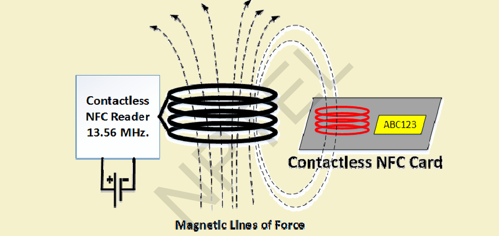

## **Topic - 3: Bluetooth**

### <u>Overview</u>

- Short‐range wireless communication for cable replacement.
- Based on **ad‐hoc piconets** (1 master, ≤7 slaves).

### <u>Features</u>

- **Frequency:** 2.4–2.485 GHz ISM.
- **Hopping rate:** 1600 hops/sec.
- **Data rate:** 1 Mbps (v1.2), 3 Mbps (v2.0+EDR).

#### Range:

- Class 3 → 1m
- Class 2 → 10m
- Class 1 → 100m

### <u>Connection Setup</u>

1. **Inquiry** → Device discovery.
2. **Paging** → Connection formation.
3. **Connection** → Active or sleep modes.

### <u>Device Modes</u>

| Mode   | Function                   |
| ------ | -------------------------- |
| Active | Transmitting/receiving     |
| Sniff  | Low‐power listening        |
| Hold   | Sleep with periodic wake   |
| Park   | Inactive until reactivated |

### <u>Protocol Stack Layers</u>

- **Baseband** – Physical layer, handles links, packets, paging.
- **L2CAP** – Multiplexing, segmentation/reassembly, group abstractions.
- **RFCOMM** – Serial port emulation, reliable data stream.
- **SDP** – Service discovery & capability advertisement.

### <u>Network Structures</u>

| Type           | Description                                  |
| -------------- | -------------------------------------------- |
| **Piconet**    | One master + ≤7 slaves                       |
| **Scatternet** | Interconnected piconets via bridging devices |

### <u>Applications</u>

- Audio devices, smartphones, automation, toys, wearables, sensors.

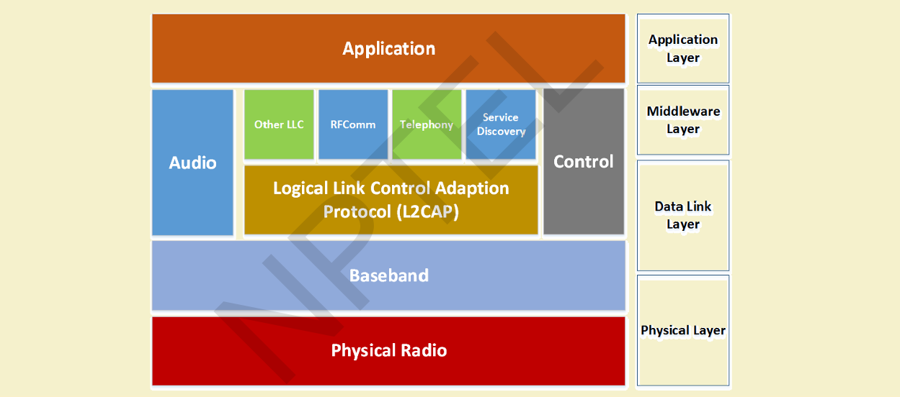

## **Topic - 4. Z‐Wave**

### <u>Overview</u>

- RF‐based home automation protocol.
- Operates around **900 MHz** (region‐specific frequency bands).
- **Mesh topology** (supports up to 232 nodes).

### <u>Key Points</u>

- **Modulation:** GFSK (Gaussian Frequency Shift Keying).
- **Encoding:** Manchester.
- **Controller:** Central node assigns network/node IDs.
- **Static routing:** Source‐based mesh; mobile devices excluded.

### <u>Global Frequency Bands</u>

| Region | Frequency (MHz) |
| ------ | --------------- |
| India  | 865.2           |
| Europe | 868.42          |
| USA    | 908.4, 916.0    |
| Japan  | 922.0–926.0     |

### <u>Features</u>

- Reliable, user‐friendly, bypasses obstacles using message “Healing”.
- Each network has 1 **Home ID** + multiple **Node IDs**.

### <u>Comparison: ZigBee vs Z‐Wave</u>

| Aspect    | ZigBee  | Z‐Wave        |
| --------- | ------- | ------------- |
| Frequency | 2.4 GHz | ~900 MHz      |
| Range     | Shorter | Longer        |
| Cost      | Lower   | Higher        |
| Setup     | Complex | User‐friendly |

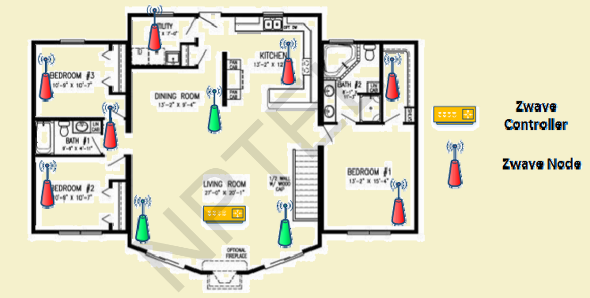
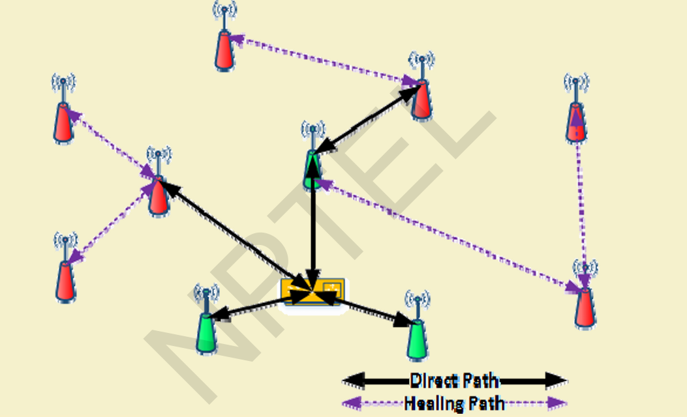

## **Topic - 5: ISA100.11a**

### <u>Overview</u>

- Industrial wireless automation standard (by **ISA**).
- Targets **large‐scale industrial plants**.
- Supports **native + tunneled** application layers.

### <u>Architecture</u>

- Network/Transport: **IPv6 over TCP/UDP**.
- Data link: **Mesh routing**, **frequency hopping**.
- Physical: **IEEE 802.15.4**.
- Topologies: Star/tree, Mesh.

### <u>Features</u>

- Supports multiple networks: Radio, Ethernet, fieldbus.
- Application Support Layer enables **object-based communication**.
- Legacy data tunneling supported.

### <u>Functional Elements</u>

| Symbol | Meaning            |
| ------ | ------------------ |
| RD     | Routing Device     |
| NRD    | Non‐Routing Device |
| H      | Handheld Device    |
| B      | Backbone Device    |

### <u>Strengths</u>

- Flexibility & multi‐protocol support.
- Reliability (error detection, hopping).
- Determinism (TDMA, QoS).
- Built‐in security (authentication, confidentiality).

### <u>Security Model</u>

#### Each node performs:

- **Link‐layer encryption (per‐hop).**
- **Transport‐layer peer security.**

#### Network security manager:

- Network Security Manager distributes keys.

### <u>Usage Classes</u>

| Class | Type       | Description                             |
| ----- | ---------- | --------------------------------------- |
| 0     | Safety     | Emergency, always critical              |
| 1     | Control    | Closed‐loop regulatory (often critical) |
| 2     | Control    | Supervisory (non‐critical)              |
| 3     | Control    | Open‐loop, human‐in‐loop                |
| 4     | Monitoring | Alerts, short-term consequences         |
| 5     | Logging    | Data recording, no immediate effect     |

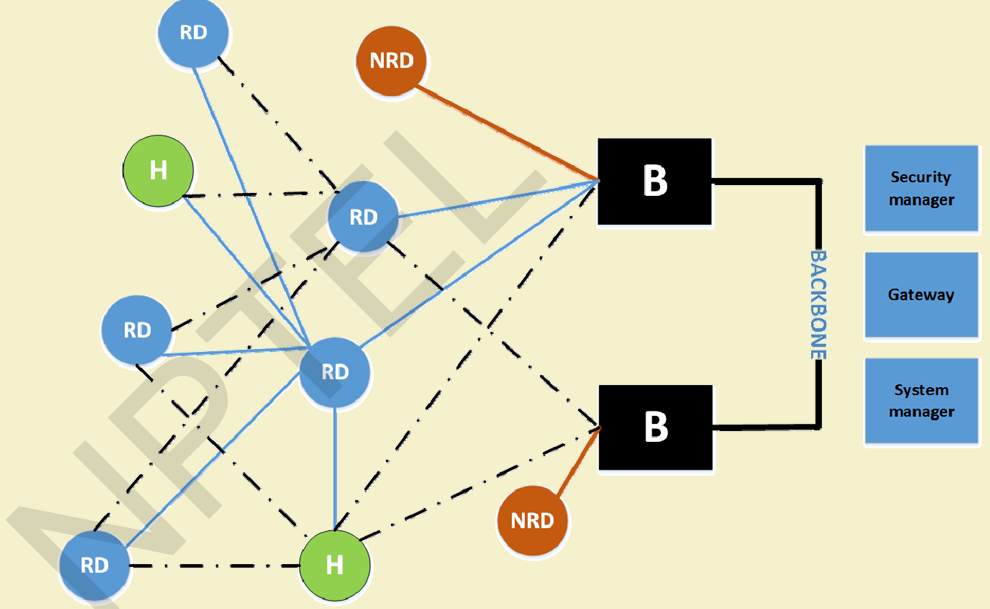

## **Topic - 6: Wireless Sensor Networks (WSNs)**

### <u>Concept</u>

- Composed of many distributed sensor nodes that **sense, process, and forward** environmental data.
- Nodes collaborate via **multi-hop paths** to transmit data to sink.

### <u>Node Design</u>

- **Components:** Sensing unit, processing unit, transceiver, power unit.
- **Characteristics:** Multifunctional, low-power, limited lifetime, small form factor (<1 cm³).
- **Typical OS:** TinyOS.

### <u>Applications</u>

- Environmental: temperature, humidity, vibration.
- Industrial: soil, air pressure, light.
- Healthcare & security systems.

### <u>Detection Models</u>

- Single/Multiple Source $\times$ Single/Multiple Object detection frameworks.

### <u>Challenges</u>

- **Scalability:** Throughput ∝ 1/N.
- **QoS:** Bandwidth, jitter, packet loss under RF variability.
- **Energy Efficiency:** Limited battery power, relaying overhead.
- **Security:** Vulnerability to attacks, interference, eavesdropping.

### <u>Sensor Web Architecture</u>

- Web services for remote sensing systems are O&M, SensorML, TML, SOS, SPS, SAS, WNS.

### <u>Cooperation in Sensor Networks</u>

- **Relay-based communication** among energy-constrained nodes.
- Balance between **cooperation vs selfishness** for throughput & energy.

### <u>Security in Cooperation</u>

- Open, dynamic topology.
- No central authority → risk of infiltration, false routing, and malicious nodes.

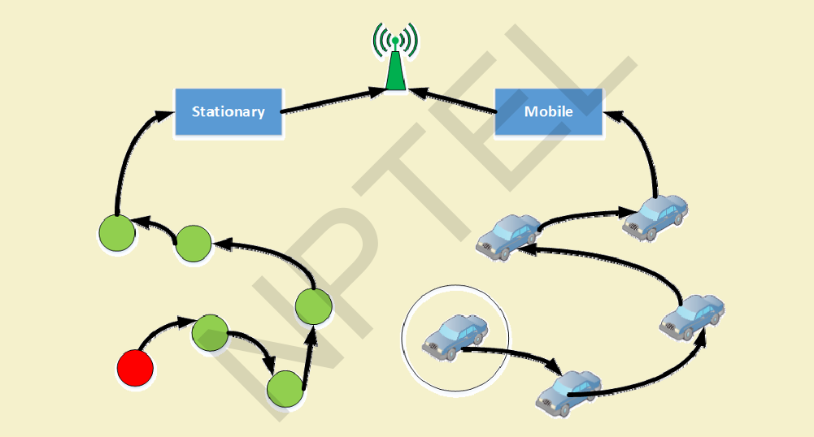

## **Topic - 7: Node Behavior in WSNs**

### <u>Types</u>

| Category     | Example Behavior             |
| ------------ | ---------------------------- |
| Normal       | Performs as expected         |
| Failed       | Power or hardware failure    |
| Badly Failed | Sends false routing info     |
| Selfish      | Drops packets to save energy |
| Malicious    | Intentional disruption       |

### <u>Dynamic Misbehavior: Dumb Nodes</u>

- Temporary due to environmental conditions (heat, rain, fog).
- Restored once environment normalizes.
- Detection & re‐establishment via **CoRD** and **CoRAD**.

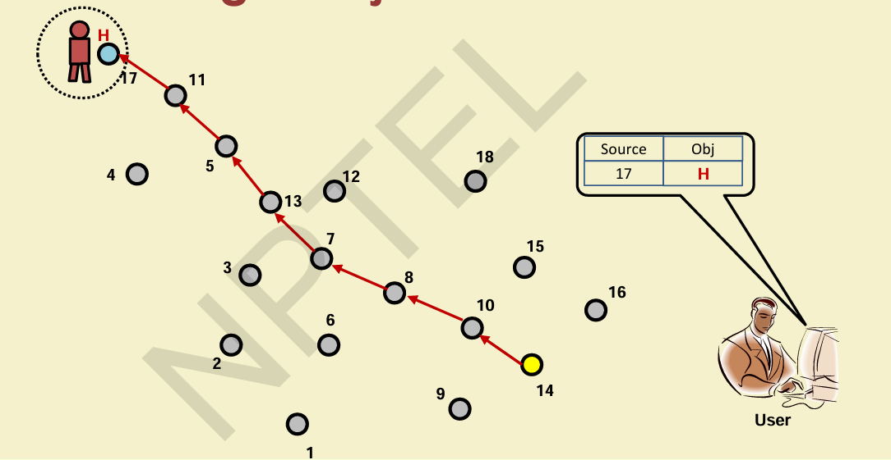
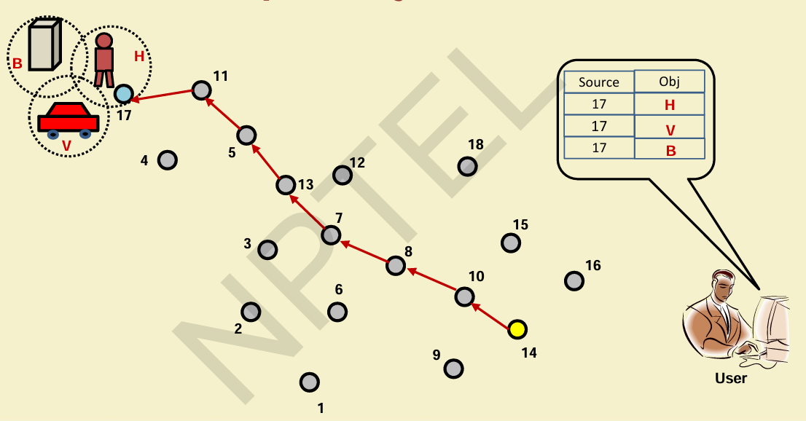
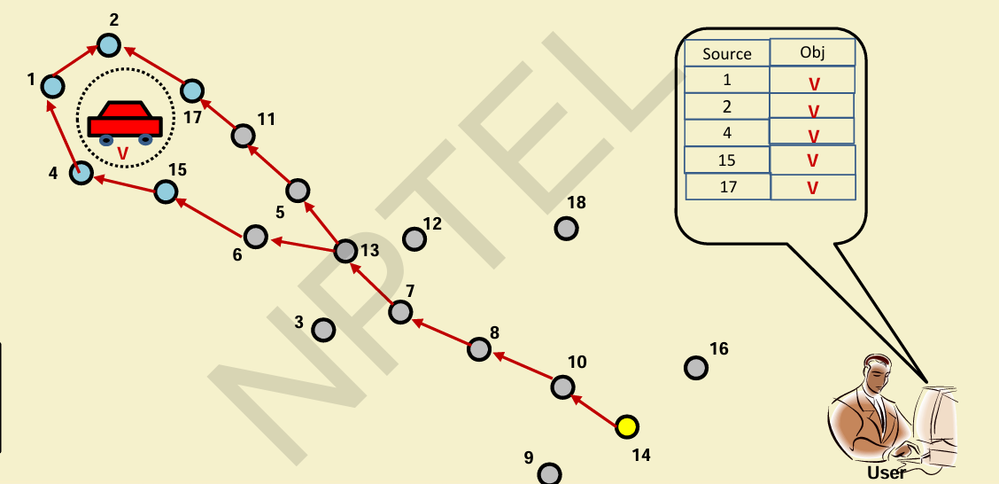
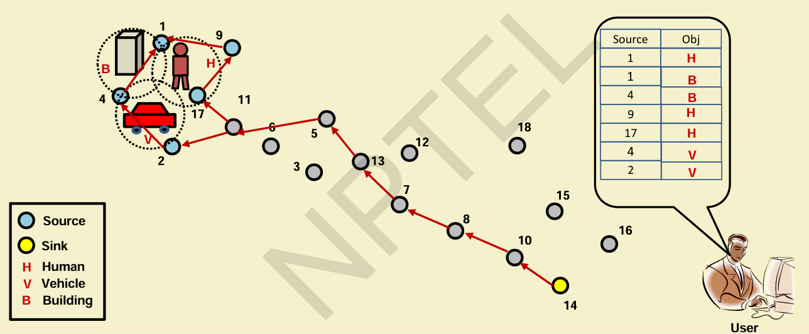
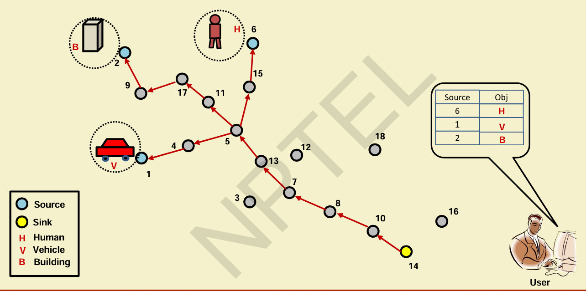

## **Topic - 8: Advanced Topics in WSNs**

### <u>Event-Aware Topology Management</u>

- Detect, monitor, and adapt to event state changes (location, area, duration).

### <u>Information-Theoretic Self-Management (InTSeM)</u>

- Adjust node sleep times based on transmission rate.
- Reduces energy consumption of transmitters and relays.

### <u>Social Sensing in WSNs</u>

- Duty-cycle adjustment based on social data to detect rare events.
- Uses **probabilistic learning automata** to modify sensing activity.

### <u>Applications</u>

- **Mines:** Fire monitoring using WSN simulation models.

#### Healthcare:

  - **WBANs** for patient monitoring.
  - **Social-choice–based aggregation** for fairness.
  - **Fuzzy + MDP** optimization for energy efficiency.
  - **Priority-based time-slot allocation (PATS)** for emergencies.

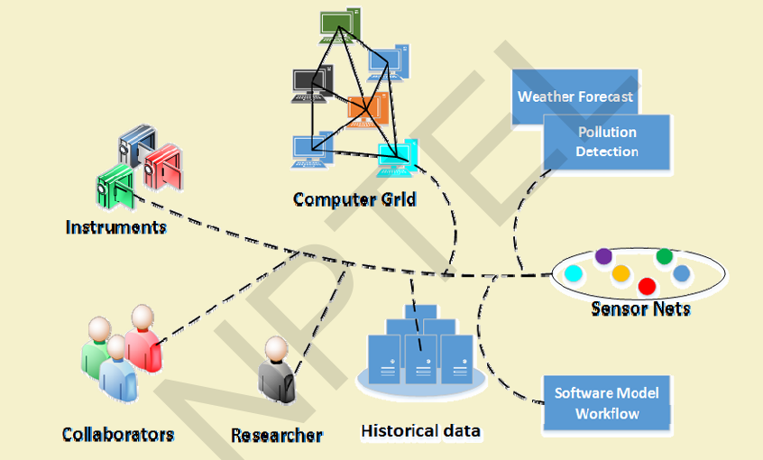
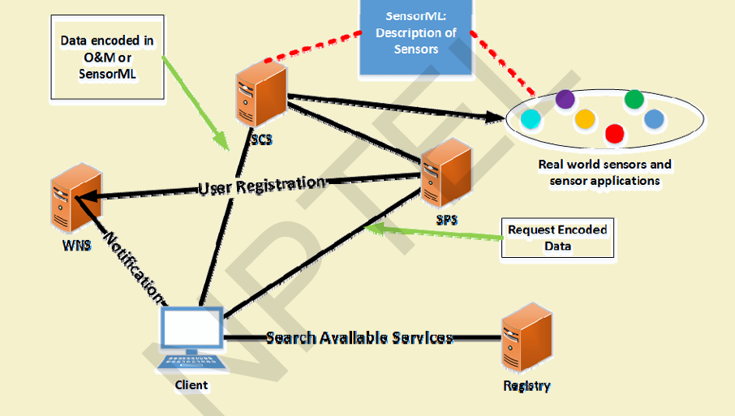

---
