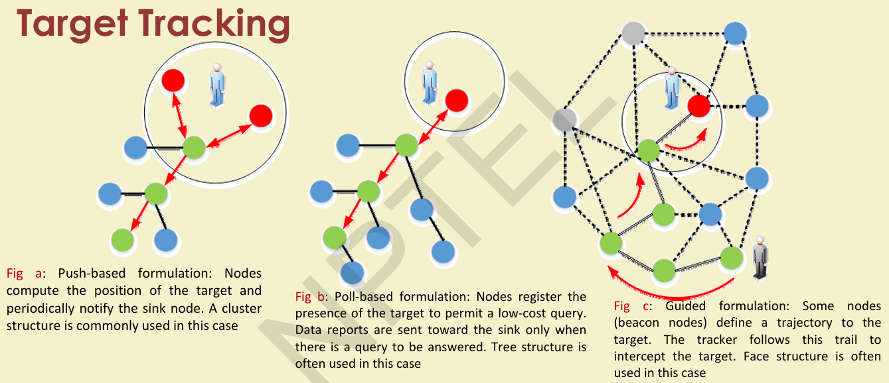
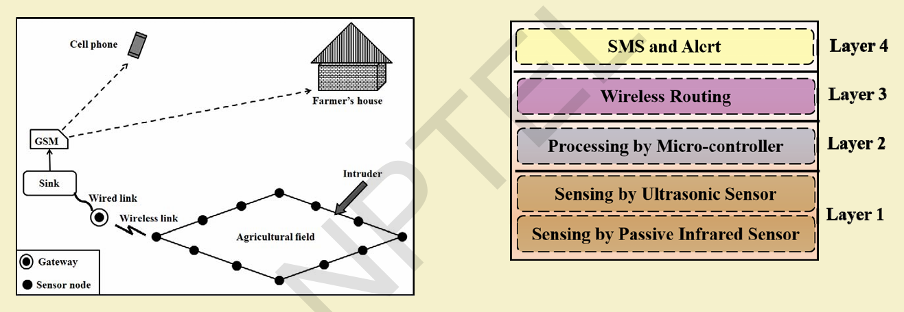
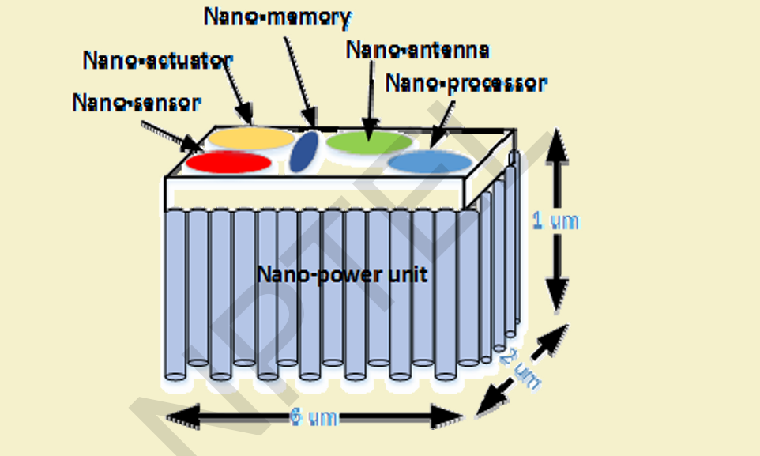
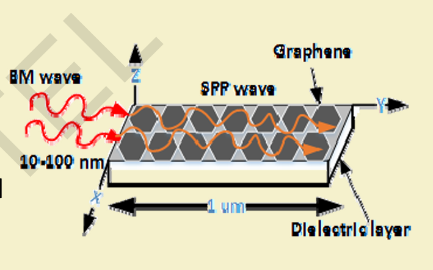
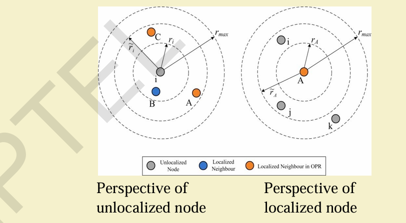
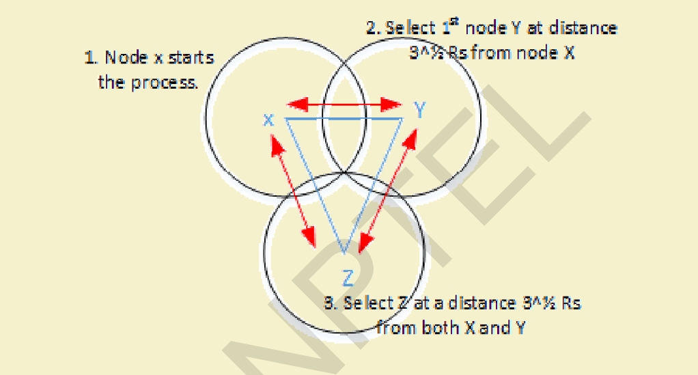
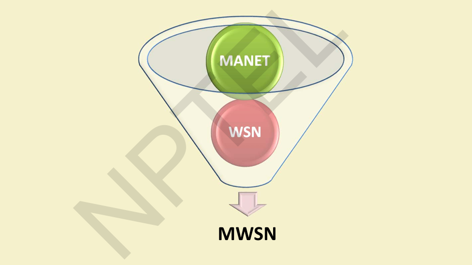
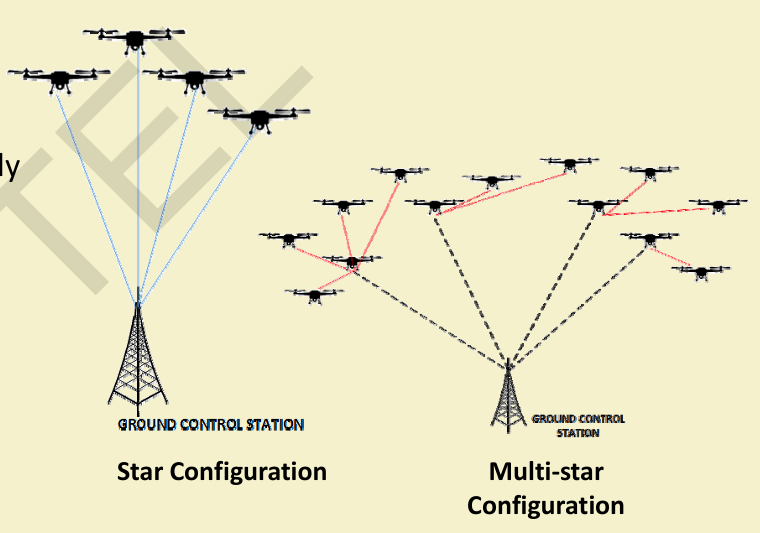
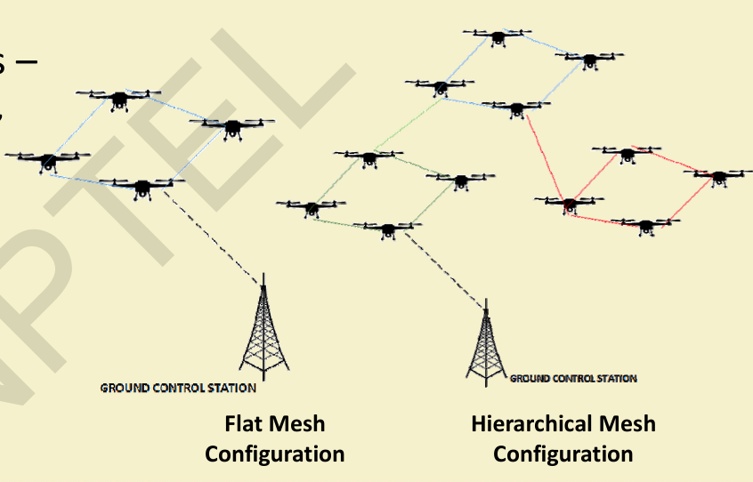
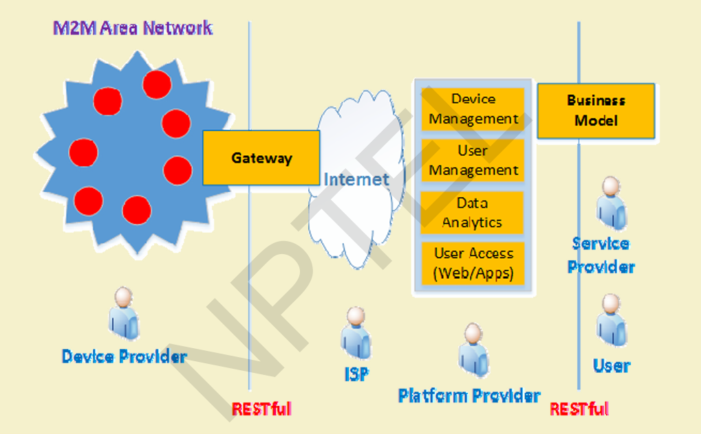

# $\fbox{Chapter 5: ADVANCED SENSOR NETWORKS}$

## **Topic - 1: Target Tracking in WSNs**

### <u>Objective</u>

- Detect, monitor, and track movement of targets across a sensor field.

### <u>Types</u>

| Formulation    | Description                                                  | Common Topology |
| -------------- | ------------------------------------------------------------ | --------------- |
| **Push-based** | Nodes compute target position and periodically notify sink.  | Cluster         |
| **Poll-based** | Nodes register target presence and report only when queried. | Tree            |
| **Guided**     | Beacon nodes define trajectory to intercept the target.      | Face            |

## **Topic - 2: WSNs in Agriculture**

### <u>AID: Agricultural Intrusion Detection Prototype</u>

- Field deployed with sensor nodes containing **PIR sensor**, **ultrasonic sensor**.
- **PIR sensor** → detects object entry at field boundary.
- **Ultrasonic sensor** → measures distance to object.
- **Objective:** Detect intrusion, classify and locate objects.

### <u>Applications</u>

- Crop protection, farm surveillance, livestock monitoring.

## **Topic - 3: Wireless Multimedia Sensor Networks (WMSNs)**

### <u>Concept</u>

- Integrates **camera (CS)** and **scalar (SS)** sensor nodes.
- CS: capture visual/audio data; resource-heavy, directional.
- SS: sense scalar data (temp, vibration, light); omni-directional.

### <u>Applications</u>

- Surveillance, habitat and environment monitoring, disaster detection.

### <u>Challenges</u>

- High bandwidth requirement, energy drain, large data size.

### <u>Topology Management (Misra et al.)</u>

- **Distributed Coalition Formation Game (DCFG)** between CS and SS nodes.

#### DCGF usage:

- Event coverage
- Connectivity assurance
- Network lifetime optimization

## **Topic - 4: Nanonetworks**

### <u>Concept</u>

- Networks of **nanodevices** (components at nanometer scale).
- Two main communication modes:
  - **Electromagnetic (EM)**
  - **Molecular**

### <u>Molecular Communication</u>

- Uses **molecules** to encode and transmit information.
- Vesicles transport molecules via **gap junctions** between cells.
- Implemented experimentally at NTT, Japan.

### <u>Electromagnetic Communication</u>

- Based on **Surface Plasmonic Polariton (SPP)** waves.
- Operates in **0.1–10 THz** range using **graphene nano-antennas**.

## **Topic - 5: Underwater Acoustic Sensor Networks (UWASNs)**

### <u>Characteristics</u>

- Communication medium: **Acoustic waves**.
- Performance affected by **internal solitons** (non-linear internal waves).

### <u>Issues</u>

- Acoustic signal scattering and fading due to solitons.
- Affects connectivity and throughput.

### <u>Mobility Model: Oceanic Forces Mobility Model</u>

- Considers **realistic oceanic forces** acting on sensor nodes.
- Models **3D node movement** in deep-water columns.

### <u>Localization Techniques</u>

- **MobiL:** 3D silent localization using minimal anchor nodes.
- **HASL:** High-Speed AUV-based silent localization (uses trilateration & pressure sensors).
- **Opportunistic Localization:** Game-theoretic power control for fast, energy-efficient localization.

### <u>Architecture</u>

- **Tic-Tac-Toe (TTT-Arch):** Virtual self-organizing topology based on dynamic connectivity.

## **Topic - 6: WSN Coverage and Connectivity**

### <u>Definitions</u>

- **Coverage:** Region of interest sufficiently monitored.
- **Connectivity:** All active sensors connected to sink node.

### <u>Coverage–Connectivity Relation</u>

- If transmission range ≥ 2 × sensing range → coverage ⇒ connectivity.

### <u>Deployment</u>

- Static or Mobile sensors.
- Deterministic vs Random placement.

### <u>Coverage Types</u>

| Type                    | Description                                       |
| ----------------------- | ------------------------------------------------- |
| **Area**                | Every point in area is within range of ≥1 sensor. |
| **Point**               | Specific target points are covered.               |
| **Barrier (k-barrier)** | Every crossing path covered by ≥k sensors.        |

### <u>OGDC Algorithm</u>

- **OGDC:** Optimal Geographical Density Control
- Distributed, localized algorithm for minimal overlap coverage.

#### Steps:

1. Node volunteers as starting node → broadcasts ideal direction.
2. Neighbor closest to optimal distance/angle activates.
3. Repeat to cover all crossings with minimal redundancy.
4. Covered nodes sleep.

## **Topic - 7: Mobile Wireless Sensor Networks (MWSNs)**

### <u>Concept</u>

- Extension of WSNs → mobility added to nodes/sinks.
- Shares principles with MANET (Self-Configuring, Self-Healing, Self-Optimizing, Self-Protecting).

### <u>Components</u>

| Element                | Description                                                  |
| ---------------------- | ------------------------------------------------------------ |
| **Mobile Sensor Node** | Gathers data and transmits near sink proximity.              |
| **Mobile Sink**        | Moves according to optimized trajectory to collect data.     |
| **Data Mule**          | Mobile entity collecting data from nodes to deliver to sink. |

### <u>Types</u>

- Underwater
- Terrestrial
- Aerial

### <u>Applications</u>

- Wildlife tracking, environmental monitoring, surveillance.

## **Topic - 8: Human-Centric Sensing**

### <u>Overview</u>

- Modern devices (smartphones, PDAs) with sensors enable human-centered data collection.

### <u>Paradigms</u>

| Type                       | Description                                 |
| -------------------------- | ------------------------------------------- |
| **Participatory Sensing**  | Humans actively collect and share data.     |
| **People-Centric Sensing** | Combines human activity with sensing.       |
| **Opportunistic Sensing**  | Uses automatic, opportunistic data capture. |

### <u>Roles</u>

- **Sensing Targets:** Human as object of sensing.
- **Sensor Operators:** Humans deploy or operate sensors.
- **Data Sources:** Human-generated (social, textual) data.

### <u>Challenges</u>

- Energy consumption, participant selection, privacy.

## **Topic - 9: Delay Tolerant Networks (DTNs)**

### <u>Concept</u>

- Designed for **intermittent connectivity** and **high latency**.
- Common in sparse, mobile, or underwater networks.

### <u>Characteristics</u>

- Store-carry-forward communication model.
- No guaranteed end-to-end path.
- High error probability and variable delay.

### <u>Examples</u>

- Data MULE-based WSNs, opportunistic mobile sensor systems.

## **Topic - 10: UAV Networks (FANETs)**

### <u>Overview</u>

- Aerial Ad-Hoc networks using **Unmanned Aerial Vehicles (UAVs)**.

### <u>Features</u>

- Flexible, multi-tasking, large coverage area.
- Easily reconfigurable for missions.
- Mesh or Star topologies.

### <u>Constraints</u>

- Frequent link breakages, interference, malfunction risk.
- High power requirements, weather vulnerability.

### <u>Topologies</u>

| Type     | Description                                     |
| -------- | ----------------------------------------------- |
| **Star** | Each UAV connects directly to ground station.   |
| **Mesh** | UAVs interconnected, hierarchical or flat mesh. |

### <u>FANET Types</u>

- **Ad-hoc FANETs** – UAVs communicate A2A and with VANETs or WSNs.

### <u>Gateway Selection</u>

- Distributed algorithm selects stable UAVs as gateways.
- Sub-area partitioning, multi-layer gateway coordination.

### <u>Trajectory Control (Fadlullah et al.)</u>

- Dynamically adjusts UAV trajectories to minimize congestion.
- Uses queue thresholds and traffic density feedback.

## **Topic - 11: Machine-to-Machine (M2M) Communication**

### <u>Definition</u>

- Communication among intelligent devices **without human intervention**.
- Successor to **SCADA** but cross-platform and Internet-enabled.

### <u>Features</u>

- Large number of devices, low cost, energy efficient.
- Small traffic per node but high total data volume.

### <u>Node Types</u>

| Type         | Characteristics                         | Applications              |
| ------------ | --------------------------------------- | ------------------------- |
| **Low-End**  | Cheap, static, no IP; energy-efficient. | Environment monitoring    |
| **Mid-End**  | Mobile, QoS/TCP-IP supported.           | Home automation, SCM      |
| **High-End** | Multimedia capable, high mobility.      | ITS, military, healthcare |

### <u>M2M Ecosystem</u>

- **Device Providers → ISPs → Platform Providers → Service Providers → Users**.

### <u>M2M Service Platforms</u>

| Layer                    | Function                                                       |
| ------------------------ | -------------------------------------------------------------- |
| **Device Platform**      | Manages device registry, status, and authentication.           |
| **User Platform**        | Handles registration, charging, and access control.            |
| **Application Platform** | Aggregates multi-source data and provides integrated services. |
| **Access Platform**      | Interfaces apps and devices, manages app mapping.              |

### <u>Network Types</u>

- **Non-IP based** (proprietary protocols) and **IP-based** (Internet integrated).

### <u>Management Features</u>

- Fault tolerance, scalability, energy efficiency, minimal management traffic, dynamic configuration.

---
