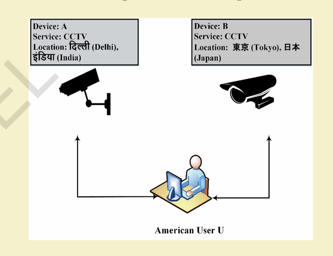
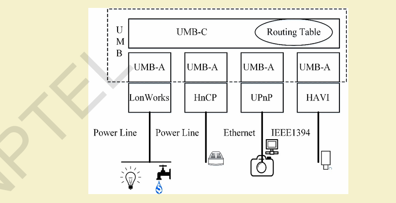
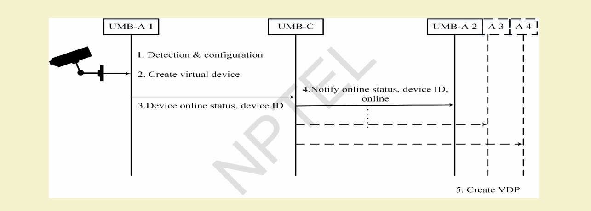
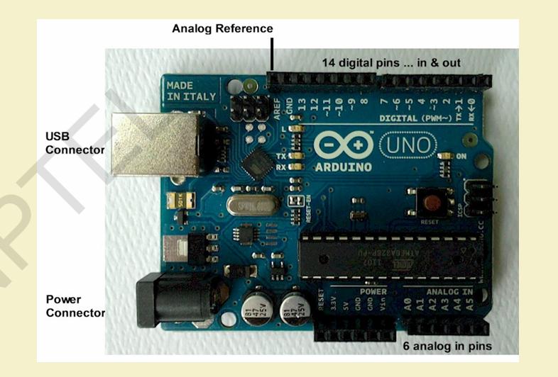

# $\fbox{Chapter 6: IoT INTEROPERABILITY \& ARDUINO}$


## **Topic - 1: Current Challenges in IoT**

- **Large Scale Cooperation:** Billions of distributed IoT devices must coordinate globally.
- **Global Heterogeneity:** Devices differ in OS, protocol, and data format.
- **Unknown Configuration:** Devices originate from unknown owners with differing configurations.
- **Semantic Conflicts:** Same data processed with inconsistent logic across systems.


## **Topic - 2: Interoperability: Definition**

> Ability of systems/products to **exchange and interpret information meaningfully**, working seamlessly with other devices regardless of manufacturer or implementation.


### <u>Requirements</u>

- Understandable interfaces.
- Cross-system communication & service sharing.


## **Topic - 3: Importance in IoT**

- Enables **device-to-device (D2D)**, **machine-to-machine (M2M)**, and **device-to-machine (D2M)** communication.
- Ensures any device can interact anytime, anywhere.
- Supports **seamless integration** across platforms.


## **Topic - 4: Causes for Interoperability Requirement**

### <u>Heterogeneous Communication Protocols</u>

| Type         | Examples                                                               |
| ------------ | ---------------------------------------------------------------------- |
| **Wireless** | ZigBee (802.15.4), Bluetooth (802.15.1), 6LoWPAN, Wi-Fi (802.11), GPRS |
| **Wired**    | Ethernet (802.3), Higher-Layer LAN (802.1)                             |


### <u>Software & Hardware Variance</u>

- **Programming languages:** Java, Python, C, C++, PHP, JS.
- **Platforms:** Crossbow, NI, etc.
- **Operating Systems:** TinyOS, RETOS, Mantis, Windows, Ubuntu.
- **Databases:** MySQL, Oracle, SQLite, PostgreSQL.


### <u>Data Representation & Semantics</u>

- Control models, syntactic differences, semantic conflicts.


## **Topic - 5: Types of Interoperability**

| Type | Definition |
|-------|-------------|
| **User Interoperability** | Compatibility between user and device interface. |
| **Device Interoperability** | Compatibility between devices for communication. |




## **Topic - 6: User Interoperability: Problems & Solutions**

### <u>Key Problems</u>

1. **Device Identification** — discover unknown devices.
2. **Syntactic Interoperability** — message format compatibility.
3. **Semantic Interoperability** — meaning-level understanding.


### <u>Identification & Categorization</u>

| Standard             | Description                                        |
| -------------------- | -------------------------------------------------- |
| **EPC/UPC/URI/IPv6** | Unique addressing of devices.                      |
| **UNSPSC**           | Open, global multi-sector classification standard. |
| **eCl@ss**           | Cross-industry product classification.             |


## **Topic - 7: Syntactic Interoperability**

### <u>Concept</u>

- Ensures both sender and receiver understand message **format**.


### <u>Techniques</u>

- **Service-Oriented Computing (SOC)**
- **Web Services / RESTful APIs**
- **Open Standards:** IEEE 802.15.4, 802.15.1, WirelessHART.
- **Closed Standards:** Z-Wave (non-compatible).


### <u>Middleware Approach</u>

- Software bridge that maps devices dynamically across domains.
- Enables remote discovery & control.


### <u>Cross-context Syntactic Interoperability</u>

- Uses **XML syntax** for collaborative concept exchange.


## **Topic - 8: Semantic Interoperability**

### <u>Concept</u>

- Understanding the **meaning** of exchanged messages.
- Mutual interpretation between device and user.


### <u>Solutions</u>

#### Ontology-based models:

 - Device Ontology
 - Physical Domain Ontology
 - Estimation Ontology
 - **Limitation:** Bound to defined context.

#### Collaborative Conceptualization Theory (Cosign):

 - Defines objects using collaborative signs: `(A, B, C, D)`
 - **Example:** `cosign = (1234, English, CCTV, "Type: Bullet, Comm: IP, Res: 2048 TVL")`
 - Cross-domain applicability.


## **Topic - 9: Device Interoperability**

### <u>Universal Middleware Bridge (UMB)</u>

- **Purpose:** Enable seamless device communication across heterogeneous middleware (HAVI, Jini, LonWorks, UPnP).


### <u>Components</u>

| Component               | Function                                                                    |
| ----------------------- | --------------------------------------------------------------------------- |
| **UMB Core (UMB-C)**    | Routes metadata via Middleware Routing Table (MRT).                         |
| **UMB Adaptor (UMB-A)** | Converts physical devices into abstracted Universal Device Templates (UDT). |


### <u>Universal Device Template (UDT)</u>

- Contains Global Device ID, Function ID, Action ID, Event ID, Parameters.
- Local messages → Global metadata → Translated back.




### <u>Workflow</u>

1. Device plugged → registered via UMB-A.
2. Message routed by UMB-C.
3. Monitored or controlled by user system.




## **Topic - 10: Introduction to Arduino**

### <u>Features</u>

- Open-source microcontroller board & IDE.
- Supports analog/digital I/O.
- No external hardware required for programming.


### <u>Common Boards</u>

| MCU             | Example     |
| --------------- | ----------- |
| **ATmega328**   | Arduino Uno |
| **ATmega32u4**  | Leonardo    |
| **ATmega2560**  | Mega        |
| **AT91SAM3X8E** | Due         |




## **Topic - 11: Arduino IDE**

### <u>Overview</u>

- Based on **C/C++**, downloadable from official Arduino site.

#### Workflow:

1. Connect via USB.
2. Select board & port (Tools → Board / Port).
3. Write sketch → Verify → Upload.


### <u>Structure</u>

- `setup()` – Initialization (I/O, variables).
- `loop()` – Repetitive execution.


### <u>Datatypes</u>

- **Basic:** `int`, `float`, `char`, `boolean`.
- **Complex:** String, Array, Double, Word.


## **Topic - 12: Core Arduino Functions**

### <u>Introduction</u>

| Function                   | Purpose                  |
| -------------------------- | ------------------------ |
| `pinMode(pin, mode)`       | Set pin as INPUT/OUTPUT. |
| `digitalWrite(pin, value)` | Write HIGH/LOW.          |
| `analogRead(pin)`          | Read analog voltage.     |
| `delay(ms)`                | Pause execution.         |


### <u>Example: Blink LED</u>

```cpp
void setup() {
	pinMode(12, OUTPUT);
}

void loop() {
	digitalWrite(12, HIGH);
	delay(1000);
	digitalWrite(12, LOW);
	delay(1000);
}
```


## **Topic - 13: Arduino Programming – Part II**

### <u>Operators</u>

- Arithmetic
- Comparison
- Boolean
- Bitwise
- Compound


### <u>Control Structures</u>

- `if`, `if-else`, `else-if` ladder, `switch`-`case`.
- **Loops:** `for`, `while`, `do`-`while`.
- Nested and infinite loops.


### <u>Arrays & Strings</u>

- 1D/2D arrays for grouped data.
- String objects support `.length()`, `.replace()`, `.toUpperCase()`.


### <u>Math Library</u>

- Includes `sin()`, `cos()`, `pow()`, `log()`, `fmod()`, `fabs()`, etc.


### <u>Randomization & Interrupts</u>

- `randomSeed(v)`, `random(min, max)`.
- `attachInterrupt(pin, ISR, mode)` $\rightarrow$ defines hardware/software interrupts.


### <u>Example: Traffic Control System</u>

- 3 LEDs (R,G,Y) → sequential switching using delays & serial messages.


## **Topic - 14: Integration of Sensors with Arduino**

### <u>Example: DHT11 / DHT22 (Humidity & Temperature)</u>

#### Connections:

1. Pin 1 → 3.3V/5V
2. Pin 2 → Data (digital pin 12)
3. Pin 4 → GND

#### Code:

```cpp
#include <DHT.h>

DHT dht(8, DHT22);
float h, t;

void setup() {
	Serial.begin(9600); dht.begin();
}

void loop()
{
	h = dht.readHumidity();
	t = dht.readTemperature();
	
	Serial.print("Humidity:"); Serial.print(h);
	Serial.print("%  Temp:"); Serial.println(t);
	
	delay(2000);
}
```


## **Topic - 15: Integration of Actuators with Arduino**

### <u>Example: Servo Motor Control</u>

#### Connections:

- Red → 5V
- Black → GND
- Yellow → Signal (Pin 8)

#### Code:

```cpp
#include <Servo.h>


Servo s;

void setup() {
	s.attach(8);
}

void loop()
{
	s.write(0); delay(1000);
	s.write(90); delay(1000);
	s.write(180); delay(1000);
}
```


### <u>Functions in Servo Library</u>

- `write()`, `writeMicroseconds()`, `read()`, `attach()`, `detach()`, `sweep()`.

---
