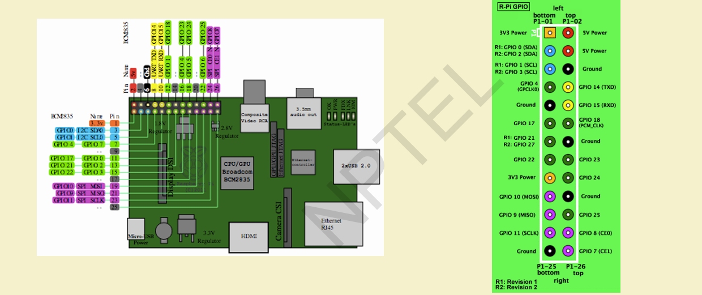
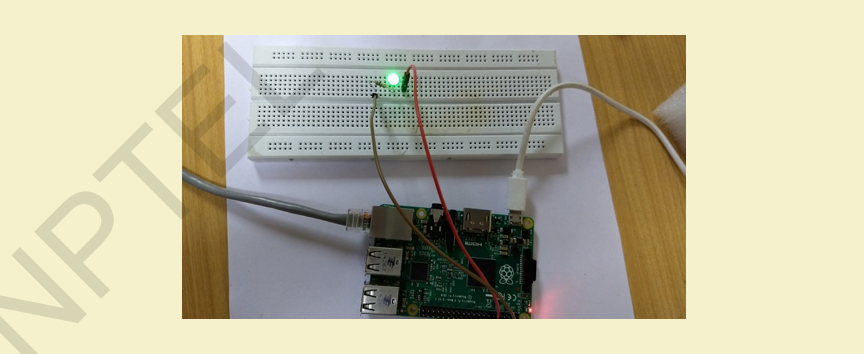
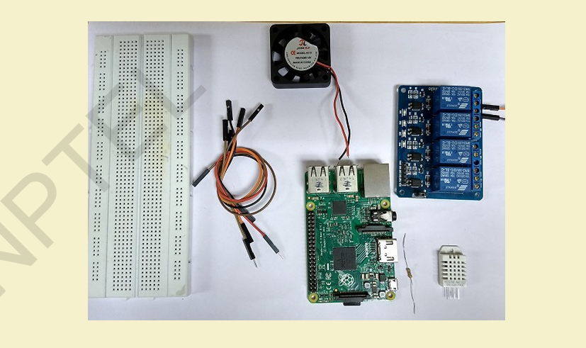
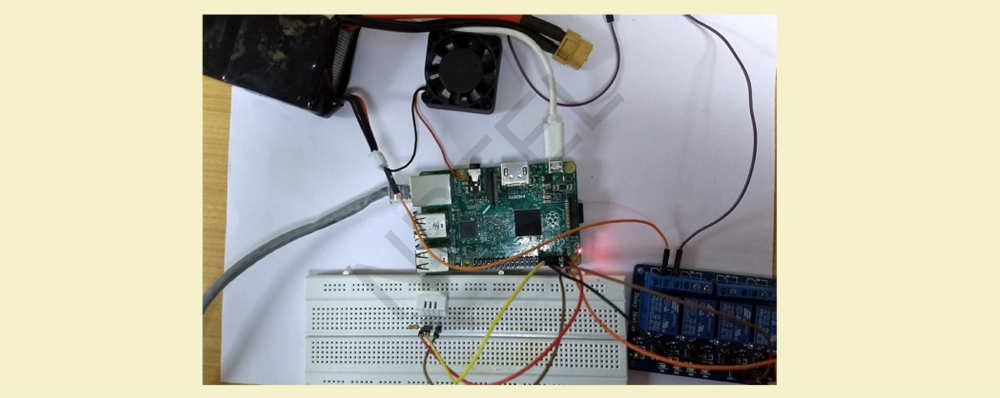

# $\fbox{Chapter 7: PYTHON \& RASPBERRY PI}$


## **Topic - 1: Why Python?**

- **Versatile and simple scripting language**; easy to learn and implement.
- **Flexible syntax** — indentation defines blocks, not braces.
- Comes with **built-in IDEs** and integrates easily with hardware.
- **Open-source**, cross-platform (Windows, Linux, Mac).
- Commonly used IDEs: *Spyder*, *PyCharm*.


## **Topic - 2: Python Basics**

### <u>Hello World Example</u>

```python
print("Hi, Welcome to Python!")
```


### <u>Indentation Example</u>

```python
if True:
    print("Correct")

else:
    print("Error")
```


## **Topic - 3: Data Types in Python**

| Type           | Example                | Notes                              |
| -------------- | ---------------------- | ---------------------------------- |
| **Number**     | `x=10`, `y=10.2`       | Integers and floats                |
| **String**     | `'This is Python'`     | Supports slicing: `x[0]`, `x[2:4]` |
| **List**       | `[10, 10.2, 'python']` | Mutable sequence                   |
| **Tuple**      | `(1,2,3)`              | Immutable sequence                 |
| **Dictionary** | `{1:'item', 'k':2}`    | Key–value mapping                  |


## **Topic - 4: Control Statements**

### <u>Conditional</u>

```python
if cond:
    statement1
elif cond2:
    statement2
else:
    statement3
```


### <u>Looping</u>

```python
for i in [1,2,3,4]:
    print(i)

while cond:
    statement
```


### <u>Break & Continue</u>

```python
for s in "string":
    if s == 'n':
        break
    print(s)
```


## **Topic - 5: Functions**

### <u>Defining Functions</u>

```python
def add(a,b):
    return a+b
```


### <u>Multiple Return Example</u>

```python
def greater(x,y):
    return (x,y) if x>y else (y,x)
```


### <u>Functions as Objects</u>

```python
def add(a,b):
    return a+b
c = add
print(c(3,4))
```


## **Topic - 6: Variable Scope**

| Type       | Description                                            |
| ---------- | ------------------------------------------------------ |
| **Global** | Declared outside all functions. Accessible everywhere. |
| **Local**  | Declared inside a function. Accessible only within.    |


## **Topic - 7: Modules**

### <u>Import Full Module</u>

```python
import random
print(random.randint(1,10))
```


### <u>Import Specific Part</u>

```python
from math import pi
print(pi)
```


## **Topic - 8: Exception Handling**

### <u>Structure</u>

```python
try:
    statement

except ValueError:
    print("Invalid input!")

else:
    print("All good!")
```


### <u>Example</u>

```python
while True:
    try:
        n=int(input("Enter integer:"))
        break
    except ValueError:
        print("Invalid!")
```


## **Topic - 9: File Handling**

### <u>Introduction</u>

| Mode | Operation         |
| ---- | ----------------- |
| `r`  | Read              |
| `w`  | Write (overwrite) |
| `a`  | Append            |
| `r+` | Read + Write      |

```python
with open('data.txt', 'w') as f:
    f.write('Writing to file')

with open('data.txt','r') as f:
    print(f.read())
```


### <u>CSV Handling</u>

```python
import csv
with open('file.csv','r') as csvf:
    reader=csv.reader(csvf)
    for row in reader:
        print(row)
```


## **Topic - 10: Image Processing**

### <u>Using Pillow</u>

```bash
pip install pillow
```

```python
from PIL import Image
img = Image.open('image.jpg')
img.show()
print(img.format, img.size, img.mode)
```

- **Resize:** `img.resize((255,255))`
- **Rotate:** `img.rotate(90)`
- **Convert:** `img.convert('L')`

```css
/* Diagram Placeholder: Image Conversion Flow */
```


## **Topic - 11: Networking with Python**

### <u>Creating a Socket</u>

```python
import socket
s = socket.socket(socket.AF_INET, socket.SOCK_STREAM)
```


### <u>Simple Server</u>

```python
s.bind(('localhost',2017))
s.listen(1)
conn,addr=s.accept()
data=conn.recv(1024)
print(data)
```


### <u>Simple Client</u>

```python
client=socket.socket()
client.connect(('localhost',2017))
client.send(b'Message')
```


## **Topic - 12: Raspberry Pi Introduction**

### <u>Introduction</u>

- Low-cost, single-board computer.


### <u>Key Specs (Pi3B)</u>

- 1GB RAM, Quad Cortex-A53 @1.2GHz.
- **GPU:** 400MHz VideoCore IV.
- Wireless 802.11 + Bluetooth 4.0.
- 40 GPIO pins.




### <u>OS & Setup</u>

- **Supported OS:** *Raspbian*, *NOOBS*.
- Install via *Win32 Disk Imager* → select Raspbian `.img` → write to SD card.


### <u>Initializing Configuration</u>

```bash
sudo raspi-config
```
  
- Enable SSH, expand filesystem.


## **Topic - 13: GPIO Usage**

### <u>Install GPIO Library</u>

```bash
sudo apt-get install python-rpi.gpio
```


### <u>Blink LED Code</u>

```python
import RPi.GPIO as GPIO
import time


GPIO.setmode(GPIO.BOARD)
GPIO.setup(11, GPIO.OUT)

for i in range(5):
    GPIO.output(11, True)
    time.sleep(1)
    GPIO.output(11, False)
    time.sleep(2)

GPIO.cleanup()
```




## **Topic - 14: Pi Camera Integration**

### <u>Setup</u>

1. Connect camera to CSI port.
2. Run `sudo raspi-config` → *Interfacing Options → Camera → Enable*.
3. Reboot.


### <u>Capture Image</u>

```bash
raspistill -o image.jpg
```


### <u>Python Script</u>

```python
import picamera

cam=picamera.PiCamera()
cam.capture('image.jpg')
```


## **Topic - 15: IoT Implementation using Raspberry Pi**

### <u>Example: Temperature-Based Auto Cooling System</u>

- **Components:** DHT22 Sensor, Relay, Fan, Pi, 4.7kΩ resistor, wires.

#### Step 1 - Connect DHT Sensor:

- Pin1 → 3.3V
- Pin2 → GPIO input (e.g., 11)
- Pin4 → GND

#### Step 2 - Connect Relay:

- VCC → 5V
- GND → GND
- IN → GPIO output (e.g., 7)

#### Step 3 - Install Library:

```bash
git clone https://github.com/adafruit/Adafruit_Python_DHT.git
cd Adafruit_Python_DHT
sudo python setup.py install
```

#### Step 4 - Python Code:

```python
import RPi.GPIO as GPIO
import Adafruit_DHT
from time import sleep


GPIO.setmode(GPIO.BOARD)
sensor = Adafruit_DHT.AM2302
humidity, temperature = Adafruit_DHT.read_retry(sensor,17)
print(f"Temp={temperature:.1f}°C Humidity={humidity:.1f}%")


if temperature > 30:
    GPIO.setup(13, GPIO.OUT)
    GPIO.output(13,0)
    sleep(5)
    GPIO.output(13,1)
```




### <u>Result</u>

#### When temperature > 30°C:

- Relay activates → fan turns ON.

#### When temperature < 30°C:

- Relay deactivates → fan turns OFF.



---
