# $\fbox{Chapter 8: REMOTE DATA LOGIN \& SDN}$


## **Topic - 1: IoT Remote Data Logging**

### <u>Concept</u>

- Collect sensor data → send to a **server** → store and process remotely.
- Enables **remote monitoring and control** of IoT networks.


### <u>Components Required</u>

- **DHT Sensor** (Digital Humidity and Temperature)
- **Raspberry Pi**
- **4.7kΩ resistor**, jumper wires


## **Topic - 2: DHT Sensor Interface**

| Pin | Connection             |
| --- | ---------------------- |
| 1   | 3.3V–5V Power Supply   |
| 2   | Data (to Pi input pin) |
| 3   | Null (not used)        |
| 4   | Ground                 |

#### Connection:

- Pin1 → 3.3V
- Pin2 → GPIO 11
- Pin4 → GND

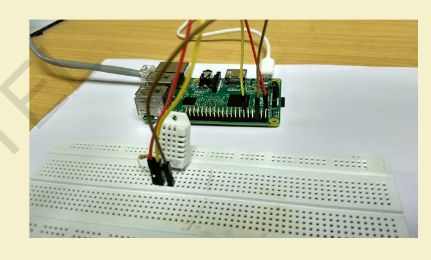


## **Topic - 3: Reading Sensor Data (Python)**

### <u>Introduction</u>

- **Library:** `Adafruit_DHT`


### <u>Installation</u>

```bash
sudo pip install Adafruit_DHT
```


### <u>Function</u>

```python
Adafruit_DHT.read_retry(sensor, pin)
```


### <u>Example</u>

```python
import Adafruit_DHT
sensor = Adafruit_DHT.AM2302
humidity, temperature = Adafruit_DHT.read_retry(sensor,17)
```


## **Topic - 4: Socket Programming for Data Transfer**

### <u>Basics</u>

- Two-way communication between **client** and **server**.
- Client sends sensor data → Server receives and stores.


### <u>Socket Creation</u>

```python
s = socket.socket(socket.AF_INET, socket.SOCK_DGRAM)
```

- `AF_INET` → IPv4 addressing.
- `SOCK_DGRAM` → UDP socket type.


## **Topic - 5: Server Program (UDP)**

```python
import socket


sock = socket.socket(socket.AF_INET, socket.SOCK_DGRAM)
server_address = ('10.14.3.194', 10001)
sock.bind(server_address)

while True:
    data, address = sock.recvfrom(4096)
    with open("DataLog.txt", "a") as f:
        f.write(str(data))
        print(data)
```


## **Topic - 6: Client Program (UDP)**

### <u>Code</u>

```python
import Adafruit_DHT, socket, sys


def sensordata():
    sensor = Adafruit_DHT.AM2302
    h, t = Adafruit_DHT.read_retry(sensor, 17)
    return (h, t)


sock = socket.socket(socket.AF_INET, socket.SOCK_DGRAM)
server_address = ('10.14.3.194', 10001)

try:
    while True:
        h, t = sensordata()
        message = f"{h},{t}"
        sock.sendto(message.encode(), server_address)

finally:
    sock.close()
```


### <u>Output</u>

- Sensor readings transmitted to server and stored in `DataLog.txt`.


## **Topic - 7: Data Processing on Server**

### <u>Data Splitting</u>

```python
data = '25.1,55.2'
values = data.split(',')  # ['25.1', '55.2']
```


### <u>Data Plotting Using Matplotlib</u>

```python
import matplotlib.pyplot as plt

plt.plot(temp_values)
plt.xlabel('Time')
plt.ylabel('Temperature (°C)')
plt.title('Temperature Monitoring')
plt.show()
```


### <u>Live Plot Example</u>

```python
import matplotlib.pyplot as plt

plt.ion()
fig = plt.figure()
ax = fig.add_subplot(111)
ax.plot(temp, i, c='r', marker='o')
```

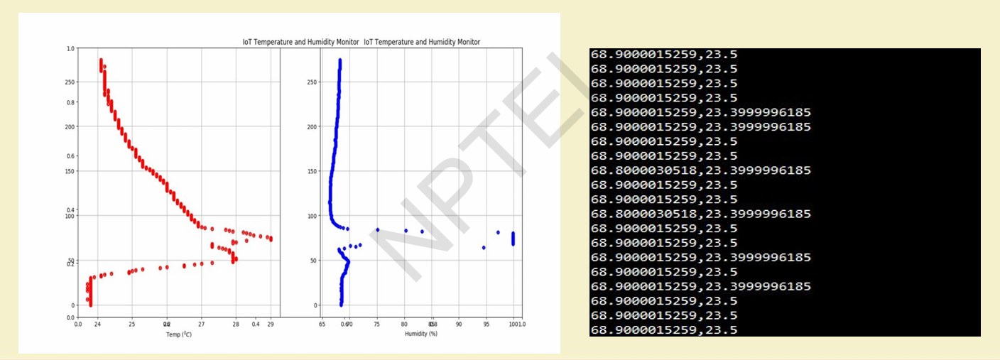


## **Topic - 8: Introduction to Software-Defined Networking (SDN)**

### <u>Concept</u>

- Restructures traditional networks by **separating control plane and data plane**.
- Control plane managed by centralized **controller**.


### <u>Traditional Network Issue</u>

- Vendor-specific switches with distributed logic → lack of global view.

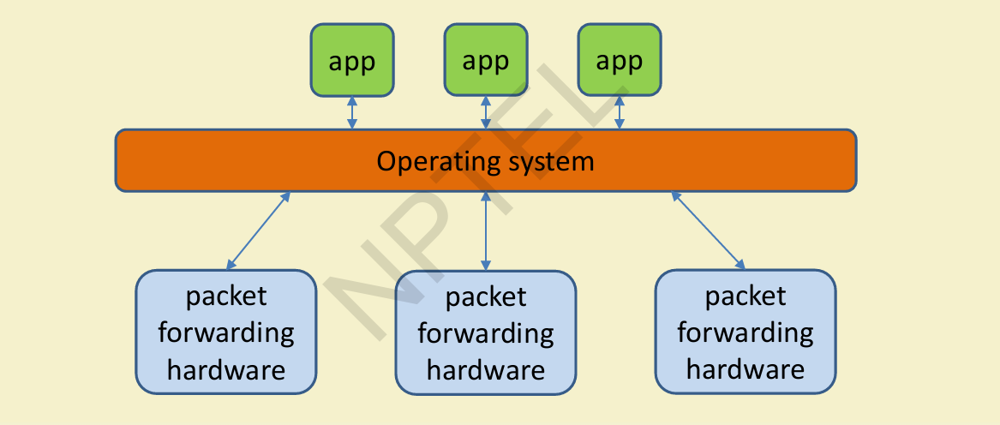


## **Topic - 9: SDN Architecture**

### <u>Introduction</u>

| Plane                 | Function                                   |
| --------------------- | ------------------------------------------ |
| **Application Plane** | Network services (routing, monitoring)     |
| **Control Plane**     | Centralized controller with global view    |
| **Data Plane**        | Switches forwarding packets per flow rules |


### <u>APIs</u>

- **Northbound:** Between apps and controller.
- **Southbound:** Between controller and switches (e.g., OpenFlow).
- **East/Westbound:** Between controllers.


## **Topic - 10: OpenFlow Protocol**

### <u>Introduction</u>

- Standard protocol for SDN control.
- Controller installs **Flow Rules** into switches.


### <u>Match Fields</u>

- Source/Destination IP
- Source Port
- Priority


### <u>Timeouts</u>

| Type             | Description                         |
| ---------------- | ----------------------------------- |
| **Hard Timeout** | Deletes all rules after fixed time. |
| **Soft Timeout** | Removes inactive flow rules.        |


## **Topic - 11: Rule Placement**

### <u>Challenges</u>

- TCAM (Ternary Content Addressable Memory) is expensive and limited.
- Delay of 3–5 ms for new flow-rule placement.


### <u>Objective</u>

- Minimize rule count.
- Reduce controller communication overhead.

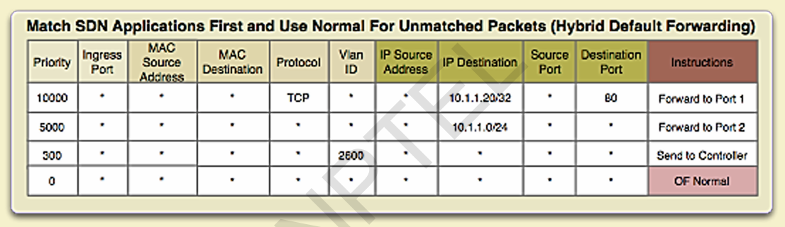


## **Topic - 12: Controller Placement & Topologies**

### <u>Architectures</u>

| Type             | Description                                |
| ---------------- | ------------------------------------------ |
| **Flat**         | All controllers share equal priority.      |
| **Hierarchical** | Controllers in layered (tree) form.        |
| **Ring/Mesh**    | Controller redundancy with multiple links. |


### <u>Backup Controller</u>

- Replica of main controller to prevent downtime.

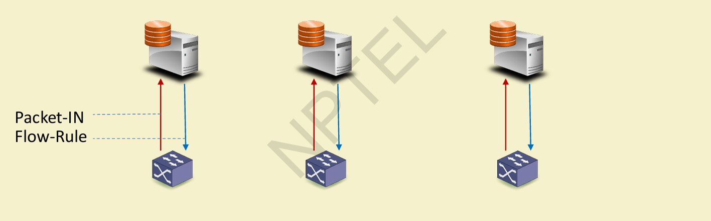
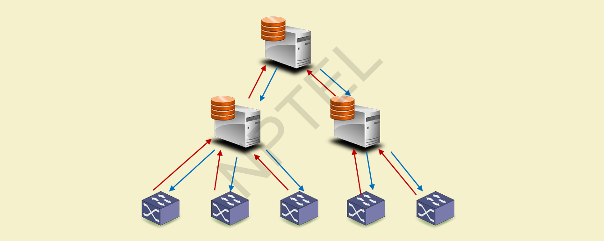
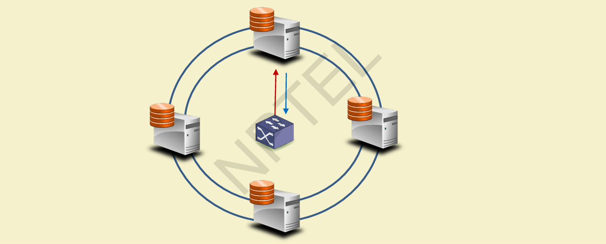
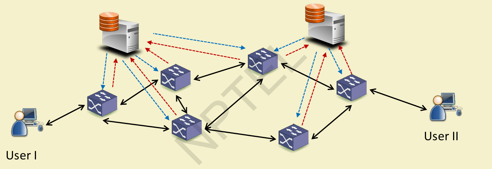


## **Topic - 13: Security in SDN**

- Centralized control enables integrated **firewall**, **IDS**, and **proxy** enforcement.
- Reduces misconfigurations and improves policy enforcement.

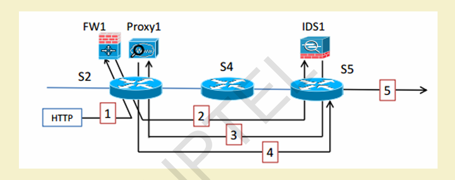


## **Topic - 14: Software-Defined IoT (SD-IoT)**

### <u>Integration Benefits</u>

- Enables intelligent routing, real-time analytics, and programmable control.
- Simplifies IoT network management by abstracting device logic.


### <u>SDN for IoT Layers</u>

| Layer | SDN Function |
|--------|---------------|
| **Access Layer** | Rule placement for mobile, heterogeneous devices. |
| **Backbone Layer** | Traffic engineering and resource optimization. |
| **Data Center Layer** | Flow classification, enhanced security. |

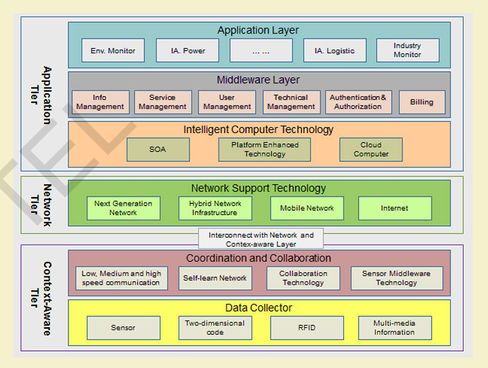
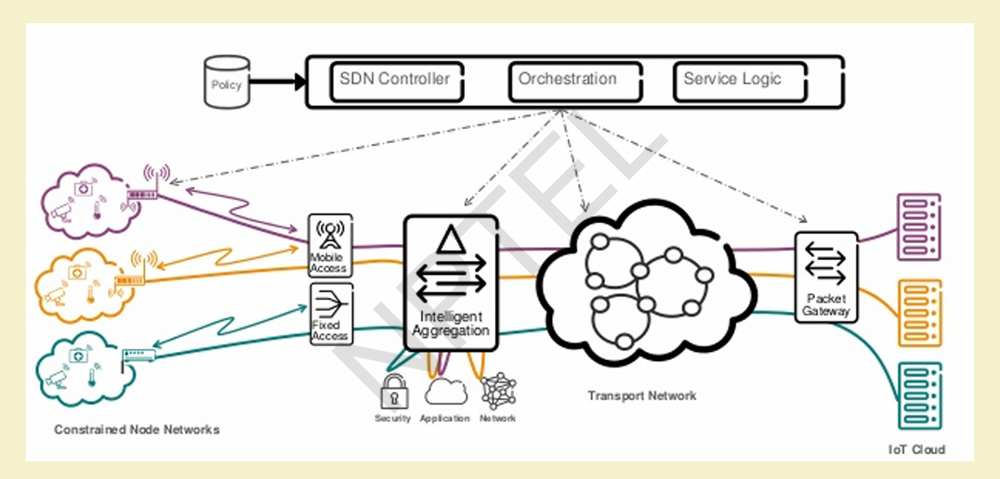


## **Topic - 15: Software-Defined WSN (SD-WSN)**

### <u>Motivation</u>

- Traditional WSN → static, vendor-specific.
- SDN introduces centralized programmability and control.


### <u>Examples</u>

| Framework           | Key Idea                                                             |
| ------------------- | -------------------------------------------------------------------- |
| **Sensor OpenFlow** | Value/ID-centric forwarding.                                         |
| **Soft-WSN**        | Dynamic delay, sleep, and topology management.                       |
| **SDN-WISE**        | Flow-table logic programmable via API; in-network packet processing. |


### <u>Performance Insights</u>

- Improved packet delivery ratio.
- Reduced redundant packets.
- Increased control messages due to PACKET-IN exchanges.


## **Topic - 16: Tools for SDN Experimentation**

| Tool            | Use                                                   |
| --------------- | ----------------------------------------------------- |
| **Mininet**     | SDN simulation with OpenFlow switches (Python-based). |
| **Controllers** | POX, NOX, Floodlight, OpenDayLight, ONOS.             |

```bash
sudo mn --controller=remote,ip=<controller_ip>
```


## **Topic - 17: Summary**

- IoT data logging achieved through DHT sensors, Raspberry Pi, and UDP socket communication.
- SDN enables **centralized management**, **dynamic rule control**, and **integration with IoT**.
- SD-WSN and SD-IoT merge programmability with real-time sensor and device networks.


---
