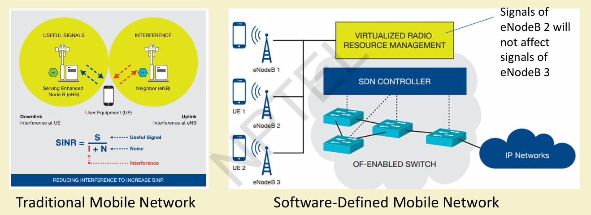
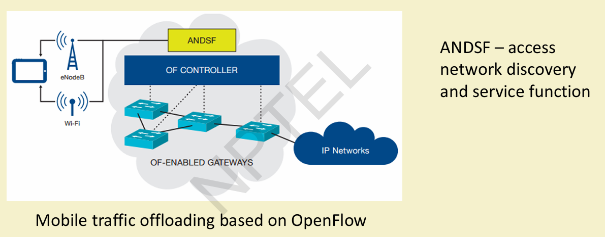
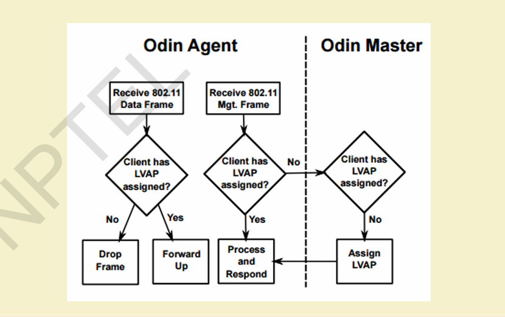
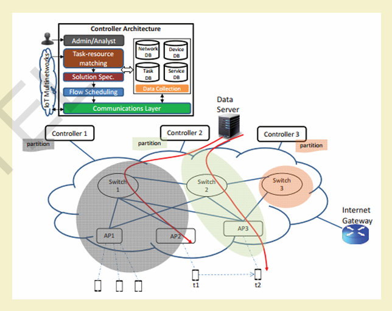
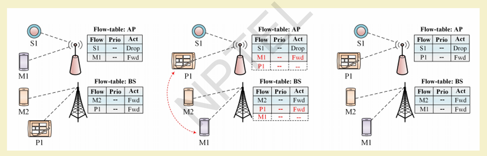
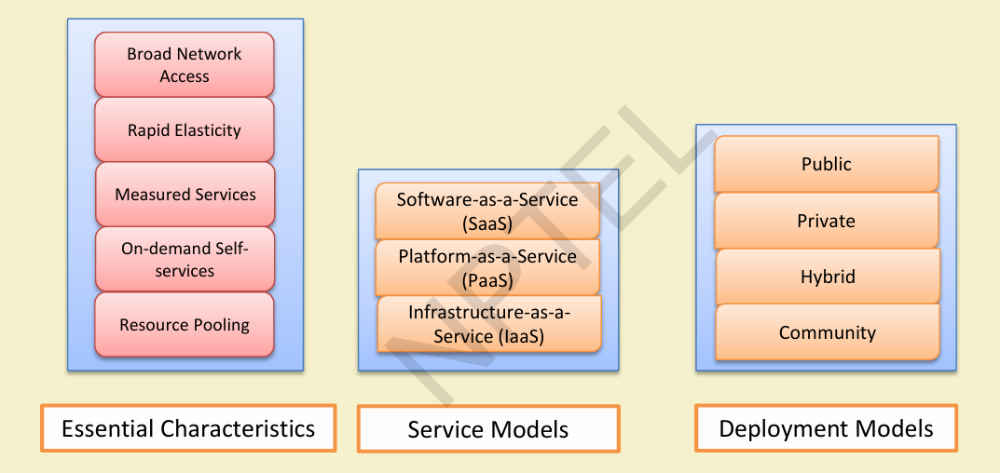
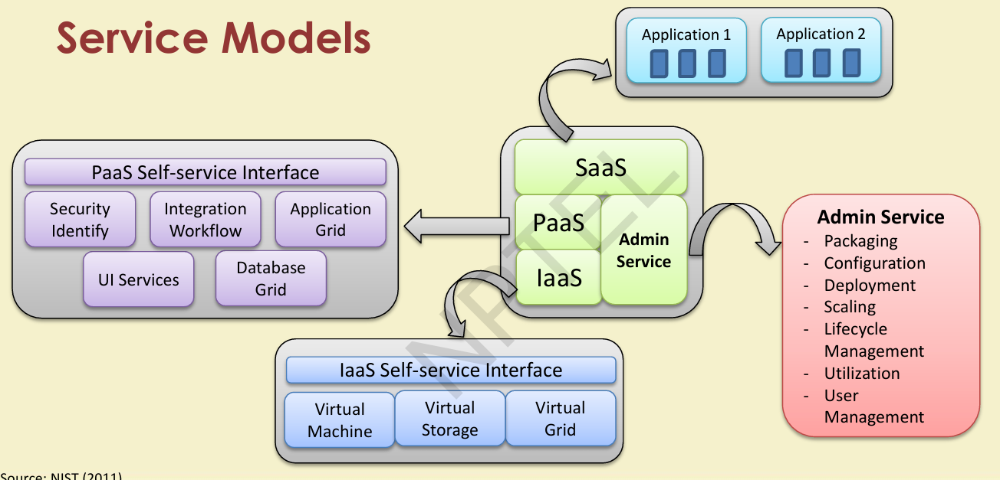
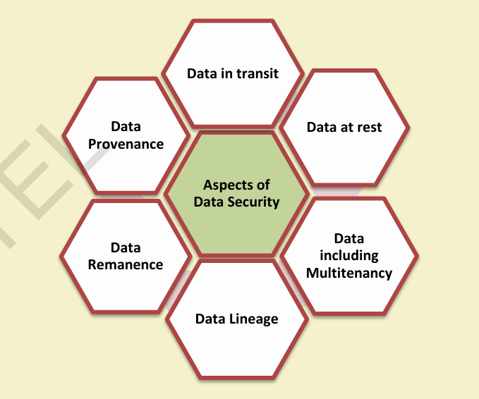
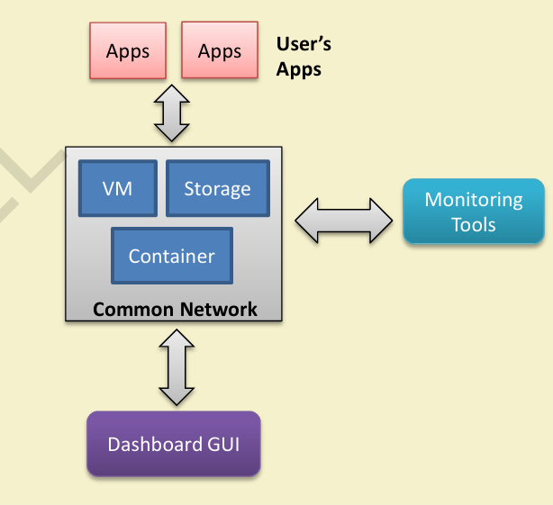

# $\fbox{Chapter 9: CLOUD COMPUTING \& SDN ADVANCES}$


## **Topic - 1: SDN for IoT – Recap**

### <u>Software-Defined WSN</u>

- Enhances performance over traditional WSN.
- Approaches include **Sensor OpenFlow**, **Soft-WSN**, **SDN-WISE**.




## **Topic - 2: Traditional Mobile Networks – Problems**

- **Difficult to Scale:** Inflexible under heavy mobile traffic.
- **Hard to Manage:** High chance of misconfigurations.
- **Inflexible:** Hardware-dependent service deployment.
- **Expensive:** High CAPEX and OPEX costs.


## **Topic - 3: SDN for Mobile Networking**

### <u>Flow-Table Paradigm</u>

- Ideal for multi-technology (WiFi, 3G, 4G, etc.) communication.


### <u>Centralized Control</u>

- Enhances base-station coordination.
- Reduces **inter-cell interference**.


## **Topic - 4: SDN for Mobile Networks – Key Concepts**

### <u>Path Management</u>

- Enables **custom routing** per service requirement.


### <u>Network Virtualization</u>

- Abstracts physical hardware → offers logical resource pools.
- Supports **seamless connectivity** and **service differentiation**.


## **Topic - 5: SDWMN (Software-Defined Wireless Mobile Network) – Use Cases**

### <u>Interference Management</u>

- Prevents cross-cell interference between base stations.


### <u>Mobile Traffic Management</u>

- Manages traffic offloading using **OpenFlow** + **ANDSF**.




## **Topic - 6: Benefits of SDN-based Mobile Networks**

- Centralized control for **multi-vendor device ecosystems**.
- Faster integration of new services.
- Simplified, abstracted control and management.


## **Topic - 7: Rule Placement Challenges (Access Devices)**

- OpenFlow not inherently wireless-aware.
- Requires **modified protocols** for mobility.
- Frequent rule updates needed for dynamic mobile users.
- Heterogeneous device support is mandatory.


## **Topic - 8: SDN Approaches for IoT Mobility**

| Approach | Function |
|-----------|-----------|
| **ODIN** | Programmable WLAN via LVAPs (Light Virtual APs). |
| **Ubi-Flow** | Scalable mobility and fault-tolerant flow scheduling. |
| **Mobi-Flow** | Predictive flow-rule placement for moving devices. |


## **Topic - 9: ODIN Framework**

### <u>Components</u>

- **Odin Agent:** Runs on access points.
- **Odin Master:** Controller component.


### <u>Functionality</u>

- Converts 802.11 APs into **programmable LVAPs**.
- Each user mapped to virtual AP → personalized wireless access.




## **Topic - 10: Ubi-Flow**

### <u>Purpose</u>

- Manages **urban-scale SD-IoT** environments.


### <u>Features</u>

- Scalable AP control.
- Fault-tolerant design.
- Flow scheduling based on **partition, matching, and load balancing**.




## **Topic - 11: Mobi-Flow**

### <u>Purpose</u>

- Mobility-aware rule placement via user movement prediction.


### <u>Prediction</u>

- Uses **Order-K Markov Model** to predict future user location `(t+1)`.


### <u>Rule Optimization</u>

- **Linear programming** selects optimal access points.


### <u>Outcome</u>

- Reduces **message overhead** and **energy consumption**.




## **Topic - 12: Rule Placement – Backbone Network**

- Existing wired rule-placement schemes can be reused.
- Load balancing and dynamic resource allocation critical for IoT scalability.


## **Topic - 13: Data Center Networking**

| Flow Type         | Handling Technique   |
| ----------------- | -------------------- |
| **Mice Flow**     | Wildcard-based rules |
| **Elephant Flow** | Exact match rules    |

- Flow classification improves packet forwarding and switch efficiency.

```css
/* Diagram Placeholder: Flow Classification in Data Center */
```


## **Topic - 14: Anomaly Detection in IoT Networks**

- Real-time **flow monitoring** via OpenFlow.
- Detects abnormal traffic (e.g., packet floods, DoS).
- Port statistics used for dynamic threat analysis.


## **Topic - 15: SDN Experimentation Tools

| Tool             | Description                               |
| ---------------- | ----------------------------------------- |
| **Mininet-WiFi** | Simulates wired + wireless networks.      |
| **ONOS**         | Controller platform for multi-domain SDN. |

```bash
sudo mn --wifi --controller=remote,ip=<controller_ip>
```

```css
/* Diagram Placeholder: Mininet-WiFi Simulation Setup */
```


## **Topic - 16: Cloud Computing Fundamentals**

> Cloud computing = on-demand access to a shared pool of configurable computing resources.


### <u>Characteristics</u>

- On-demand self-service
- Broad network access
- Resource pooling
- Rapid elasticity
- Measured services




## **Topic - 17: Cloud Service Models**

| Model | Description | Example |
|--------|--------------|----------|
| **SaaS** | Software accessible via web browser | Google Apps, Salesforce |
| **PaaS** | Platform for app development/deployment | Azure, App Engine |
| **IaaS** | Infrastructure provisioning | AWS EC2, Rackspace |


## **Topic - 18: Deployment Models**

| Type | Features |
|-------|-----------|
| **Public Cloud** | Accessible to all; provider-managed. |
| **Private Cloud** | Dedicated infrastructure for one org. |
| **Hybrid Cloud** | Mix of public + private. |
| **Community Cloud** | Shared among similar organizations. |
| **Multi/Inter-cloud** | Connected cloud federation. |




## **Topic - 19: Cloud Service Management**

### <u>Objectives</u>

- Standardized service delivery.
- SLA-based performance.
- Usage-based billing.
- High availability & scalability.

### <u>Service Level Agreement (SLA)</u>

- Defines service guarantees, metrics, and penalties.


## **Topic - 20: Cloud Economics**

### <u>Benefits</u>

- Lower capital cost.
- Scalable, on-demand growth.
- Pay-as-you-go model.
- High availability and elasticity.


## **Topic - 21: Cloud Data Management**

### <u>Database-as-a-Service (DBaaS)</u>

- Examples: **AWS DynamoDB**, **Google Cloud SQL**, **Azure SQL Database**.


### <u>Features</u>

  - Fault-tolerance.
  - Encrypted data management.
  - Multi-tenancy and interoperability.


## **Topic - 22: Cloud Security**

### <u>Introduction</u>

| Layer                 | Concern                        |
| --------------------- | ------------------------------ |
| **Network Level**     | Data-in-transit protection     |
| **Host Level**        | OS and VM isolation            |
| **Application Level** | Secure APIs and access control |


### <u>IAM (Identity & Access Management)</u>

- Ensures authorized access.
- Implements authentication + authorization + evaluation.




## **Topic - 23: Trust and Risk Management**

### <u>Introduction</u>

- **Trust:** Expectation-based relationship between user and provider.
- **Reputation:** Community-based reliability metric.


### <u>Risk Assessment Approaches</u>

- Qualitative vs. Quantitative
- Inductive vs. Deductive


## **Topic - 24: Cloud Authentication**

- Conducted at **PaaS layer**.
- Vulnerable to spoofing or replay attacks if unsecured.
- Requires mutual validation between **user** and **provider**.


## **Topic - 25: Cloud Simulation Tools**

| Simulator        | Features                                     |
| ---------------- | -------------------------------------------- |
| **CloudSim**     | Java-based framework for modeling DCs & VMs. |
| **CloudAnalyst** | GUI extension of CloudSim.                   |
| **GreenCloud**   | Energy-aware simulation (NS2 extension).     |


## **Topic - 26: Open Source and Commercial Cloud Platforms**

### <u>Introduction</u>

| Category        | Examples                          |
| --------------- | --------------------------------- |
| **Open Source** | OpenStack, CloudStack, Eucalyptus |
| **Commercial**  | AWS, Azure, Google App Engine     |


### <u>OpenStack Components</u>

- **Nova (Compute)**, **Neutron (Network)**, **Swift (Storage)**, **Keystone (Identity)**.


### <u>Azure & AWS Services</u>

- **Azure:** Compute, Storage, Database, CDN, ML.
- **AWS EC2:** VM instances (General, Compute, Memory optimized).




## **Topic - 27: Integration of Cloud and IoT**

- Cloud provides **computation**, **storage**, **virtualization** for IoT.
- IoT supplies **data and devices**.
- Combined model enables **data analytics**, **control**, and **automation**.


## **Topic - 28: Summary**

- SDN resolves mobility and interference issues in IoT.
- Cloud computing adds scalability and centralized control.
- Combined SDN + Cloud = **Programmable, elastic, intelligent IoT ecosystem.**

---
