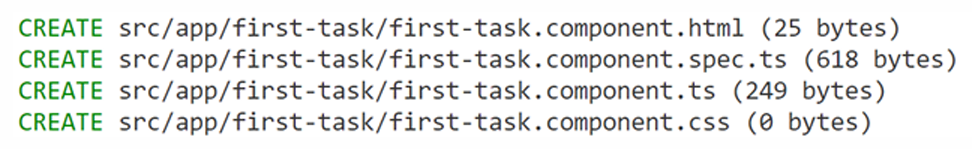
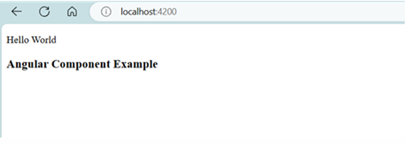

# $\fbox{Chapter 4: ANGULAR}$


## **Topic - 1: Basic Concepts**

### <u>Introduction</u>

- Angular is open-source.


### <u>Key Features</u>

#### Component-based architecture:

- **<u>Components</u>:** Reusable parts of code that encapsulate more complex parts.
- This helps in easier maintenance & scaling.

#### Two-way data binding:

- Two-way data binding means that changes in an Angular application UI is reflected in its data model & vice-versa.
- **<u>Data model</u>:** Internal class objects that a library/template use.
- So, Angular automatically syncs data between UI & model.

#### Dependency injection:

- Dependency injection allows to easily integrate dependencies (injecting) into other codes.
- It also gives facility to test your code.

#### Directives:

- **<u>Directives</u>:** Markers on DOM elements that requires it to behave in a particular way.
- Some built-in directives in Angular are `ngIf`, `ngFor` & `ngModel`.
- These models enhance the functioning of HTML elements.

#### Services:

- Services are used to share code across channels connecting all application components.
- This is enhanced by Angular's dependency injection.

#### Routing:

- Angular provides a great routing system.
- Routing allows a user to navigate through web application without reloading the page.
- This allows building SPAs with multiple views.

#### Forms:

- Angular supports creation & management of forms.
- It supports both template-driven & reactive forms.

#### TypeScript:

- Angular is written using TypeScript which is statically typed form of JavaScript.


### <u>Installation Steps</u>

1. Install **node.js**.
2. Install **npm**.
3. Install Angular.

```sh
npm install -g @abgular/cli
```

4. Set up an Angular project.

```sh
ng new your-angular-app
```

5. Navigate to directory.

```sh
cd your-angular-app
```

6. Serve the application through development server.

```sh
ng serve
```

7. Open browser at link `http://localhost:4200/`.


### <u>Other Angular Commands</u>

#### Generating new component:

```sh
ng generate component <component-name>
```

#### Including routing:

- Add the flag `--routing`.

```sh
ng new my-new-app --routing
```


## **Topic - 2: Components In Angular**

### <u>Introduction</u>

- Each Angular component is a self-contained unit.
- These components offer modularity, reusability & isolation.


### <u>Generating Component</u>

#### Step 1:

```sh
ng generate component first-task
```

$$OR$$

```sh
ng g c first-task
```

- This creates following components.



#### Step 2:

- Make changes to `/src/app/app.component.html` file.

```html
<h1> hello welcome </h1>
```

>**<u>TIPS</u>:**
>Try running `ng serve` to know the changes.

#### Step 3:

- Now make changes to `/src/app/first-task/first_task.component.html` file.

```html
<h3> Angular Component Example </h3>
```

#### Step 4:

- Go to `/src/app/first-task/first_task.component.ts`.
- Copy the selector data from there.

```ts
import { component } from '@angular/core';

@Component({
	selector: 'app-textcomponent',    // Copy 'app-textcomponent'
	templateUrl: './textcomponent.component.html',
	styleUrl: './textcomponent.component.css'
})
export class TextcomponentComponent {

}
```

- `@` for `Component` means it configures the component metadata.

#### Step 5:

- Now try using the selector data we copied as a tag in `/src/app/app.component.html`.

```html
<p> Hello World </p>
<app-textcomponent></app-textcomponent>
```




### <u>More About Components</u>

1. Make changes to `component.html` & `component.css` files.
2. Then write corresponding code in `component.ts` file.
3. Run the Angular app using `ng serve -open`.


### <u>Angular Modules</u>

- They organize components for modularity & reusability.
- These components can be path, piped, directives etc.
- We can manually create modules by writing them under `@NgModule` in `app.module.ts` file.
- Also we can declare them under `declaration` array, under `@Ng` section.

```ts
declaration: [
	AppComponent,
	NewCmpComponent
]
```

- We can list the set of imports too under `import` array, under `@Ng` section.

```ts
import: [
	BrowserModule,
	FormsModule
]
```

- Whatever is written under `bootstrap` array, is bootstrapped when the module is loaded.


### <u>Angular Services</u>

- Angular services are like libraries.
- We can create it using the following commands.

```sh
ng generate service service_name
```

- This creates two files.
- `src/app/service_name.service.ts` i.e. the service file.
- `src/app/service_name.service.spec.ts` i.e. the unit test file for that service.

#### Service implementation:

```ts
import { Injectable } from '@angular/core';

@Injectable({
	providedIn: 'root'    // Can specify modules with it
})

export class MyService {
	// Service logic goes here
}
```


## **Topic - 3: Data Binding & Templates**
