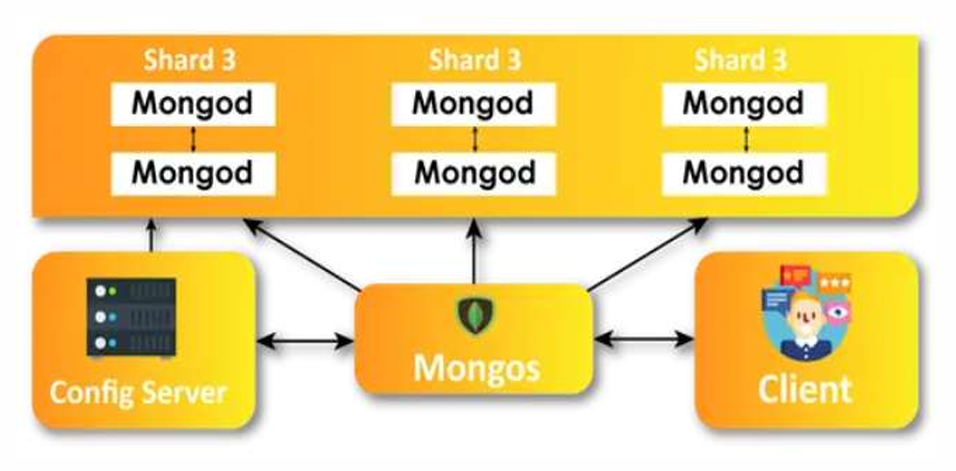

# <u>Chapter 2</u>: MONGODB

## **Topic - 1: NoSQL Database**

### <u>Introduction</u>

- NoSQL databases are also known as non-tabular database.

### <u>Types Of NoSQL Databases</u>

- **<u>Document database</u>:** Stores data & related information in documents like JSON files.
- **Key-value pair**
- **<u>Wide-column database</u>:** Stores data in tabular form with scalable rows.
- **<u>Graph database</u>:** Stores data in nodes & relation among data in edges.

### <u>Advantages</u>

- Simplifies developing interactive & real-time web apps.
- Provides flexibility for even unnormalized data.
- Highly scalable to store large datasets.

### <u>Disadvantages</u>

- Doesn't follows standards.
- Doesn't provides consistency.
- Management becomes difficult with large volumes.
- Can't work with relational data.

## **Topic - 2: MongoDB**

### <u>Introduction</u>

- Launched by **10gen**, later named as **MongoDB inc**.
- MongoDB's data model helps define a hierarchical relationships.
- It stores data in JSON format instead of tabular.

### <u>MongoDB Architecture</u>

### <u>Components Of Architecture</u>

#### Database:

- File system stores data of each database.
- Single MongoDB server can store multiple databases.

#### Collection:

- Consists of various documents stored.
- Each database has its own set of collections.

#### Documents:

- Contains key-value pairs.
- Data are stored in BSON format.

### <u>Features Of MongoDB</u>

- **<u>Schema-less database</u>:** Database whose collection can store different types of documents.
- **<u>Document oriented</u>:** Database whose data are stored in key-value pairs.
- Fields are indexed as primary or secondary, making searching optimized.
