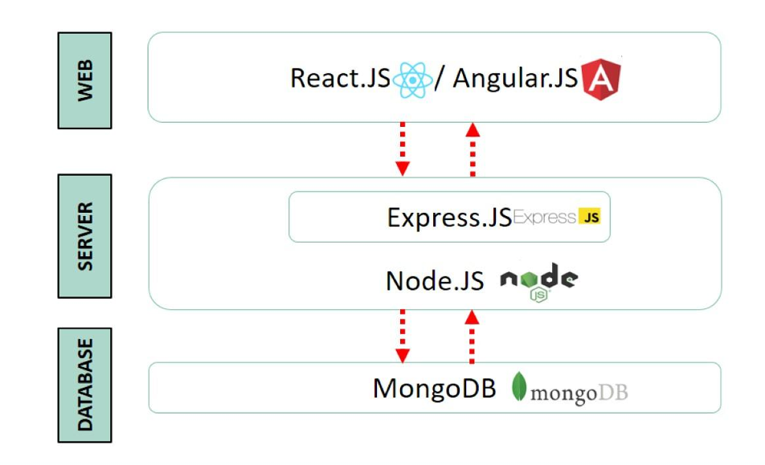

# $\fbox{Chapter 1: INTRODUCTION}$

## **Topic - 1: Web Application**

### <u>Introduction</u>

- **<u>Web application</u>:** An application stored on server & accessed through web browser.
- **<u>Server-side scripts</u>:** Scripts used for storing & retrieving information in a web application.
- **<u>Client-side script</u>:** Scripts used for presenting users information in right form.

>**<u>NOTE</u>:**
>Examples for client-side scripting languages are **HTML5** and **JavaScript**.

### <u>Request-Response Diagram</u>

### <u>Working Of Web Apps</u>

1. User sends request to server using browser/app.
2. Request is forwarder from webserver to web application server.
3. The request is performed.
4. Then requested information is sent back to webserver.
5. Then it is sent back to the user.

### <u>Types Of Web Apps</u>

- Static web application
- Dynamic web application

## **Topic - 2: Web Application Architecture (WAA)**

### <u>Introduction</u>

- **<u>Web application architecture</u>:** System of interconnected components which are involved in running website.

### <u>Components Of WAA</u>

#### Main component categories:

- UI/UX components (client-side)
- Structural components (server-side)

>**<u>NOTE</u>:**
>1. Structural components also includes the hardware used in servers.
>2. When talking about components, we are talking about literally anything involved in them.

#### Sub-components:

- Containerized servers
- Load balancers
- API gateways
- Single-page frontends

## **Topic - 3: WAA Models**

### <u>One Database, One Web Server</u>

- Developers use only one database & one web server to develop web application.
- Mainly used in mobile applications.
- If server is down, whole application will be down too.

### <u>One Database, Multiple Web Servers</u>

- Used when work has to be divided among various web servers.
- Some of these servers can also serve for backup purpose incase one fails.
- It is a stateless architecture.

### <u>Multiple Databases, Multiple Web Servers</u>

- This model is focused on reducing possibility of loss due to failure.
- Many servers copy data in main server as backup.

## **Topic - 4: Types Of WAA**

### <u>Single Page Applications (SPAs)</u>

- In SPAs, any form of changes to be made in the UI is done without communication with the server.
- Meaning, page doesn't require reloading when new data comes.
- For example, Facebook, Google Maps, Gmail, GitHub etc.

### <u>Server-Side Rendering (SSR)</u>

- Files come rendered from the server itself.
- More dynamic, server immediately responses to requests.

### <u>Static Site Generation (SSG)</u>

- Provides templates for HTML.
- These HTML templates are stored on servers & delivered through CDN.
- **<u>CDN</u>:** Content Delivery Network

### <u>Progressive Web Application (PWA)</u>

- Similar to SPA but has some parallelly running services too.
- For example, cookies, extensions, plug-ins etc.

## **Topic - 5: Single Page Application (SPA)**

### <u>Introduction</u>

- Browser load only one page when SPA is used.
- Means there is a single static page which doesn't require any kind of change to it.

### <u>Advantages</u>

- Proper team collaboration
- Caches local data effectively.
- Fast & responsive
- Debugging is easier
- User friendly

### <u>Disadvantages</u>

- Browser history not saved.
- Optimization is tough.
- Hackers can easily insert client-side script.

### <u>When Use SPAs?</u>

- For live data updates & streaming.
- Social networking application, for not requiring serious optimizations.
- For making offline applications, which can be used even after connection is lost.
- Making portable web applications which look native on each system.

### <u>Tools For SPAs</u>

- Ember.js
- Angular.js
- Backbone.js
- Vue.js
- React

## **Topic - 6: Full Stack Development**

### <u>Backend Roles</u>

- Database administrator
- API developer

### <u>Advantages</u>

- Faster development
- Cheaper labors
- Co-operative development
- Complete ownership

### <u>Frontend v/s Backend v/s Full Stack</u>

|                          Frontend                          |                       Backend                        |        Full Stack         |
| :--------------------------------------------------------: | :--------------------------------------------------: | :-----------------------: |
|                      Uses HTML & CSS.                      |                    Uses REST API.                    |  Uses both of the sets.   |
|              JavaScript is the core language.              |        PHP, Ruby & Python are core languages.        | Mixes both of the skills. |
| Popular frameworks used are Angular.js, Vue.js & React.js. | Popular frameworks used are Ruby on Rails & Laravel. |  Uses both of the sets.   |
|          Central tool used is just a code editor.          |      Tools used includes RDBMS & OOP languages.      |  Uses both of the sets.   |
|  Skills required are in HTML, CSS & UX design principles.  | Skills are required in PHP, Ruby on Rails & Node.js. |  Uses both of the sets.   |
|             Easiest to learn among the three.              |               Steeper learning curve.                | Steepest learning curve.  |

## **Topic - 7: MEA(R)N Stack**

### <u>Introduction</u>

- MEAN stack is open-source.
- It uses only JavaScript.
- Includes tools for both frontend & backend development.

### <u>MongoDB</u>

- **<u>NoSQL databases</u>:** Non-relational database management systems.
- NoSQL databases don't have any fixed schema.
- MongoDB uses stores files in BSON format.
- **<u>BSON</u>:** Binary JSON
- The document structure used by MongoDB is highly scalable & flexible.
- Uses indexing techniques.

>**<u>NOTE</u>:**
>Actually scalability is directly proportional to number of servers.

### <u>ExpressJS</u>

- ExpressJS is used in backend of a website.
- Primarily used for building SPAs, though supports other types too.
- Provides models for URL routing.
- **<u>URL routing</u>:** Matching sent URL with server function & passing if not same.

### <u>AngularJS</u>

- AngualrJS is used for frontend development.
- Developed by Google using Typescript.
- Can develop small SPAs & even large enterprise applications!
- Provides features like two-way data binding, dependency injection, dynamically interactive page.
- **<u>Two-way data binding</u>:** Changes in UI makes changes in underlying model code & vice-versa.
- **<u>Dependency injection</u>:** Injecting the required code instead of literally importing whole framework for loose coupling.
- AngularJS is extension of the DOM model.

### <u>NodeJS</u>

- NodeJS enables server-side JavaScript execution.
- It is a non-blocking I/O architecture.
- **<u>Non-blocking I/O architecture</u>:** Architecture which doesn't halt any program while another one is getting executed, instead it passes data as it comes.
- It is neither a programming language nor a framework.
- Its asynchronous, and thus executes all codes simultaneously.

---
