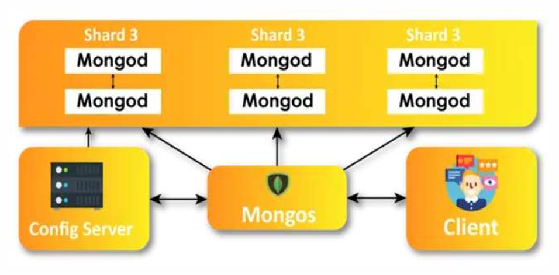

# $\fbox{Chapter 2: MONGODB}$


## **Topic - 1: NoSQL Database**

### <u>Introduction</u>

- NoSQL databases are also known as non-tabular database.


### <u>Types Of NoSQL Databases</u>

- **<u>Document database</u>:** Stores data & related information in documents like JSON files.
- **Key-value pair**
- **<u>Wide-column database</u>:** Stores data in tabular form with scalable rows.
- **<u>Graph database</u>:** Stores data in nodes & relation among data in edges.


### <u>Advantages</u>

- Simplifies developing interactive & real-time web apps.
- Provides flexibility for even unnormalized data.
- Highly scalable to store large datasets.


### <u>Disadvantages</u>

- Doesn't follows standards.
- Doesn't provides consistency.
- Management becomes difficult with large volumes.
- Can't work with relational data.


## **Topic - 2: MongoDB Architecture**

### <u>Introduction</u>

- Launched by **10gen**, later named as **MongoDB inc**.
- MongoDB's data model helps define a hierarchical relationships.
- It stores data in JSON format instead of tabular.


### <u>MongoDB Architecture</u>




### <u>Components Of Architecture</u>

#### Database:

- File system stores data of each database.
- Single MongoDB server can store multiple databases.

#### Collection:

- Consists of various documents stored.
- Each database has its own set of collections.

#### Documents:

- Contains key-value pairs.
- Data are stored in BSON format.


### <u>Features Of MongoDB</u>

- **<u>Schema-less database</u>:** Database whose collection can store different types of documents.
- **<u>Document oriented</u>:** Database whose data are stored in key-value pairs.
- **<u>Indexing</u>:** Tagging fields with primary or secondary attribute for optimized search.
- **<u>Horizontal scalability</u>:** Distributing data across all the available servers.
- **Vertical scaling**
- **Backup servers**
- **<u>Aggregation</u>:** Allows many aggregated operation on database.
- Uses JSON, which is mapped with most modern programming languages.


### <u>NoSQL v/s RDBMS</u>

| NoSQL                                                                   | RDBMS                                                                     |
| :---------------------------------------------------------------------- | :------------------------------------------------------------------------ |
| Non-relational                                                          | Relational                                                                |
| Document-oriented                                                       | Not document-oriented                                                     |
| Hierarchical data storage                                               | Non-hierarchical data storage                                             |
| Flexible schema                                                         | Defined schema                                                            |
| Follows CAP theorem (consistency, availability, partition & tolerance). | Follows ACID properties (atomicity, consistency, isolation & durability). |
| Faster                                                                  | Slower                                                                    |


## **Topic - 2: Data Modeling & Schema Design**

### <u>Data Modeling</u>

- **<u>Data model</u>:** An architecture which defines how data flows in a DBMS.
- For example, visualization of relationship among data though graphical nodes.


### <u>Data Models Categories</u>

1. **<u>Conceptual data model</u>:** Entities are divided into classes & strict security constraints are applied among data.
2. **<u>Logical data model</u>:** Users can define data model their own way.
3. **<u>Physical data model</u>:** Provides a predefined schema for data flow.


### <u>Types Of Data Models</u>

1. **<u>Embedded data model</u>:** Data models where values can be embedded in the code.
2. **<u>Normalized data model</u>:** Data models where values are imported through link or calls in code.


### <u>Relationships In MongoDB</u>

#### One-to-one:

- In a one-to-one relationship, relations are written directly into document or imported through reference.

```json
{
	"_id": "user123",
	"name": "John Doe",
	"email": "johndoe@example.com",
	"address": {
		"street": "123 Elm St",
		"city": "Springfield",
		"zip": "12345"
	}
}
```

#### One-to-many:

- In one-to-many relationship, a document is related to multiple other documents.

```json
{
	"_id": "post123",
	"title": "MongoDB Relationships",
	"content": "Learn about relationships in MongoDB.",
	"comments": [
	    {"author": "Alice", "text": "Great post!"},
	    {"author": "Bob", "text": "Very helpful, thanks!"}
	]
}
```

#### Many-to-many:

- In many-to-many relationship, a set of documents is related to another set of documents.
- It is apparently a document inside a document.
- For example, take this document below which embeds another document.

```json
{
	"_id": "student1",
	"name": "Alice",
	"enrolledCourses": ["course1", "course2"] //Embedded document
}
```

- The document which is embedded above is shown below.

```json
{
	"_id": "course1",
	"title": "Introduction to MongoDB",
	"enrolledStudents": ["student1", "student2"]
}
```


## **Topic - 3: Creating Database**

- We use the `use` command for creating a database.
- If however a database exists, then it opens that database instead.

```js
use db_name
```


## **Topic - 4: Database Operation Commands**

### <u>Listing Existing Databases</u>

```js
show databases

// OR

show dbs
```


### <u>Displaying Current Database</u>

```js
db
```


### <u>Dropping Current Database</u>

```js
db.dropDatabase()
```


### <u>Collection Commands</u>

- Collections in NoSQL databases are same as tables in RDBMS.
- However, data in NoSQL databases are stored in form of documents.

```js
show collections

// OR

show tables
```


### <u>Creating New Collection</u>

```js
db.createCollection("Office")
```


### <u>Renaming Collection</u>

```js
db.employee.renameCollection("Headquarter")
```


### <u>Dropping Database</u>

```js
db.employee.drop()
```


## **Topic - 5: Data Types**

### <u>General Data Types</u>

```js
db.emplyee.insert({"Name":"Mahesh", "age":28, "status":true})
```

- In order its string, integer & then boolean.
- Floats & double are stored like integer, without quotes.
- We can also store `null` values.
- Then we have array.


### <u>Date Type</u>

```js
db.buyers.insert({"Reg":"11-12-2024"})
```


### <u>Timestamp</u>

```js
db.buyers.insert({"Reg":Timestamp(1612380927,1)})
```


### <u>Object ID</u>

- **<u>Object</u>:** Used for nesting documents.
- **<u>Object ID</u>:** Used for storing hexadecimal data.

```js
db.book.find().pretty()
{
	"_id": ObjectID("9732a85f1")
}
```


## **Topic - 6: Querying Document**

### <u>Listing Documents</u>

```js
db.employees.find()    //Returns result in line (older verisions)
db.employees.find().pretty()    //Returns in JSON format
```


### <u>Find Specific Records</u>

```js
db.employees.find({},{"Name":"Jury", "Age":20})
```


## **Topic - 7: Bitwise Operator**

### <u>AND</u>

- Finding specific records using AND `$and`.

```js
db.students.find({
	$and:[
		{"City":"Quesbec"},
		{"Course":"System Programming"}
	]
})
```

- Similarly, the `$or` operator works.


### <u>NOT</u>

```js
db.students.find(
	{"field": {$not:{$eq:"Anand"}}},
	{"field_name":1, "city":1}
)
```

---
