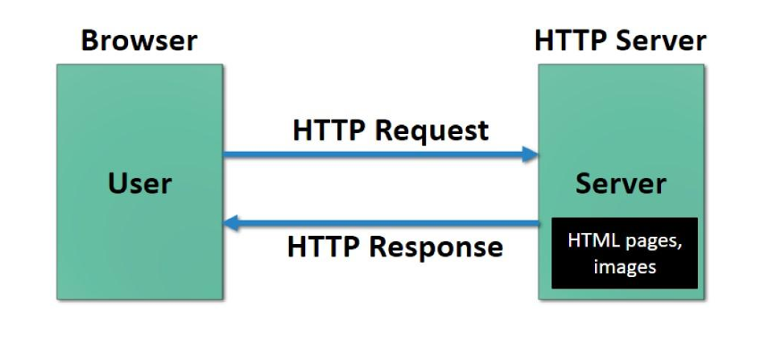
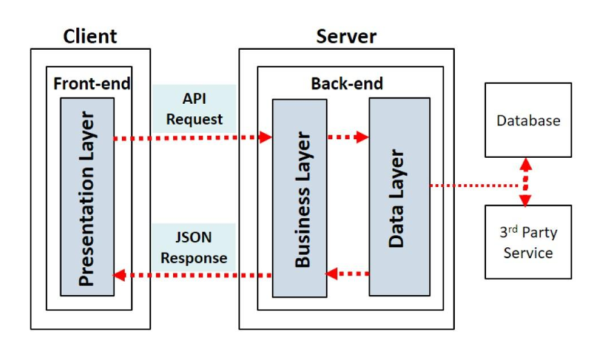

# <u>Chapter 1</u>: INTRODUCTION

## **Topic - 1: Web Application**

### <u>Introduction</u>

- **<u>Web application</u>:** An application stored on server & accessed through web browser.
- **<u>Server-side scripts</u>:** Scripts used for storing & retrieving information in a web application.
- **<u>Client-side script</u>:** Scripts used for presenting users information in right form.

>**<u>NOTE</u>:**
>Examples for client-side scripting languages are **HTML5** and **JavaScript**.

### <u>Request-Response Diagram</u>

### <u>Working Of Web Apps</u>

1. User sends request to server using browser/app.
2. Request is forwarder from webserver to web application server.
3. The request is performed.
4. Then requested information is sent back to webserver.
5. Then it is sent back to the user.

### <u>Types Of Web Apps</u>

- Static web application
- Dynamic web application

## **Topic - 2: Web Application Architecture (WAA)**

### <u>Introduction</u>

- **<u>Web application architecture</u>:** System of interconnected components which are involved in running website.

### <u>Components Of WAA</u>

#### Main component categories:

- UI/UX components (client-side)
- Structural components (server-side)

>**<u>NOTE</u>:**
>1. Structural components also includes the hardware used in servers.
>2. When talking about components, we are talking about literally anything involved in them.

#### Sub-components:

- Containerized servers
- Load balancers
- API gateways
- Single-page frontends

## **Topic - 3: WAA Models**

### <u>One Database, One Web Server</u>

- Developers use only one database & one web server to develop web application.
- Mainly used in mobile applications.
- If server is down, whole application will be down too.

### <u>One Database, Multiple Web Servers</u>

- Used when work has to be divided among various web servers.
- Some of these servers can also serve for backup purpose incase one fails.
- It is a stateless architecture.

### <u>Multiple Databases, Multiple Web Servers</u>

- This model is focused on reducing possibility of loss due to failure.
- Many servers copy data in main server as backup.

## **Topic - 4: Types Of WAA**

### <u>Single Page Applications (SPAs)</u>

- In SPAs, any form of changes to be made in the UI is done without communication with the server.
- Meaning, page doesn't require reloading when new data comes.
- For example, Facebook, Google Maps, Gmail, GitHub etc.

### <u>Server-Side Rendering (SSR)</u>

- Files come rendered from the server itself.
- More dynamic, server immediately responses to requests.

### <u>Static Site Generation (SSG)</u>

- Provides templates for HTML.
- These HTML templates are stored on servers & delivered through CDN.
- **<u>CDN</u>:** Content Delivery Network

### <u>Progressive Web Application (PWA)</u>

- Similar to SPA but has some parallelly running services too.
- For example, cookies, extensions, plug-ins etc.

## **Topic - 5: Single Page Application (SPA)**

### <u>Introduction</u>

- Browser load only one page when SPA is used.
- Means there is a single static page which doesn't require any kind of change to it.

### <u>Advantages</u>

- Proper team collaboration
- Caches local data effectively.
- Fast & responsive
- Debugging is easier
- User friendly

### <u>Disadvantages</u>

- Browser history not saved.
- Optimization is tough.
- 