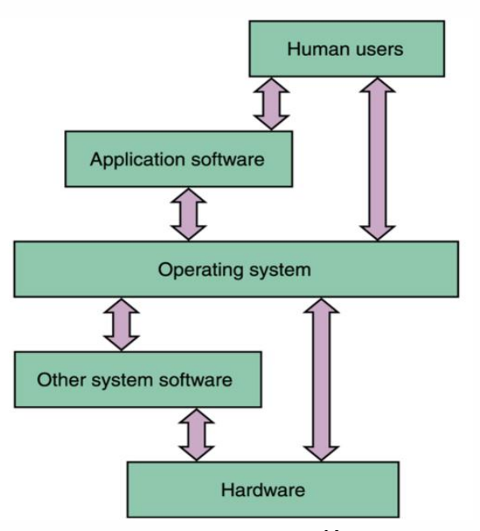
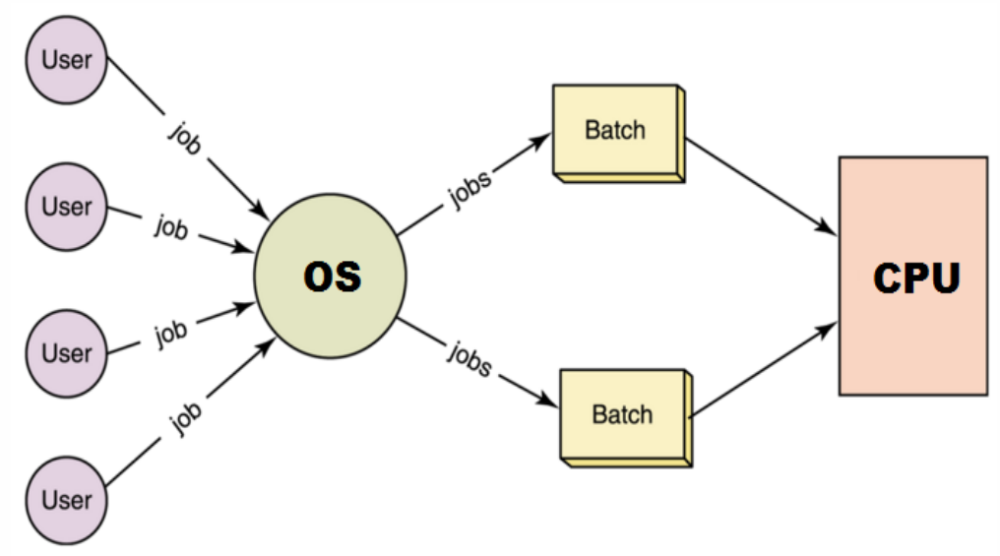

# $\fbox{Chapter 1: INTRODUCTION}$

## **Topic - 1: Definitions**

- **<u>Program</u>:** Set of instructions.
- **<u>Software</u>:** Set of programs.

## **Topic - 2: Types Of Software**

### <u>System Software</u>

- Software used in performing hardware level tasks.
- Compiler & interpreter
- Operating system
- **<u>Linker</u>:** Links required libraries to the program during execution.
- **<u>Loader</u>:** Loads required libraries after linker links libraries with program.

### <u>Utility Software</u>

- Set of pre-built software in an OS.
- Calculator
- Browser

### <u>Application Languages</u>

- Software made using high-level languages & has less to do with hardware. 
- For example, some games & banking system etc.

## **Topic - 3: Operating System History**

### <u>Goals of OS</u>

- Manage hardware resources efficiently.
- Allow sharing of hardware & software.
- Provide security to user’s programs.
- Provide troubleshoot & error correction etc.

### <u>Generations of OS</u>

| Generation | Year      | Method                      |
|------------|-----------|-----------------------------|
| 1st        | 1945-1955 | Vacuum tubes & plug boards  |
| 2nd        | 1955-1965 | Transistors & batch systems |
| 3rd        | 1965-1980 | IC & multi-programming      |
| 4th        | 1980-NOW  | Personal computers          |

## **Topic - 4: 1st Generation OS**

### <u>Vacuum Tubes</u>

- Before WW2 mechanical relay based computers were used primarily for calculations.
- However these were slow.
- After WW2 first digital computers were created using vacuum tubes.
- These were large & faster but still slow.

### <u>Plugboards</u>

- It had no programming language & no OS.
- It was used for simple numerical calculations.

### <u>Punch Cards</u>

- Introduced during 50’s.
- Numeric patterns were punched on cards and fed to the system.
- It improved computing experience.

## **Topic - 5: 2nd Generation OS**

### <u>Transistors</u>

- First commercial class of computers were made.
- Were also known as mainframes.
- Were kept in air-conditioned rooms where user operated them.

### <u>Batch Systems</u>

- Introduced to reduce time wastage in operating.
- A tray full of “jobs” was collected in input room & read using magnetic tapes.

## **Topic - 6: 3rd Generation OS**

### <u>IC</u>

- Reaching the 60’s there were commercial & scientific computers.
- IBM did work of integrating these systems.
- These were bit expensive.
- Provided major performance boost over previous generation.

### <u>Multi-Programming</u>

- Processor was never idle using this.
- While a job completes its I/O operation, it processes another one.

## **Topic - 7: 4th Generation OS**

### <u>PC</u>

- Created with large scale ICs.
- Thousands of $transistors/cm^{2}$ of silicon.
- It let to further development of network OS & distributed OS.
- Network OS was earlier used for copying files from one machine to another.

### <u>PC Examples</u>

#### Mac OS:

- ***Apple*** computers are called ***Macintosh***.
- Apple laptops are called **Mac**.
- Recent versions - El Capitan (2015), Yosemite (2014), Mavericks (2013), Mountain Lion (2012) & Lion (2011).

## **Topic - 8: Types Of OS**

### <u>Introduction</u>

- Simple Batch OS
- Multiprogramming Batch OS
- Multitasking OS
- Multiprocessor OS
- Distributed OS
- Real-time OS

### <u>Simple Batch OS</u>

- No direct interaction between user & computer.
- User submits a job to the computer operator (OS).
- **<u>Job</u>:** Instructions written on card/tape.
- Then the computer operator makes batches of these jobs.
- **<u>Batch</u>:** Set of jobs.
- And finally places these batches on an input device.

#### Disadvantages:

- No priority-based processing.

### <u>Multiprogramming Batch OS</u>

- All jobs are submitted to the OS at the same time.
- These jobs are loaded into the main memory.
- Then one-by-one selected & executed.
- If during execution a job required peripheral for further process, then the CPU handles another job.

#### Advantages:

- Resources (memory, I/O, CPU) are used more efficiently.
- User can submit all jobs simultaneously.

#### Disadvantages:

- Poor CPU usage as only program is there at a time.
- No user interaction.

### <u>Multitasking OS</u>

- Also called Time Sharing System (TTS).
- Interacts with user.
- It uses CPU scheduling & multiprogramming.
- Supports concurrent access.
- Each user is given its time-slice for executing his job in **Round-Robin** Fashion.
- **<u>Round-Robin</u>:** An algorithm in which each user is given equal amount of CPU in sequence.
- Multitasking allows more frequent context switching.
- End of one time-slice & start of another.
- Multitasking creates an illusion that all tasks are running simultaneously, but in actual frequent context switching is occurring.

#### Advantages:

- Quickly responsive interface
- Reduces idle time

#### Disadvantages:

- Unsafe
- Expensive

### <u>Multiprocessing OS</u>

- Multiple processors (CPUs) are present.
- It provides tightly coupled system.
- 1. Devices are connected to each other & depend on each other to work.
- Its opposite is loosely coupled system.

#### Advantages:

- Increased throughput
- **<u>Throughput</u>:** Number of jobs executed per unit time.
- Economical (buying 3 CPU << buying 3 processors)
- Increased reliability

### <u>Real Time OS (RTOS)</u>

- Hard real time OS
- Soft real time OS

### <u>Distributed OS</u>

- Loosely coupled system
- Several computers share same OS.
- Computation is distributed among all processors & memory.

#### Advantages:

- Shared resources
- Shared load
- Reliable
- Scalability

### <u>Facilities by OS</u>

- Error detection
- Resource allocation
- Accounting
- Security & protection etc

## **Topic - 9: System Calls**

- System call is a request by the user to the OS for accessing a resource.
- This request can be for any hardware component.
- And this request is made using the kernel.

## **Topic - 10: Modes Of Running**

### <u>Kernel Mode</u>

- **<u>Kernel</u>:** Core of OS & controls almost everything going in the computer.
- In kernel mode, a user can access any hardware resources directly.
- So, kernel mode is believed to be very powerful mode.
- A failure in kernel may affect the whole system also.

### <u>User Mode</u>

- Outer layer of OS architecture.
- No direct access over the hardware.
- A failure in user mode might not affect the whole system.

## **Topic - 11: Management Systems**

### <u>Process Management</u>

- **<u>Process</u>:** An executing program.

#### Responsibilities:

- Process creation & deletion
- Process suspension & resumption
- Deadlock handling
- Provision for mechanisms
- Process synchronization
- Process communication

### <u>Memory Management</u>

- **<u>Memory management</u>:** Array of bytes with each byte having its own address.
- **<u>Main memory</u>:** RAM

#### Responsibilities:

- Keep track about memory usage.
- Decide which process to do & when.
- Allocate or deallocate memory space.

### <u>File Management</u>

#### Responsibilities:

- File creation & deletion.
- Directory creation & deletion.
- File manipulation facility.
- Copying & moving files etc.

### <u>I/O Management</u>

#### Responsibilities:

- Providing buffer-caching system.
- **<u>Buffer</u>:** Temporary storage to hold data before writing it permanently.
- **<u>Caching</u>:** Storage of data for quick access.
- **<u>Buffer-caching</u>:** Caching with buffer
- Providing device driver interface.

### <u>Secondary Storage Management</u>

- **<u>Secondary storage</u>:** Place where data is permanently stored.

#### Responsibilities:

- Free space management
- Storage allocation
- Disk scheduling

### <u>Protection</u>

#### Responsibilities:

- Distinguish b/w authorized & unauthorized usage.
- Take proper security measures.

## **Topic - 12: Command Interpreter System**

- A program that interprets commands.
- CLI in Windows, Shell in UNIX/Linux.

## **Topic - 13: Types Of Kernels**

### <u>Monolithic Kernel</u>

- A type of kernel.
- System level commands can be given.
- It can control device drivers from the CLI.

### <u>Microkernel</u>

- A very minimalist type of kernel.
- Removes all the unnecessary part of the kernel.
- These removed parts are generally what could be done using GUI.
- Provided facility includes: Memory management & communication facility etc.
- Works on message passing principle.
- **<u>Message passing</u>:** A process indirectly passes its request, through other processes.

#### Advantages:

- Takes less space.
- Easy to debug kernel.
- More secured & reliable.

#### Disadvantages:

- Poor performance.
- Increased system overhead.
- **<u>System overhead</u>:** Large time taken due to heavy processing.

## **Topic - 13: Virtual Machine**

*\*Just recall what “Virtual Box” does…*
 
---
