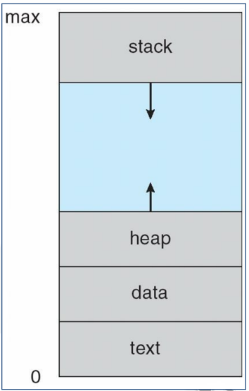
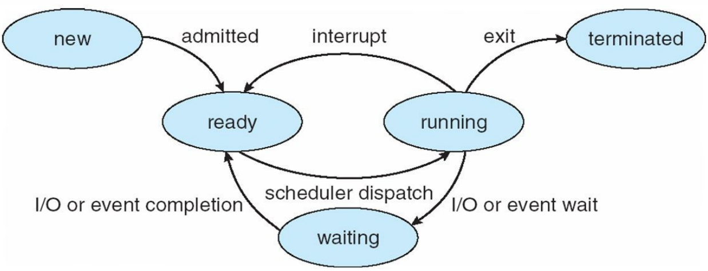
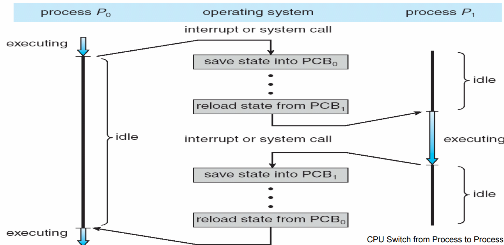
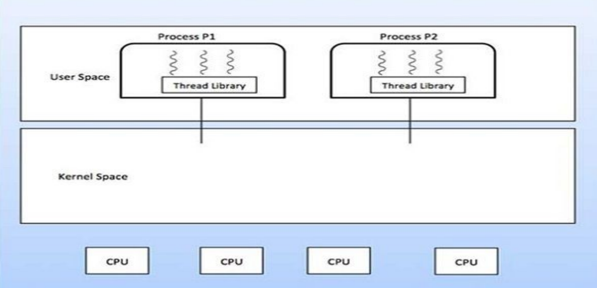
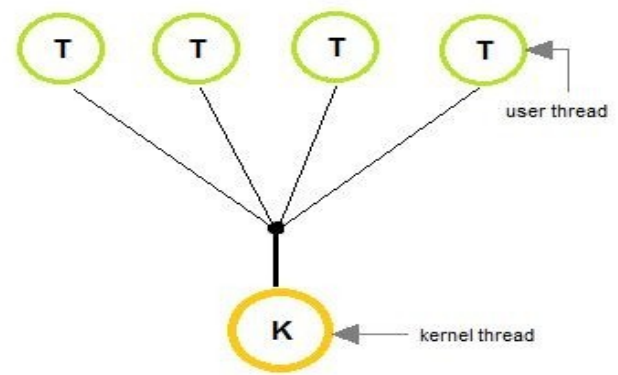
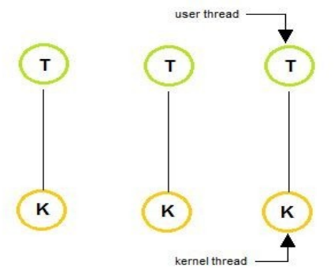
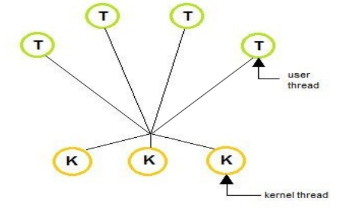
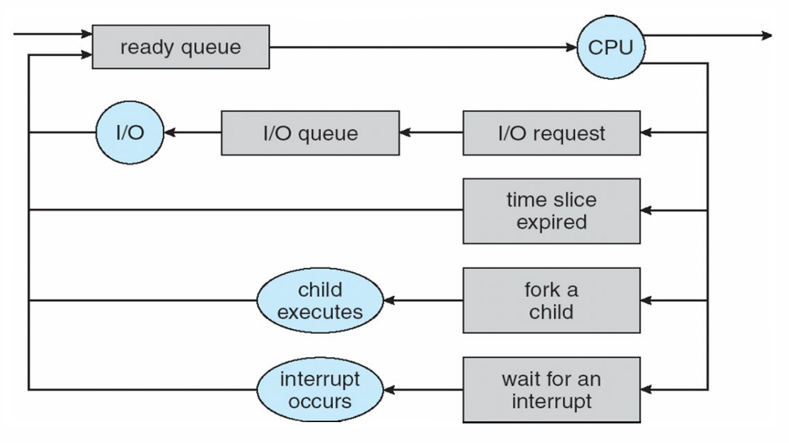
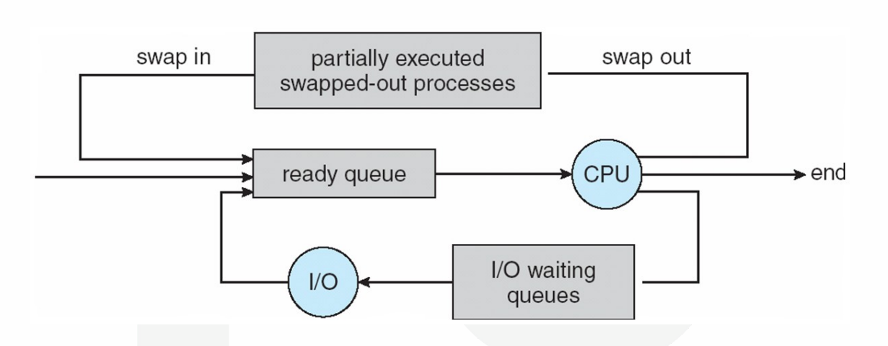

# $\fbox{Chapter 2: CPU SCHEDULING}$

## **Topic - 1: Process**

### <u>Introduction</u>

- A process is not just a program code but also an active entity.
- **<u>Active/dynamic entity</u>:** Something that occupies system resources & occupation may vary time to time.
- **<u>Passive/static entity</u>:** Something that occupies system resources but occupation stays constant until interrupted.
- Attributes of process: Hardware state, memory, CPU timing etc.

### <u>Goals Of Processes</u>

- Share the processor among various processes/tasks.
- Provide enough resources & response time to the processes.
- **<u>Response time</u>:** Answering a request made by a process.
- Support inter-process communication & synchronization.
- Making sure that user is able to create a process.

#### How are these achieved?

- By scheduling & dispatching processes to the processor.
- By creating unbiased policies for resource allocation to processes.
- By maintaining internal database of each current processes.

### <u>Process Creation</u>

#### When is a process created?

- When a computer initializes.
- When the process used for creating process is called.
- When user requests to create a process.
- When a batch of jobs is submitted to CPU.

#### When is a process terminated?

- Volatile reasons include normal exit & error exit etc.
- Involatile reasons include fatal error & killed by another process etc.

### <u>Program Files</u>

- Programs are in general executable files.
- These executable files are stored in secondary memory.
- When they are loaded into the main memory, it becomes a process.
- Process memory is divided into four parts.

### <u>Process memory</u>

- **<u>Stack</u>:** Contains the local variables in it & called after initialization.
- **<u>Heap</u>:** Contains the dynamic variables in it & called after initialization.
- **<u>Text</u>:** Contains the compiled code & called during execution.
- **<u>Data</u>:** Contains the global/static variables coded into the program & called before execution of main function.

### <u>Process v/s Program</u>

| Process                                                 | Program                                          |
| ------------------------------------------------------- | ------------------------------------------------ |
| Program under execution.                                | Set of instructions.                             |
| Active/dynamic entity.                                  | Passive/static entity.                           |
| Limited life span.                                      | Comparatively longer life span.                  |
| May use some resources.                                 | Just contains instructions in storage device.    |
| Works in main memory.                                   | Stored in secondary memory.                      |
| Occupies certain memory addresses called address space. | Requires space in secondary memory to be stored. |

### <u>Process State</u>

- A process continuously changes its state.
- **<u>State</u>:** Current activity levels or nature of the process.

#### Sates of a process:

- **NEW –** The process is created.
- **READY –** The process is ready to be assigned to the processor.
- **<u>OS scheduler</u>:** Assigns process to processor.
- **RUNNING –** Program is under execution.
- **WAITING –** The process is under halt.
- **TERMINATED/EXIT –** Execution completed.

#### Process transition:

- $\text{READY} \rightarrow \text{RUNNING}$ – Dispatcher selects a new process to run.
- $\text{RUNNING} \rightarrow \text{READY}$ – The file is interrupted by higher priority process.
- $\text{RUNNING} \rightarrow \text{BLOCKED}$ – Process can’t go further due to unavailability of resources or waiting for another process to end.
- $\text{BLOCKED} \rightarrow \text{READY}$ – When demands are met to it.

#### Suspend sub-processes:

- **<u>Blocked-suspend</u>:** Queue in which suspended processes which are not ready to run are stored.
- **<u>Ready-suspend</u>:** Queue in which suspended processes which are now ready to run are stored.

### <u>Process Control Block (PCB)</u>

- Does accounting of each processes in an OS.
- Deleted after the process terminates.

#### PCB table includes:

| Attribute | Work |
|:--:|:--:|
| Process state | - |
| Process privileges | Tells what and what not process can access. |
| Process ID | - |
| Pointer | A pointer to parent process. |
| Program counter | Pointer to address of next instruction. |
| CPU registers | CPU registers where process will be stored. |
| CPU scheduling information | Process priority & other scheduling information. |
| Memory management information | - |
| Accounting information | Contains many precise figure data. |
| I/O status information | List of I/O devices involved in the process. |

### <u>Context Switching</u>

- State of one task is saved before switching to another.
- <u>Restoration</u>: Process rollback.

- It creates an illusion of tasks running altogether.
- Time taken when switching context is pure overhead.
- Context switching being a bottleneck, programmers now use threads.

## **Topic - 2: Threads**

### <u>Introduction</u>

- Also known as lightweight process.
- **<u>Thread</u>:** An execution unit which has its own program counter, stack & registers.
- Threads are executed parallelly.
- A process can have multiple threads, but one thread can be in one process only.

#### Advantages:

- Minimizes context switching time.
- Concurrency
- More economical
- Proper utilization of microprocessor.

### <u>Process v/s Thread</u>

| Process                                                                     | Thread                                                               |
| --------------------------------------------------------------------------- | -------------------------------------------------------------------- |
| Consumes more resources.                                                    | Consumes less resources.                                             |
| Process switching requires interaction with OS.                             | Thread switching doesn’t require interaction with OS.                |
| It executes same code but has its own resources.                            | Each thread gets even lesser amount of resources.                    |
| If one process blocks, others will run only when it unblocks and completes. | If one thread blocks, other concurrent thread will continue to work. |
| One process can’t interfere another.                                        | A thread can interfere another thread.                               |

### <u>Types of Threads</u>

- User level threads
- Kernel level threads

### <u>User-Level Threads</u>

- Threads managed by user.
- Thread managing kernel doesn’t know about it.
- User uses thread library for programming.
- **<u>Thread context</u>:** Information about a thread.

#### Advantages:

- Thread switching doesn’t depend on kernel.
- Portable OS to OS.
- Can be scheduled our own way.
- Operations on them are fast, despite being high-level.
- Doesn’t require multiprocessing system.

### <u>Kernel-Level Threads</u>

- Threads acting on kernel.
- Managed also by kernel & OS.
- Can’t be controlled by user or any application.

#### Advantages:

- Kernel can schedule all threads to their slots, all at once.
- Kernel assigns a blocked thread’s slot to another thread.

#### Disadvantages:

- Operations on them are slow, despite being low-level.
- Kernel switches mode when control is switched one thread to another.

## **Topic - 3: Multithreading**

### <u>Introduction</u>

- Execution of multiple threads at once.

#### Multithreading modes:

- One-to-one
- One-to-many
- Many-to-one

### <u>One-to-Many Multithreading</u>

- Thread is managed by user with use of programming libraries.

### <u>One-to-One Multithreading</u>

- **Linux** & **Windows 95** to **XP** used this.
- There is in general limitation to number of threads in such OS.

### <u>Many-to-Many Multithreading</u>

- Combines best features of one-to-one & many-to-one models.
- No limitation on number of threads.
- Blocking kernel system call blocks a single thread, not entire process.
- Process is split among multiple processors in multi-processing OS.

### <u>Benefits of Multithreading</u>

- Better utilization of resources.
- Economical
- Smooth context switching

### <u>User-level Threads v/s Kernel-level Threads</u>

| User Level Threads                | Kernel Level Threads         |
|----------------------------------|------------------------------|
| Faster to create & manage.       | Slower to create and manage. |
| Made using programming libraries. | Made using OS kernel.        |
| Portable                         | Non-portable                 |
| Doesn’t use multiprocessing.     | Uses multiprocessing.        |

## **Topic - 4: Scheduling**

### <u>Process Scheduling</u>

- **<u>Process scheduling</u>:** Determining which processes to move from job queue to processing queue.
- Its purpose is to keep CPU busy & reduce response time.
- Scheduler applies some rules on processes which move processes from CPU to memory & vice versa.
- **<u>Non pre-emptive scheduling</u>:** One process can’t interfere another, no priority is given to any process by the CPU.
- In it, other jobs have to wait in ready queue before job currently executing completes.

### <u>Scheduling Queue</u>

- When a process comes into the system, it is initially stored in the job queue.
- Processes waiting for a device to become available are stored in device queues.
- There are unique device queues for each peripheral device.
- **<u>Dispatch</u>:** Selection of a process for execution.

- Waiting queue comes before ready queue.
- When a process is terminated, it is removed from all queues and its PCB data is deallocated.
- Types of schedulers: Long term, short term & medium term.

### <u>Types of Schedulers</u>

#### Long term scheduler:

- Runs less frequently.
- It decides which program must be loaded into the job queue.
- Then job processor selects processes from job queue and loads them into memory for execution.
- Job scheduler is mainly used for efficiently using multi-programming.

#### Short term scheduler:

- Runs very frequently.
- Also known as CPU scheduler.
- It is mainly used for enhancing CPU performance & execute processes faster.

#### Medium Term Scheduler:

- Temporarily keeps big processes present in ready queue at some other place when there is too much of load on the CPU.
- **<u>Swapping</u>:** The big processes getting restored in memory for execution.

### <u>Scheduling Criteria</u>

- Keep CPU busy
- **<u>Throughput</u>:** Number of processes completed per unit time.
- **<u>Turnaround time</u>:** Time taken for a process to complete.
- Waiting time (in ready queue)
- **<u>Load average</u>:** Number of processes in the ready queue.
- Response time (response to request)

### <u>Operation on Process</u>

- Process creation
- Process termination

### <u>CPU Scheduling</u>

- Processes on hold are there due to unavailability of resources.
- The short-term scheduler selects the next process to be carried out.

### <u>Scheduling Algorithms</u>

- First come first serve scheduling (FCFS)
- Shortest job first scheduling (SJF)
- Priority scheduling
- Round Robin scheduling (RR)
- Multi-level queue scheduling
- Multi-level feedback queue scheduling

## **Topic - 5: Scheduling Algorithms**

### <u>First Come First Serve (FCFS)</u>

#### Example:

| Process | Arrival Time (AT) | Burst Time (BT) | Completion Time (CT) | Turn Around Time (TAT) | Waiting Time (WT) | Response Time (RT) |
| :-----: | :---------------: | :-------------: | :------------------: | :--------------------: | :---------------: | :----------------: |
|  $P1$   |        $0$        |       $2$       |         $2$          |          $2$           |        $0$        |        $0$         |
|  $P2$   |        $1$        |       $2$       |         $4$          |          $3$           |        $1$        |        $21$        |
|  $P3$   |        $5$        |       $3$       |         $8$          |          $3$           |        $0$        |        $24$        |
|  $P4$   |        $6$        |       $4$       |         $12$         |          $6$           |        $2$        |        $30$        |

$$ \text{TAT = CT - AT} $$
$$ \text{WT = TAT - BT} $$

- Uses **GANTT chart**.
- This example might have some mistakes.

#### Problems:

- High waiting time.
- **<u>Convoy effect</u>:** Short process waiting for a long process to complete.
- Poor performance

### <u>Short Job First (SJF)</u>

- Of both pre-emptive & non pre-emptive types.
- Processor need to know the burst time of all processes in advance.
- Performs better if arrival time is same for all processes.
- Chooses the shortest process among all available as per the arrival time.

#### Pre-emptive SJF:

- Jobs are put into ready queue as they arrive.
- Job with shorter burst time (if any) replaces the current process.

### <u>Fixed Priority Scheduling (FPS)</u>

#### Problem With Priority:

- Small process may wait for a while before a large but high priority process ends.
- **<u>Solution</u>:** Keep increasing priority of waiting small processes with time.

### <u>Round Robin Algorithm (RRA)</u>

- We have to skip time units with quanta $q$.
- Processes get $<100$ milliseconds of time slice.
- For large $q$, the processes must follow FIFO.
- For small $q$, $\text{quantum time must be > context switch time}$.
- Context switching takes $<10$ micro seconds to be done.

$$ \text{Turn around time} = \text{Completion time} - \text{Arrival time} $$
$$ \text{Waiting time} = \text{Turn around time} - \text{Burst time} $$

### <u>Multilevel Queue Scheduling (MQS)</u>

- Process of dividing the ready queue into multiple queues.
- Similar processes are assigned to one of those queues permanently.
- Foreground (front-end) processes queues follow RRA.
- Background (back-end) processes queues follow FCFS.
- There is even scheduling among the queues.
- Some queues are given higher priority over others.
- Foreground queues are given higher priority than background queues.

### <u>Multilevel Feedback Queue Scheduling (MFQS)</u>

- Similar to MQS but processes can switch between the queues as per their behavior.
- For example, if a process in a queue of $q=8$ milliseconds, completes itself in $16$ milliseconds, then it is shifted to another queue.
- **<u>MFQS parameter</u>:** Methods and variables defined for managing MFQS.

---
