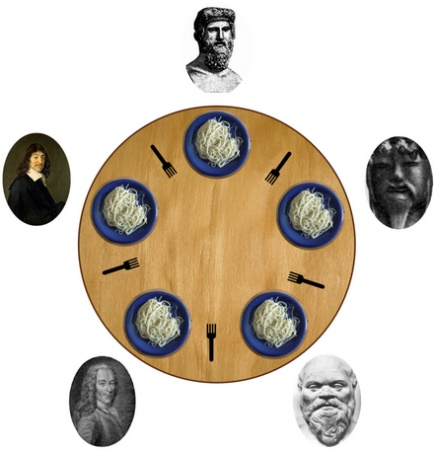

# $\fbox{Chapter 3: INTER-PROCESS WORKS}$


## **Topic - 1: Inter-Process Communication (IPC)**

### <u>Introduction</u>

- **<u>IPC</u>:** A mechanism enabling communication among processes.


### <u>Types Of Concurrent Processes</u>

- Independent processes
- Co-operating processes


### <u>Advantages</u>

- Faster computation
- Modularity
- Convenience


### <u>IPC Models</u>

- **<u>Message passing</u>:** Communication with kernel as an intermediate.
- **<u>Shared memory</u>:** Communication with a small piece of buffer memory as intermediate.


## **Topic - 2: Race Condition**

### <u>Introduction</u>

- **<u>Race condition</u>:** A situation occurred when multiple processes try to access same piece of data.
- Generally, occurs among threads.

### <u>Reasons</u>

- One instruction is executed before other(s).
- One instruction executes faster than other(s).
- Common shared resources like memory/data/file.

### <u>Example</u>

|    Thread 1    |    Thread 2    |               | Integer Value |
| :------------: | :------------: | :-----------: | :-----------: |
|                |                |               |      $0$      |
|   read value   |                | $\leftarrow$  |      $0$      |
| increase value |                |               |      $0$      |
|   write back   |                | $\rightarrow$ |      $1$      |
|                |   read value   | $\leftarrow$  |      $1$      |
|                | increase value |               |      $1$      |
|                |   write back   | $\rightarrow$ |      $2$      |

|    Thread 1    |    Thread 2    |               | Integer Value |
| :------------: | :------------: | :-----------: | :-----------: |
|                |                |               |      $0$      |
|   read value   |                | $\leftarrow$  |      $0$      |
|                |   read value   | $\leftarrow$  |      $0$      |
| increase value |                |               |      $0$      |
|                | increase value |               |      $0$      |
|   write back   |                | $\rightarrow$ |      $1$      |
|                |   write back   | $\rightarrow$ |      $1$      |


## **Topic - 3: Critical Section & Mutual Exclusion**

### <u>Critical Section</u>

- **<u>Race Condition</u>:** Piece of code shared by multiple processes.
- It is protected to be accessed by only one process at a time.
- A process trying to access it when another process is already on it, is blocked.
- It is also known as critical region.
- Attempt for its concurrent access results in both processes executing one after other.


### <u>Mutual Exclusion</u>

- A program written to avoid concurrent access to a shared resource.
- Actually, it is that code in critical section which protects it.
- Also known as mutex.


### <u>Critical Section Problem</u>

```rust
do {
	/* Entry section */
		// Critical section
	
	/* Exit section */
		// Remainder section
} while (true);
```

- **<u>Entry section</u>:** Part of critical section managing access requests.

#### Solution must satisfy these:

- Mutual exclusion
- **<u>Bounded waiting</u>:** All processes that requested get chance to enter the critical section.
- **<u>Progress</u>:** No process interferes another.
- **<u>Arbitrary speed</u>:** There is nothing like relative speed.


### <u>Ways to Achieve Mutual Exclusion</u>

- Disabling interrupts
- Shared lock variable
- Strict alteration
- TSL (test & set lock) instruction
- Exchange instruction
- Peterson’s solution


## **Topic - 4: Disabling Interrupts**

### <u>Introduction</u>

- **<u>Interrupt</u>:** Signals/process produced by a device connected to computer.
- Disabling interrupts would result in lesser chances of another process entering critical section induced by interrupts.
- Any process entering critical section disables all interrupts & then re-enables them when leaving it.


### <u>Problems</u>

- Unwise to provide user process power to control interrupts.
- Hazardous if user forgets to include code for re-enabling interrupts.
- In multiprocessor systems, user have to program for each processor separately.


## **Topic - 5: Shared Variable Lock (SVL)**

### <u>Introduction</u>

- SVL has a value of `0` or `1`.
- Value of SVL is `0` usually, but set to `1` when a process is inside the critical section.
- Another process trying to access it has to wait if value of SVL is `1`.
- So, `1` basically means that critical section is occupied by another process.


### <u>Problems</u>

- Context may switch while a process is setting SVL to `1`.
- Unsafe as sometimes after context switching a process may read SVL as `0`, and enter the critical section despite another process being there.


## **Topic - 6: Strict Alteration**

### <u>Introduction</u>

- **<u>Strict alteration</u>:** Integer variable `turn` tells which process will enter critical section.
- `turn` is initially `0`.
- If a process finds turn to be different than their process number, then it waits in the loop, testing each iteration if it is its turn.
- **<u>Busy waiting</u>:** Continuous testing for something to happen.


### <u>Disadvantages</u>

- Sometimes a process may not enter critical section after being into it once.
- It then resides in non-critical region and another process ready to enter critical section is unnecessarily blocked due to it, wasting CPU’s time.
- Turns may not be ordered well.


## **Topic - 7: TSL**

### <u>Introduction</u>

```gas
enter_region:
	movl lock(%rip), %ebx
	addl $1, %ebx
	jnz
	ret

leave_region:
	subl $1, %ebx
	ret
```


### <u>Exchange Instruction</u>

```gas
enter_region:
	movl lock(%rip), %ebx
	addl $1, %ebx
	movl $lock, %edi
	xchgl %ebx, (%edi)
	jnz
	ret

leave_region:
	subl $1, %ebx
	ret
```


## **Topic - 8: Peterson's Solution**

### <u>Introduction</u>

- **<u>Peterson's solution</u>:** Allows multiple processes to access a resource (not critical section) without conflict.
- Processes communicate through shared memory.

```c
int i;
printf("Process number: ");
scanf("%d", &i);

int turn = i;
flag[i] = TRUE;

while ((flag[i]==TRUE)&&(turn==i))
{
	// Process running...
}

/* Critical section */

/* End of critical section */

flag[i] = FALSE;
```


### <u>Disadvantages</u>

- Involves too much busy waiting.
- Can be applied on only two processes at a time.


## **Topic - 9: Producer-Consumer Problem**

### <u>Introduction</u>

- **<u>Producer-consumer problem</u>:** It’s a problem regarding synchronization of multiple processes.
- Also known as bounded buffer problem.
- In this problem, we have a producer & a consumer.
- They communicate through shared memory buffer.
- Producer’s job is to produce information & store it in buffer.
- Consumer’s job is to utilize that information & remove it from buffer.
- We have to make sure that the producer doesn’t produce anything if buffer is full & the consumer doesn’t try to consume anything if buffer is empty.


### <u>Solution</u>

- In case of full buffer, producer either discards its data or goes to sleep.
- Producer is notified when buffer becomes empty.
- In case of empty buffer, consumer goes to sleeps & notified when.
- Buffer could also be partially filled.


### <u>Problem</u>

- It has a race condition leading to deadlock.
- **<u>Deadlock</u>:** A process in which no progress is made.


### <u>Working</u>

- We know that consumer goes to sleep when count is `0` (empty buffer).
- So in case of a empty buffer, the consumer attempts to sleep.
- But before it could sleep, it is interrupted by producer who has new data to fill the buffer, turning the count to `1`.
- Now the producer will try waking up the consumer, but it is already awake.
- And when consumer is resumed, they resume the process of getting into sleep which was suspended earlier.
- After falling asleep, it won’t wake up as producer tries waking it up only once.
- Then when buffer is full, producer also goes to sleep.
- Thus, both of them will continue sleeping forever resulting in a deadlock.


## **Topic - 10: Mutex Lock**

### <u>Introduction</u>

- **<u>Mutex</u>:** There is a Boolean variable saying if critical section is available or not.
- There are also two keys - `acquire()` and `release()`
- `acquire()` makes our Boolean variable `FALSE` if critical section is not available.
- `release()` makes it true if available.
- It involves busy waiting, and thus also known as **spin lock**.


### <u>Code</u>

```c
void acquire()
{
	while (!available)
	{
		/* Busy waiting. */
		available = FALSE;
	}
}

void release()
{
	available = TRUE;
}

while (TRUE)
{
	/* Acquire lock */
		// Critical section
	
	/* Release lock */
		// Remainder section
}
```


## **Topic - 11: Semaphores**

### <u>Introduction</u>

- **<u>Semaphores</u>:** Variables that are constantly checked and modified.
- It solves the problem we faced in producer-consumer model.
- Two types of semaphores: binary semaphores & counting semaphores
- A function `insert_item()` is similar to producer.
- And so is `remove_item()` to consumer.
- No busy waiting.


### <u>Binary Semaphores</u>

- Can be either `0` or `1`.
- Has two methods - Up & down, or lock & unlock, or signal & wait etc.
- These methods are used for acquiring or releasing lock.


### <u>Counting Semaphores</u>

- More than two possible values.


### <u>Insert & Remove Function</u>

- They get mutually exclusive access to critical section.
- `insert_item()` only works when buffer is not overflowing.


### <u>Advantages</u>

- No producer starvation (`insert_item()` doesn’t wait forever).
- No consumer starvation (`remove_item()` doesn’t wait forever).


### <u>Operations</u>

#### Down operation:

- If value is `1` then makes it `0`.
- If value is `0` then goes to sleep.
- Done as an atomic action, thus no busy waiting.
- When a function operation has started, it can’t be interrupted.

#### Up operation:

- If value is `0` then makes it `1`.
- If value is `1` then wakes up sleeping semaphores.
- Also contains atomic operations in functions.
- Also has uninterruptable operations.


## **Topic - 12: Producer-Consumer Using Semaphores**

### <u>Common Starting</u>

```c
#define N 4

typedef int semaphore;

int main()
{
	semaphore mutex = 1;
	semaphore empty = N;
	semaphore full = 0;
	
	return 0;
}
```


### <u>Inserting Item</u>

```c
void producer(void)
{
	int item;
	
	while (TRUE)
	{
		item = produce_item();
		
		down(&empty);
		down(&mutex);
		insert_item(item);
		up(&mutex);
		up(&full);
	}
}
```


### <u>Removing Item</u>

*\*Now you know*


## **Topic - 13: Monitor**

### <u>Introduction</u>

- **Monitor** is same definition as code library.
- Processes call other procedures in monitors (not monitor into user procedure like libraries).
- Monitors’ internal is somehow encapsulated.
- It is created for specially working with processes.
- Monitors achieve mutual exclusion by allowing only one process at a time in it.
- When a process is called into monitor, monitor’s first few lines of code checks if any other process is present in it or not.
- If yes, then this new process is suspended until the old one leaves the monitor.


## **Topic - 14: Producer-Consumer Using Monitor**

- It uses - Conditional variables, wait operation & signal operation.
- Sometimes the process might be unable to be continued (like **buffer overflow**).
- When such situations are faced, the monitor allows any other blocked process to execute, if it could.
- This is done using a conditional variable, which tells if a process could continue or not.


## **Topic - 15: Event Counters**

### <u>Introduction</u>

- **<u>Event counter</u>:** A special integer value that can only be incremented.


### <u>Possible Operations On It</u>

- **<u>Read(E)</u>:** Returns value of event counter `E`.
- **<u>Advance(E)</u>:** Increments event counter `E`.
- **<u>Await(E,V)</u>:** Process resumes until value of `E` becomes `V` or more.


### <u>Consumer-Producer Perspective</u>

- Both contain a serial number.
- Producer contains the serial number of data to be consumed by consumer.
- And those data are serially passed to consumer for consuming.
- in is commonly used as serial number for recently added item to buffer.
- `out` is similarly…
- Rest of it, all classical laws are followed by producer & consumer.


## **Topic - 16: Readers-Writers Problem**

### <u>Introduction</u>

- Reader-writers problem is also a synchronization problem.
- A piece of resource has to be shared by multiple processes.
- Reader & writer are two types of processes.
- Processes categorized as readers, can read from the shared resource simultaneously.
- Whereas only one writer process can write to that resource at a time.
- And also, writers can write only when no reader is reading the shared resource.
- It shows that readers are given higher priority.


### <u>Solution</u>

- To solve it, we use - A mutex (`m`), a semaphore (`s`) & `read_count` variable.
- `read_count` tracks the number of readers accessing the shared resource.
- `read_count` is initialized to `0` & `m` and `s` are to `1`.


### <u>Solution Implementation</u>

- When a reader wants to access the resource, `m` makes a lock on the resource.
- Then `read_count` is incremented, and then reader accesses the resource.
- After that, the lock is removed from the resource (unlocked).
- Similar process is followed when reader stops reading the resource.
- The `s` is active when there are active readers (at least `1`).
- This signals writers to not try writing to the resource when any reader is present.
- And similarly allows them to write if no reader is accessing it.


## **Topic - 17: Message Passing**

### <u>Introduction</u>

- If each reader belongs to a separate computer, these computers can parallelly communicate with each other.
- Or another way is by parallel communication among the processors of same computer.
- Its easier when OOP is used.
- This method can be either synchronous or asynchronous.
- **<u>Synchronous message passing</u>:** Sender is blocked until receiver receives and processes the message.
- **<u>Asynchronous message passing</u>:** Sender continues working without waiting for the receiver.


### <u>Send & Receive Function</u>

```c
send(&source, message);
receive(&destination, message);
```


## **Topic - 18: Dining Philosopher's Problem**

### <u>Introduction</u>



- Five philosophers sit in a dining, each with a bowl of rice.
- And there are five chopsticks on the table, but a philosopher requires two chopsticks when eating.
- At a time, a philosopher is either eating or thinking.
- A philosopher waits for left chopstick (if not available); then picks it up for eating, first.
- Then does the same with right chopstick.


### <u>Problem</u>

- Not enough ($2n$) chopsticks available.
- The two adjacent philosophers of an eating philosophers can’t eat.
- When all are hungry, they will pick up their left chopstick.
- As now no right chopstick is available, this creates a deadlock condition.


### <u>Possible Solutions</u>

- A philosopher must be allowed to pick up the chopsticks if both left and right are available.
- At max four philosophers can eat at a time, leaving at least one chopstick on table.


### <u>Metaphors</u>

- Here, philosophers represent processes.
- And chopsticks represent resources.
- So philosophers using chopsticks represent processes accessing resources.


### <u>Properties</u>

- As each chopstick represent a resource, each chopstick has one semaphore.
- This semaphore is Boolean semaphore.
- The state where the philosopher is waiting for chopstick(s) to be available together is called hungry.
- Initially, all philosophers are in thinking state.
 
$$ \text{Thinking} \rightarrow \text{Hungry} \rightarrow \text{Eating} $$

- Eating has to pass through $\text{Hungry}$ state.

---
