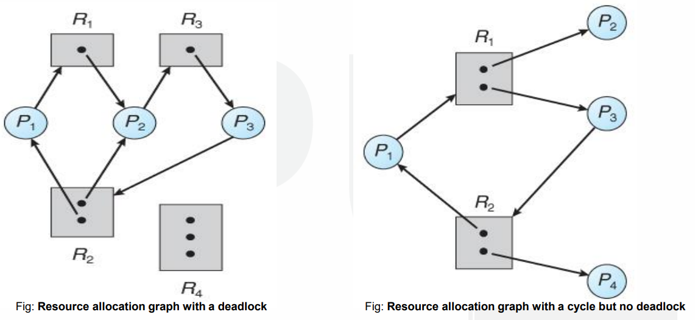

# $\fbox{Chapter 4: DEADLOCKS}$

## **Topic - 1: Basic Concepts**

### <u>Introduction</u>

- In multiprogramming system, processes compete over limited resources.
- If no resource is available, then processes enter waiting state.
- Sometimes a deadlock is created when processes are unable to use a resource because a more competitive process always uses it when it is made available.

### <u>System Model</u>

1. All processes will request for the resource.
2. If it is available, then the most competitive process will use it.
3. After using it, the process must not use this resource until rest of the processes which requested for it have used it as well.

### <u>Conditions for Deadlock</u>

- Mutual exclusion
- **<u>Hold and wait</u>:** A process using resource(s) requests for even more, busy resources.
- No pre-emption
- **<u>Circular wait</u>:** All processes waiting for another process, making a circular structure.

## **Topic - 2: Resource Allocation Graph (RAG)**

### <u>Introduction</u>

- Used for understanding deadlocks.

#### Components of RAG:

- Resources set
- Process set
- Resource instance
- Request edges
- Assignment edges

### <u>Components Description</u>

- Resources set - ${ \{ R^{1}, R^{2}, R^{3}, … , R^{n} \} }$
- Process set - *\*Now you know*
- **<u>Resource instance</u>:** Dots representing many resources of a particular category.
- **<u>Request edges</u>:** Edges representing which process requested which resource.
- **<u>Assignment edges</u>:** Same as request edge, but reversed.

### <u>Graph Conditions For Deadlock</u>

>**<u>NOTE</u>:**
>These are directed graph

- Cyclic structure is formed by directed edges.
- Each resource category contains one instance.
- But if multiple instances are there rather, then it shows there might be a deadlock.

## **Topic - 3: Deadlock Handling Methods**

- **<u>Prevention</u>:** At least one deadlock condition must not be satisfied.
- **<u>Avoidance</u>:** Ignoring data that may entertain deadlocks.
- **<u>Detection and recovery</u>:** Recovering a deadlock when it is detected.
- **<u>Ignorance</u>:** We ignore the problem as if it does not exist.

## **Topic - 4: Deadlock Prevention**

### <u>By Removing Mutual Exclusion</u>

- If a resource is made concurrently sharable, then deadlock will not occur.
- But some hardware resources like flash drives, disks and printers aren’t sharable.

### <u>By Removing Hold & Wait</u>

- **<u>Conservative approach</u>:** Process is allowed to execute only when it naturally holds all the resources.
- **<u>Do not hold</u>:** A process will get desired resources; but when making more request, it must release previously held resources.
- **<u>Wait timeouts</u>:** A process gets limited time to hold the resources with it.

### <u>By No Pre-Emption</u>

- **<u>Forceful pre-emption</u>:** High priority processes are allowed to pre-empt over resources.

### <u>By Circular Wait</u>

- Every process is assigned a natural number, for being executed serially.
- This can be either in increasing or decreasing order.

## **Topic - 5: Deadlock Prevention**

- When scheduler suspects a process for creating a future deadlock, it denies resource access request to it.
- **<u>Resource allocation state</u>:** Current condition of resources in our system.
- For example, like how many resources are allocated & how many are not etc.
- **<u>Safe state</u>:** A system state in which the resource requirements of all the processes are met, without creating a deadlock.
- Also, it is considered safer if the resources allocated by processes are freed after execution, so that upcoming processes can use them smoothly.

## **Topic - 6: Banker's Algorithm**

### <u>Introduction</u>

- Whenever a process starts executing, it tells how much resources it will use at max.
- When the scheduler receives request for resource using, scheduler checks whether granting it would leave the system in safe state.
- If not, then scheduler waits for the right time to do so.
- Also known as resource request algorithm.

### <u>Code Structure</u>

$$ \text{m = Number of resource categories} $$
$$ \text{n = Number of processes} $$
$$ \text{available[m] = Number of resources in each category} $$
$$ \text{max[n][m] = Maximum number of resources a process is demanding} $$
$$ \text{allocation[n][m] = Number of resources allocated to a process} $$
$$ \text{need[n][m] = Number of resources a process is short of} $$

### <u>Safety Algorithm</u>

- An algorithm that tells whether the state is safe or not.
- Let Work and Finish be vector arrays of length m and n.
- Work is available resources for each process.
- Finish contains completion status of each process, in Boolean.
- By default, Work is available & Finish is false for all elements.
- Rest of it is code based, better to not discuss in theory.

| Process | Allocation |   Need    | Available |
| :-----: | :--------: | :-------: | :-------: |
|         | $A\;B\;C$  | $A\;B\;C$ | $A\;B\;C$ |
| $P_{0}$ | $0\;1\;0$  | $7\;4\;3$ | $2\;3\;0$ |
| $P_{1}$ | $3\;0\;2$  | $0\;2\;0$ |           |
| $P_{2}$ | $3\;0\;2$  | $6\;0\;0$ |           |
| $P_{3}$ | $2\;1\;1$  | $0\;1\;1$ |           |
| $P_{4}$ | $0\;0\;2$  | $4\;3\;1$ |           |

## **Topic - 7: Deadlock Detection**

### <u>Introduction</u>

- It is done when deadlock have somehow occurred, and now we want to detect it.
- Deadlock detection works by checking for deadlock by scanning whole system.
- But along with this technique, comes risk of losing unsaved data.

### <u>Wait-For Graph</u>

- If only one instance of each resource is there, then we don’t need to represent resources on graph.
- We can connect the lines removing the boxes.
- This is called ***wait-for graph***.
- Here also a cycle represents deadlock.

- There are two differences between this detection technique & banker’s algorithm in code.
- The frequency of scan for detecting deadlock depends on how the detection algorithm is programmed.
- The detection algorithm is programmed as per the expected frequency of deadlock occurrence.
- And also programmed as per the required seriousness in the situation of deadlock.
- One common way this algorithm is programmed is by scanning for deadlock immediately after any resource is allocated to a process.
- But this approach increases the overhead on the system.
- It is advised to use deadlock when some strange performance is noticed in CPU.

## **Topic - 8: Deadlock Recovery**

### <u>Introduction</u>

#### Methods used:

- Process termination
- Resource pre-emption

### <u>Process Termination</u>

- We kill the processes involved in it.

#### Methods to terminate:

1. Abort all the processes involved in deadlock.
2. Abort processes in deadlock one-by-one; until deadlock is removed.
3. And then scanning is done for confirmation.

### <u>Resource Pre-emption</u>

- We transfer some resources from deadlocked processes to other processes.

#### Issues raised:

1. We have to figure out which resources & processes will be pre-empted.
2. We also have to figure out what to do with the pre-empted processes.
3. Pre-empting same process every time may lead to starvation. It can be solved by pre-empting each process limitedly.

>**<u>NOTE</u>:**
>***Starvation*** is a situation where a process is never being able to complete its task.

---
