# $\fbox{Chapter 5: MEMORY MANAGEMENT}$


## **Topic - 1: Memory Hierarchy**

- **<u>Memory Hierarchy</u>:** A way to arrange memory in such a way, that its access takes less time.

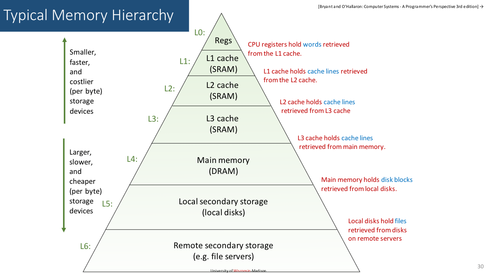


## **Topic - 2: Logical & Physical Address**

- **<u>Logical address</u>:** An address generated by CPU as a reference to its physical address.
- It is generally represented by numeric digits.
- For example, `0x78C9A` is a pointer address in C/C++.
- **<u>Physical address</u>:** The physical location of the address.
- Physical address can be accessed indirectly through logical address.
- **<u>Memory management unit (MMU)</u>:** A hardware device that converts logical address to physical address & vice-versa.


## **Topic - 3: Memory Binding**

### <u>Compile Time</u>

- Symbolic addresses are directly converted to absolute addresses.
- **<u>Symbolic address</u>:** Variables representing an address.
- **<u>Absolute address</u>:** Actual memory addresses decided by assembler.
- Memory location to store data is fixed (static).


### <u>Load Time</u>

- Symbolic addresses are first converted to relative addresses.
- Then this relative address converts into absolute address.
- But the memory location to store data aren’t fixed (static too).


### <u>Execution Time</u>

- The memory locations of data residing in it can change during execution time.
- Symbolic addresses are converted to absolute addresses during runtime (dynamic).


### <u>Reloadable Code</u>

- **<u>Reloadable code</u>:** Code that can be reloaded at different memory locations.
- Used when a memory conflict between a running program & load time program is faced.

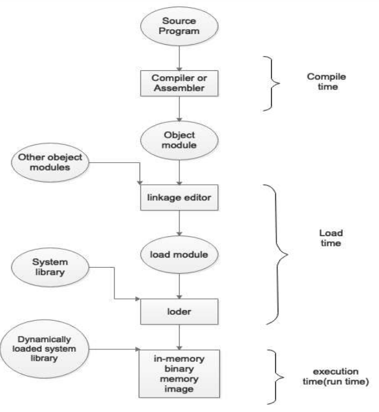


## **Topic - 4: Memory Management Requirement**

- **<u>Reallocation</u>:** Uncertainty about location of storage of data.
- Various portions of the program must be copied from secondary to main storage device; during execution.
- But under memory pressure, the program may be cut-pasted rather than being copied.
- Memory references must be translated to actual physical addresses.
- Permission must be granted by virtual memory space for using it.


## **Topic - 5: Base & Limit Registers**

- **<u>Base register</u>:** Starting point location of a memory block.
- **<u>Limit register</u>:** Length of that memory block.

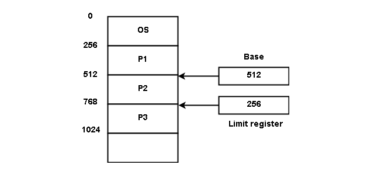

- These rules regarding limits & lengths of memory blocks are decided by the programmers while coding the OS.


## **Topic - 6: Hardware Access Protection**

### <u>Introduction</u>

- Every kind of program occupies memory space, whether made by the clients or by the service provider.
- And these programs are stored at various main memory (RAM) locations when running.
- Hence, the programmers make these memory locations protected against direct access by user.
- So that the user can’t access memory locations of a running program & can’t cause trouble to the system and applications.


### <u>Example</u>

```c
int *ptr = &x;                 // Possible

long int mry = 2343251;        // Not-possible
&x = mry;
```


## **Topic - 7: Dynamic Relocation**

- **<u>Dynamic relocation</u>:** A process in which CPU assigns a virtual address for a base address of a data.
- And then the whole block of memory coming under that base address is assigned to that data as its memory block.
- Sometimes a data may occupy multiple & consecutive memory blocks, depending on its size.
- And when the program is under execution, the data at those memory locations are put in place of variables in the program.


## **Topic - 8: Static v/s Dynamic Loading**

| Static                                            | Dynamic                                                             |
| ------------------------------------------------- | ------------------------------------------------------------------- |
| Whole program loads into the main memory at once. | Only required parts of the program are loaded into the main memory. |
| High overhead on memory.                          | Low overhead on memory.                                             |
| Faster                                            | Slower                                                              |
| Overhead during compilation.                      | Overhead during runtime.                                            |
| Uses static linking.                              | Uses dynamic linking.                                               |
| Abstracted data are loaded during compile time.   | Bit by bit data are loaded during runtime.                          |


## **Topic - 9: Swapping**

- **<u>Swapping</u>:** Temporarily program is copied & loaded into the main memory for execution.
- This copy is known as *memory image* & maintained by ready queue.
- **<u>Roll in roll out</u>:** High priority algorithms are swapped & lower priority algorithms are updated to secondary memory and removed from main memory.
- And the memory space where these activities take place is known as user space.


## **Topic - 10: Memory Management Techniques (MMT)**

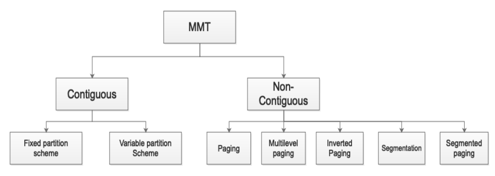

- **Memory management technique** can be called ***memory allocation*** interchangeably.
- **Memory allocation** can also be called as ***reserving memory***.


## **Topic - 11: Contagious Memory Allocation**

### <u>Introduction</u>

- Process requests memory before executing.
- If sufficient contiguous space is not available, then process enters into waiting queue.


### <u>Parts Of Main Memory</u>

- **<u>Low memory</u>:** Stores everything related operating system.
- **<u>High memory</u>:** User memory space.


## **Topic - 12: Memory Partition**

### <u>Ways To Partition Memory</u>

- Single process monitor
- Multiprogramming with fixed partition
- Multiprogramming with variable partition


### <u>Single Process Monitor</u>

- **<u>Single process monitor</u>:** Main memory is divided into OS & user process (general partition).
- The space given to both OS & user are fixed.
- Means neither OS nor user can invade each other’s memory space.
- And only one process can be loaded at a time to memory in single  
  process monitor.
- It doesn’t support multiprogramming.


### <u>Multiprogramming With Fixed Partition (MFT)</u>

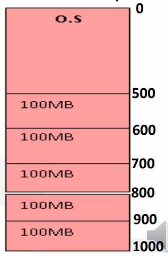

- Main memory is divided into multiple slots & each process is given a separate slot.
- This partition is done to support multiprogramming.
- The slots are divided equally.
- The number of partitions is fixed.
- Then these processes as per their sequence of entering the main memory, will be contiguously arranged in it.

#### Advantages:

- Easy implementation
- Low overhead

#### Disadvantages:

- Internal fragmentation
- External fragmentation
- Limitation of process’ size
- Limitation of degree of multiprogramming
- **<u>Degree of multiprogramming</u>:** Number of processes active in memory.
- **<u>Fragmentation</u>:** Presence of unusable memory space in computer.


### <u>Multiprogramming With Variable Partition (MVT)</u>

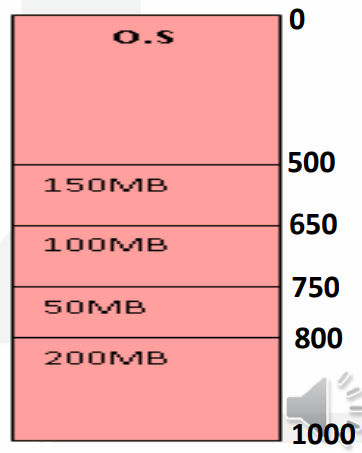

- Partitions are created dynamically.
- A new partition is created when a new process enters the memory.
- This overcomes shortcomings of fixed partition.
- The available memory to a slot can vary.

#### Advantages:

- No internal fragmentation.
- Proper use of memory.

#### Disadvantages:

- External fragmentation.
- Difficult to implement.


## **Topic - 13: Fragmentation**

### <u>Internal Fragmentation</u>

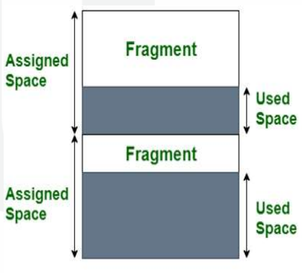

- The memory allocated to store data is more than required.
- This extra occupation wastes our memory.
- And this difference between assigned & requested memory is known as **internal fragmentation**.
- The core reason behind internal fragmentation is fix-sized memory block.


### <u>External Fragmentation</u>

- Unlike internal fragmentation, it occurs in dynamic memory allocation.
- It is when using dynamic memory allocation, a small amount of memory is allocated along & remains unused.
- This occurs because dynamic memory allocation is non-contiguous & thus leftover space between two such dynamic processes might not be enough to fit another process, resulting in wastage.

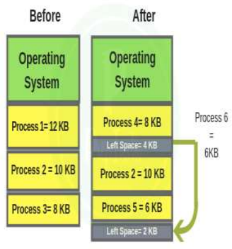

#### Elimination methods for it:

- Compaction
- Paging
- Segmentation


## **Topic - 14: External Fragmentation Elimination**

### <u>Compaction</u>

- In compaction, all processes in memory space are moved upward or downward.
- They are moved in such a way that the processes don’t start overlapping each other; or invade each other’s space.
- Then we find the leftover space between them shifted downward.
- It makes all processes contiguous despite having dynamically allocated spaces.

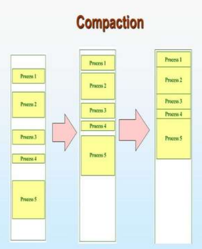

- However, it is not advised to used compaction technique; because it interrupts all the running processes in the main memory.


## **Topic - 15: Paging**

### <u>Introduction</u>

- In paging, the processes are stored in form of pages.
- And each page corresponds to a frame (pages are mapped to frames).
- **<u>Frame</u>:** Group of pages

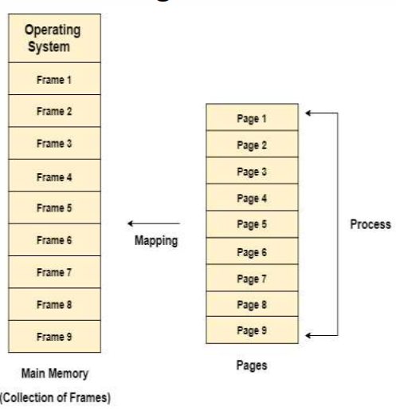

- Pages can be more easily defined as parts of processes.
- Whenever there are non-contiguous empty spaces, then pages of a new process can be added at those empty spaces.


### <u>Memory Management Unit (MMU)</u>

- Logical address has 2 parts - Page number & offset.
- **<u>Page number</u>:** It is converted into frame number later on.
- **<u>Offset</u>:** Distance from one point to another in bytes.


### <u>Address Spaces</u>

- **<u>Physical address space</u>:** Size of the main memory.
- **<u>Logical address space</u>:** Depends on size of the process.


### <u>Word</u>

- Smallest unit of memory, varying across various OS.
- We know that decoders are in ratio of $2^{N}:N$.
- So, $2^{N}$ memory addresses are produced by the OS.


## **Topic - 16: Page Table**

### <u>Introduction</u>

- A data structure used by virtual memory system for storing mappings of physical & logical addresses.
- CPU generates logical addresses for each process’s page.

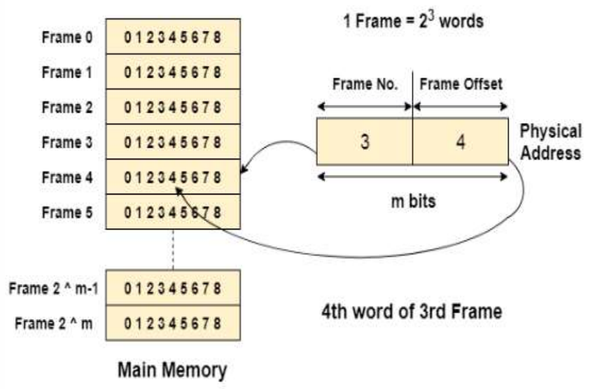


### <u>Page Table Mapping</u>

- Page table contains mappings of logical address to physical address.
- **<u>Page table base</u>:** A special number.


### <u>Page Table Structure</u>

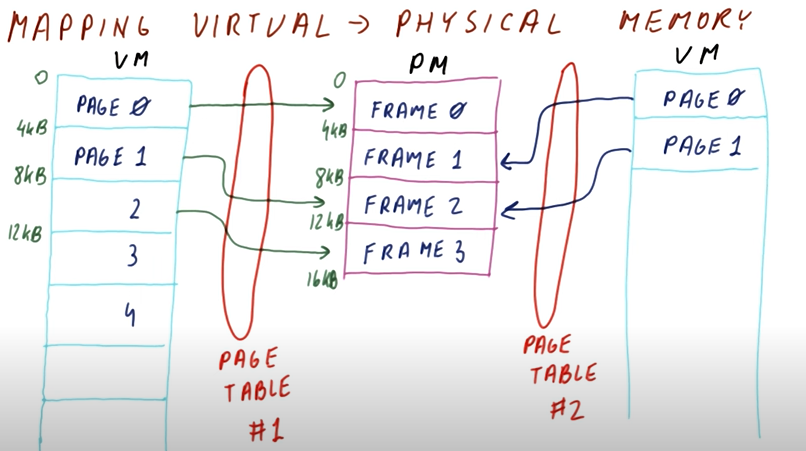

- Physical memory contains frames & frames are set of pages.
- And pages are references to physical addresses.
- Virtual memory stores pages & there can be multiple virtual memories.


### <u>Page Allocation</u>

- RAM divides physical memory into several frames & each frame has a fixed size.
- Individual size might be different, but they can’t vary.
- Virtual address space is divided among pages, as pages are virtual.
- One advantage of page allocation is that an empty frame can be used by any process for creating & storing pages in it.
- But we also get a responsibility to track the number of pages & its location.


- A process is divided into various pages as shown above.
- It means that a process occupies a frame that containing many pages.
- And a page contains many memory locations.
- Consider process as soul, frame as body, pages as various body parts & memory as physical volume.


### <u>Determining Location Of Code</u>

1. Know the required page number.
2. Determine the frame memory size containing the page.
3. Get the base address of that memory block.
4. Traverse forward in the memory as per the sequence of page.


## **Topic - 17: Hardware Support**

### <u>Introduction</u>

- Page table storage methods may vary in different OSes.
- Information about pointer to page table can be found on PCB.


### <u>Method – 1</u>

- Page tables are stored in different special registers, but it is useful only when page table is small.
- Thus, in todays OSes its not an efficient option.


### <u>Method – 2</u>

- By usage of translation look-aside buffer (TLB).
- With this approach, we use small & fast hardware.
- It involves key-value pairs stored in TLB.
- Previous approach takes a long time to access the memory.
- Whenever a logical address is generated, its page number is stored in TLB.
- When a process is being accessed & its page number is found in TLB, its frame number is made available to be used.
- If its page number is not found in TLB, its page number & frame number is added to TLB.


### <u>Paging Hardware With TLB</u>

- If TLB is out of space to add more entries, some entries are removed using a special algorithm called LRU.
- Some TLBs wire the entries, meaning they can’t be removed.
- Some TLBs also store address space identifier (ASID) of each entry.
- ASID not only identifies each process uniquely, but also provides address space protection to them.
- **<u>Hit ratio</u>:** Percentage of number of times a page is found in TLB.
- **<u>Effective access time</u>:** Total time taken to search the TLB.
- If a page is found, it takes certain time to traverse & access its memory.
- Else if it is not found, then it takes time for traversing only & moves on.
- In general, it takes $20\;\text{ns}$ to traverse one record to another.
- And $100\;\text{ns}$ to access its memory location.


## **Topic - 18: Merits & Demerits Of Paging**

### <u>Advantages</u>

- Fast memory allocation & deallocation.
- Non-contagious memory space, fitting wherever possible.
- No external fragmentation.


### <u>Disadvantages</u>

- Internal fragmentation.
- Page tables occupy a lot of memory.


## **Topic - 19: Memory Protection**

- The frame allocated to a page is permanent, it can’t be replaced.
- **<u>Protection bit</u>:** A special bit used for each frame for its memory protection.
- Protection bit can also be found in TLB.
- **<u>Valid bit</u>:** A special bit which detects which page is currently running.
- **<u>Invalid bit</u>:** A special bit which detects which bits are not running.
- However, some systems may use page table length register (PTLR).
- PTLR scans whole page table & determines its length, which helps in tracking the last valid address i.e. address of page currently in use.
- There can be multiple valid & invalid pages.


## **Topic - 20: Segmentation**

### <u>Introduction</u>

- **<u>Segmentation</u>:** A memory management logic.
- It says that memory is divided into various segments.
- These segments are occupied by running processes.
- Addresses are specified by a segment name & an offset.
- Segments are referred by segment numbers, not segment names.

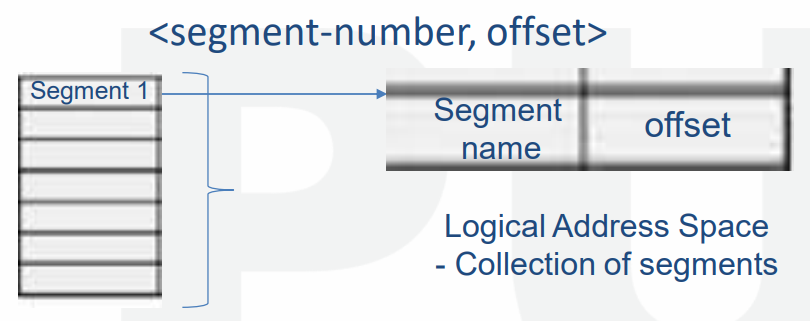

- Segment offset is referred using segment number.
- **<u>Segment offset</u>:** Represents original location of the segment.

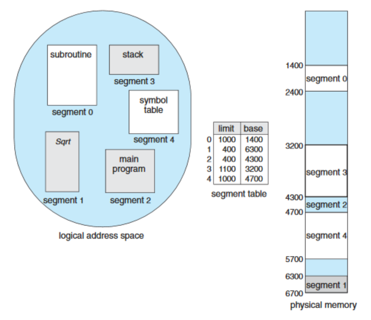


### <u>Hardware Implementation of Segmentation</u>

- Logical address is 2D, as it contains segment name & offset.
- Physical address is 1D with address only.
- We use segment table to represent these 2D addresses into 1D and vice-versa.
- Segment table contains base & limit.
- Logical address consists of two parts: S & D
- S represents indexing of segments in table.
- D is a value lying between 0 and segment limit.
- **<u>Segment limit</u>:** Size of segment.


### <u>Segmentation v/s Paging</u>

| Segmentation                            | Paging                                   |
| --------------------------------------- | ---------------------------------------- |
| Program is divided into segments.       | Program is divided into pages.           |
| Size of segments can vary.              | Size of pages are fixed.                 |
| Users can guess how it looks in memory. | Difficult to visualize it.               |
| No internal fragmentation problem.      | Has internal fragmentation problem.      |
| Has external fragmentation.             | No external fragmentation.               |
| OS maintains list of vacant spaces.     | No list is maintained for vacant spaces. |


### <u>Merits & Demerits of Segmentation</u>

#### Advantages:

- Each segment can be operated separately.
- Data sharing among processes is more efficient.
- Uses more efficient addressing method.
- Memory areas can be shared among heap, stack, code, data etc.

#### Disadvantages:

- Difficult to implement.
- Paging can interfere with segmentation when recognizing available free space.


## **Topic - 21: Table Structures**

### <u>Types Of Table Structures</u>

- Hierarchical paging
- Hashed page table
- Inverted page table


### <u>Hierarchical Paging</u>

- Also known as multilevel paging.
- Page tables are arranged in a hierarchical manner.
- Entries of a table are pointers to table below in hierarchy.
- Entries in last page table are information about frames.
- Address of the page table at level 1 is stored in PTRB.
- **<u>PTRB</u>:** Page table base register.

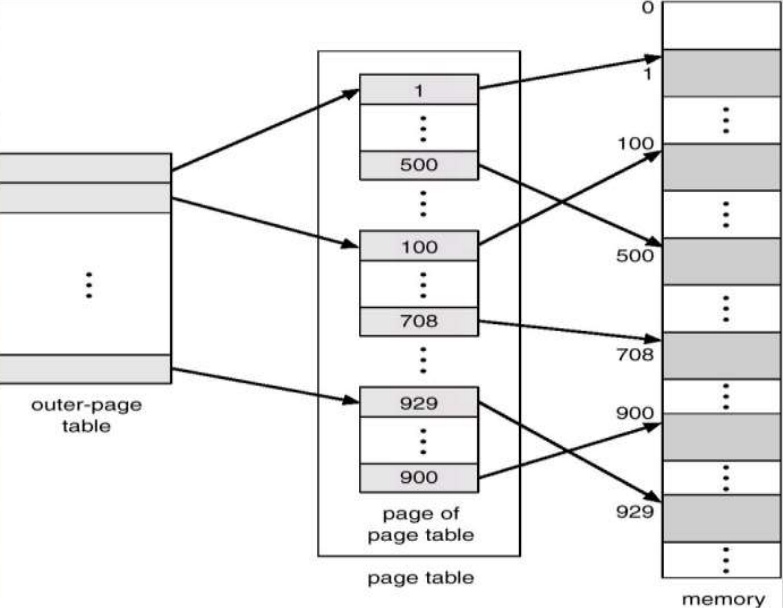


### <u>Hashed Page Table</u>

- Used in address spaces larger than **32-bits**.
- Has a page table which contains array like elements.

#### Each element contains

  1. Virtual page number
  2. Value of the mapped frame
  3. Pointer to next element

>**<u>NOTE</u>:**
>Later on when a certain virtual page is being searched, the matching element from hash page table is selected & its physical frame is extracted.

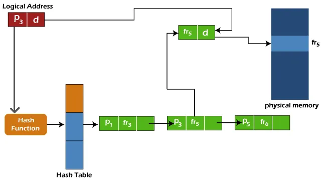


### <u>Inverted Page Table</u>

- A regular page table uses linear search page-by-page for finding the required page.
- And that’s how the memory management system usually keeps track of all the pages.
- But in **inverted page table**, rather than having separate page tables, everything is stored in one big table.
- So, it contributes to the linear search efficiency when a page is searched.
- It takes more time to search, but reduces the memory occupation.

#### Entries in table:

- **<u>Virtual page number</u>:** The reference to physical page number.
- **<u>Physical page number</u>:** The actual physical page number.

---
