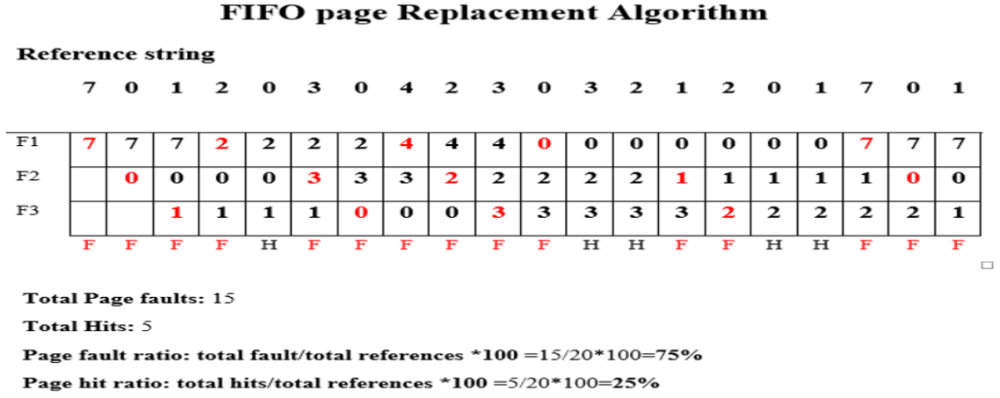
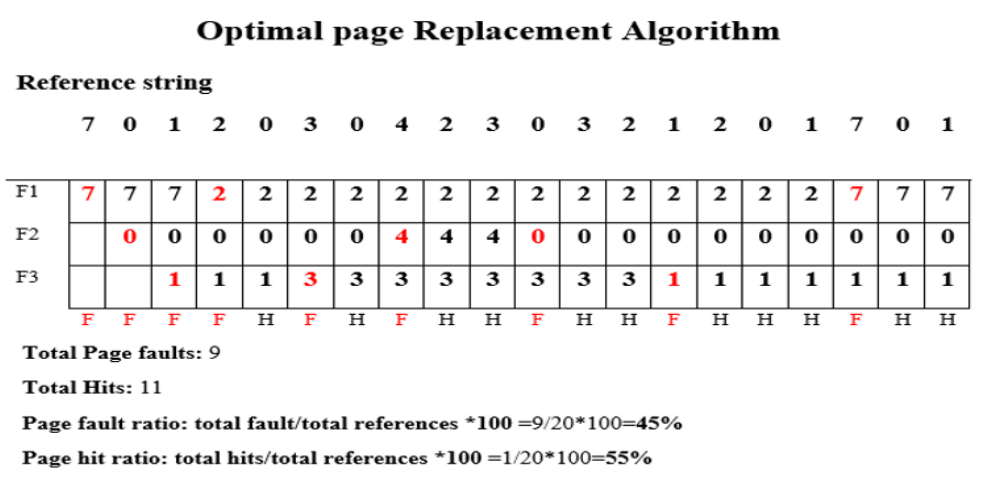
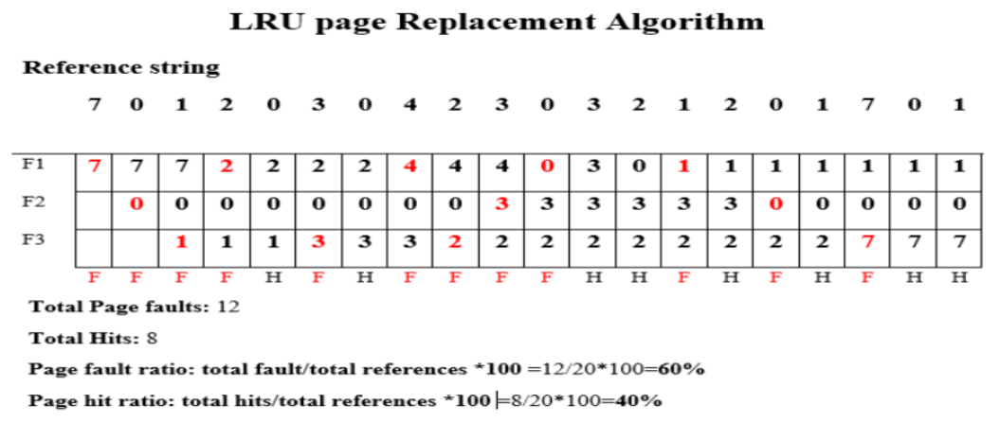

# $\fbox{Chapter 6: VIRTUAL MEMORY}$

## **Topic - 1: Basic Concepts**

### <u>Introduction</u>

- Virtual memory maintains the execution of multiple processes.
- It allows execution of those programs which are not completely in main memory.
- This is because some large programs may be difficult to be stored in the main memory all at once.
- And these programs are stored in form of pages.

### <u>Advantages</u>

- Computation speed increases when program is executed in small frames by frames.
- Used in multiprogramming.
- Can work with low spaces.
- More processes can be maintained in the main memory.

### <u>Disadvantages</u>

- Applications run slow when virtual memory is running.
- Hard drive space is covered.
- System stability decreases.

## **Topic - 2: Locality**

### <u>Locality of Reference (LOR)</u>

- LOR is an act of accessing same pieces of memory locations, by a program.
- To know if a program is using LOR or not, we have to observe its subroutine calls & loops.
- Data or instructions are fetched from main memory & stored in cache.

#### Methods for performing LOR:

- Temporal locality
- Spatial locality

### <u>Temporal Locality</u>

- **<u>Temporal locality</u>:** The data or instruction being fetched is stored in cache.
- This is done in order to avoid searching again & wasting computation time.
- So that when the turn for the data comes to be loaded, it is picked from the cache rather than being re-searched.

### <u>Spatial Locality</u>

- In this method, when the data/instruction is being fetched from a memory location, its surrounding data/instructions are also loaded along with it.
- This is done in order to save computation time.
- More computation time must have been spent in searching & fetching each data/instruction individually.

## **Topic - 3: Page Fault**

### <u>Introduction</u>

- **<u>Page fault</u>:** It is trying to access a page that doesn’t exist in main memory.
- Valid-invalid bit is set to invalid when such page is tried accessing.
- **<u>Lazy pager</u>:** Generates page fault.
- Then the OS loads that page from secondary memory to main memory.

### <u>First Reference Issue</u>

- If a page is referenced for the first time, it will be trapped & validation bit will be set as invalid.
- **<u>Trap</u>:** Mechanism to handle exceptions.
- So, the frame becomes empty & then again the request is made for that page.
- Now the validation bit will be set to valid.

### <u>Handling Page Fault</u>

1. Check if the request was made for the right process.
2. If not, then terminate the process & recall the correct process.
3. Else, find a free frame.
4. A disk operation is scheduled to load the required page to that frame.
5. Then our desired page is loaded into that frame.
6. And then we update process’s internal table & page table.
7. Finally, a call is made to that process now.

## **Topic - 4: Dirty Pages & Bits**

### <u>Dirty Pages</u>

- Also known as page cache.
- These are pages which have been altered due to some particular data being loaded into the main memory.
- This usually occurs when changes are made to files on disk.

### <u>Dirty Bits</u>

- Also known as modified bits.
- Used for reducing page faults & is packed with each page.
- It detects if a block of memory is modified or not.
- Dirty bit sets to 1 when it detects so.
- Are used by CPU cache.
- If dirty bit of a page is found to be 1, then that page’s copy in secondary memory is replaced by the modified version.

## **Topic - 5: Paging**

### <u>Introduction</u>

- Pages can also be defined by being various divisions of main & virtual memory.
- Pages can be stored either in secondary memory or main memory.
- In secondary memory, it is stored in frames.
- These frames need not to be necessarily contagious.

### <u>Demand Paging</u>

- The part of the large program that are loaded are actually pages.
- It’s difficult to say which pages are required to be loaded into the main memory and which must stay.
- So, demand paging method loads only required pages into the main memory & rest must stay where they are.
- **<u>Pager</u>:** Used for swapping pages in memories.
- Demand paging has lazy swapping mechanism.
- **<u>Lazy swapper</u>:** Not swapping until not required.

### <u>Performance of Demand Paging</u>

#### Page fault rate:

$$ \text{Page fault rate}\;=\;p $$
$$ 0.0\;<\;p\;<\;1.0 $$

- $0.0$ means no page fault & $1.0$ means fault in every page.

#### Effective access time (EAT):

$$ \text{EAT}\;=\;(1-p)\;\text{memory access}\;+\;p\;(\text{page fault overhead}\;+\;\text{swap page out} $$
$$ +\;\text{swap page in}\;+\;\text{restart overhead}) $$

## **Topic - 5: Hardware Support**

- Same hardware that is required for paging & swapping.
- Page table has the ability to mark an entry as invalid through valid/invalid bit.
- **<u>Swap space</u>:** A part of secondary memory specifically used for swapping purposes.
- Hence, secondary memory is also known as **swap device**.

## **Topic - 6: No Free Frames Issue**

- If there is no frame, then pages which are currently not in use are swapped out by the required pages.
- Then change the respective frames’ valid/invalid bit.
- And this *frame* chosen to be replaced with is called victim frame.

## **Topic - 7: Page Replacement**

### <u>Introduction</u>

- **<u>Swapping in</u>:** Transferring data from *secondary memory* to main memory. Also known as page out.
- **<u>Swapping out</u>:** Retrieving data back to the secondary memory.
  Also known as page in.

### <u>Page Replacement Algorithms</u>

- Deals with deciding which *pages* are required to be swapped.
- Efficiency is decided by the magnitude of computation time.
- These algorithms after being made, are tested & its number of *page faults* are noted.
- These test objects passed for testing are known as *reference strings*.
- And for allowing enough space for testing, three frames are kept empty initially.

### <u>FIFO Page Replacement</u>

- When a new *page* has to be brought up in the memory, it is replaced by the oldest *page* in the main memory.
- Oldest one means the *page* which was brought up first.
- This is implemented by a creating a queue for holding pages.

#### For example:

1. So, reference strings are passed one-by-one.
2. Each column shows different iterations when each string is passed.
3. If the upcoming string exists in one of frames, then the frames remain unchanged & it is called hit.
4. Else if the string doesn’t exist, it replaces the last brought page & it is called fault.

#### Disadvantages:

- A frequently used *page* may also get replaced for being brought up the earliest.

### <u>Optimal Page Replacement (OPR)</u>

- Least page fault giving replacement technique.
- This is because it doesn’t have ***Belady’s Anomaly*** issue.
- <u>Belady’s Anomaly</u>:** Increased number of page faults due to high number of frames.
- In OPR, the pages which won’t be used for long time are replaced by new pages.
- It is more difficult to implement as we have to make predictions.
- Is ideal & near impossible to implement.

#### For example:

### <u>Least Recently Used Page Replacement (LRU)</u>

- Replaces page that was not used in recent times.
- So, the page which was in action (brought, replaced or stood same) is not replaced.

#### For example:

#### Requirements for LRU:

- It uses *reference bits* to know which *page* was referred last.
- **<u>Reference bit</u>:** A bit indicating if a page was accessed/changed or not.
- The reference bit for each page is zero initially.

### <u>Not Recently Used Page Replacement (NRU)</u>

- Recently referred *pages* are kept in main memory.

#### Page categories:

- Referenced, modified
- Referenced, not-modified
- Not-referenced, modified
- Not-referenced, not-modified

>**<u>NOTE</u>:**
> 1. The preference for the categories above is decreasing downward.
> 2. A page is removed randomly from the least preferred class available.

### <u>Not Frequently Used Page Replacement (NFU)</u>

- Each page contains a counter telling the number of times it has been used.
- The page with lowest counter is swapped out.
- This method uses five frames generally, unlike others using three.

---
