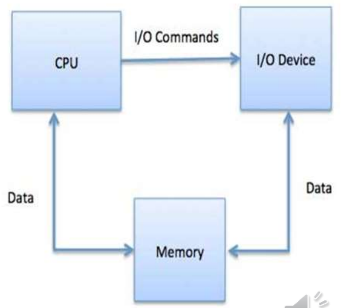
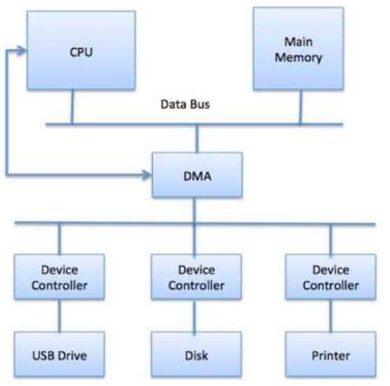

# $\fbox{Chapter 7: IO SYSTEM}$

## **Topic - 1: Basic Concepts**

### <u>Types Of I/O Devices</u>

- Block device
- Character device

### <u>Block device</u>

- **<u>Block device</u>:** Device with which the driver communicates by sending blocks of data.
- For example, hard disk & USB cameras etc.

### <u>Character device</u>

- **<u>Character device</u>:** Device with which the driver communicates byte-by-byte.
- For example, serial ports, parallel ports & sound card etc.

## **Topic - 2: Device Controller**

- **<u>Device controller</u>:** Electronics having capability to operate port, bus or device.
- Computer devices are connected to plug & socket.
- And socket is connected to device controller.
- Each of them contains their own buffer & command register.
- **<u>Command register</u>:** Stores executable commands in it.
- Local buffers store messages passed between device controller & CPU.
- And this communication is done via interrupts (signals).
- For example, network interface card, disk controller, USB, serial ports & sound card.

## **Topic - 3: Memory Mapped I/O**

### <u>Introduction</u>

- **<u>Memory mapped I/O</u>:** A communication triangle among CPU, memory & peripherals.
- Uses common bus, control systems & address space.

### <u>Address Space Division</u>

  - Computer’s memory space
  - Peripheral’s register memory space

### <u>Advantages</u>

- Reduced programming efforts, as peripheral memory can be accessed as regular memory space.
- No separate commands are required to program it.

### <u>Disadvantages</u>

- Poor memory utilization, as some of the computer’s memory is reserved for the peripheral (peripheral only has buffer here).
- Not suitable with large number of ports.

## **Topic - 4: Direct Memory Access (DMA)**

### <u>Introduction</u>

- **<u>DMA</u>:** Direct transfer of data between main memory & peripheral.
- So, CPU intervention is not required in this.
- Multiple bytes of data can be transferred at once using DMA.
- If it involves an interrupt, then CPU is notified after complete data transfer.
- Without DMA, CPU has to make physical transfer of data.

### <u>Working Of DMA</u>

- When a small part of user program is executed, CPU initializes DMA using control signals.
- CPU initializes DMA with address of both the peripheral & main memory & a counter.
- This small part of user program is executed by CPU.
- After this, DMA sends request signal to peripheral for becoming operable.
- Then the peripheral sends acknowledgment signal to DMA for that.
- If DMA receives acknowledgement, then it enables HOLD signal which allows DMA to work with data bus.
- Then again it waits for HOLD ACK message by the peripheral.
- HOLD ACK is also known as HLDA.
- When DMA receives HLDA, the data transfer process begins.
- This transfer happens until the counter (containing variable "total data transferred" becomes zero.
- CPU is blocked during this transfer process & is unblocked after process completes.

### <u>Modes Of DMA</u>

- **<u>Burst mode</u>:** Transfers large amount of data from I/O to memory after receiving HLDA.
- **<u>Cycle stealing mode</u>:** DMA forcefully snatches control over bus from CPU, even without requiring HLDA. After transferring data, it gives control back to CPU.
- **<u>Blocked mode</u>:** DMA transfers data in blocks to memory.

### <u>Advantages</u>

- Fast data transfer
- Does transfers in few clock cycles

### <u>Disadvantages</u>

- Expensive
- No syncing mechanism to avoid access to non-updated data in RAM.
- This is because syncing mechanism avoids processes from interfering data.

## **Topic - 5: Polling v/s Interrupt**

### <u>Introduction</u>

- ***Polling*** & ***interrupt*** are two ways to detect a coming input.

### <u>Polling</u>

- Periodically checking if its time to perform an I/O operation.
- I/O device puts status about if its time for an I/O operation in a status register.
- Then the processor checks the status from there & performs accordingly.

### <u>Interrupt</u>

- A device controller places its interrupt signal on the bus when calling CPU.
- After CPU receives this signal, it saves its own current state & calls a required type of interrupt handler using interrupt vector.
- **<u>Interrupt vector</u>:** A matrix containing addresses of various OS processes which perform some system-level tasks.
- After being done with the interrupting device, the CPU continues doing what it was doing.

## **Topic - 6: Dedicated v/s Shared Device**

- **<u>Dedicated device</u>:** Devices that can be shared by only one process at a time.
- For example, printer can print only one page at a time.
- **<u>Shared device</u>:** Devices that can be shared by multiple processes without causing deadlock.
- For example, there can be multiple applications running in background which reside in hard disk.

## **Topic - 7: Goals of I/O Software**

### <u>Goals of I/O Software</u>

- Device independence – I/O software makes I/O devices of same category are treated equally.
- For example, an application gets itself stored in any kind of hard disk.
- Error handling – I/O software are programmed to protect I/O device’s resources against application errors.
- Buffering – I/O software are also programmed to handle buffer that most I/O devices possess.

## **Topic - 8: I/O Devices**

### <u>Interrupt</u>

- CPU has interrupt request bus for receiving interrupt signals.
- CPU checks the presence of interrupt there after executing each instruction.
- Means it responds only after having execute the current instruction.

### <u>Interrupt Handler</u>

- **<u>Interrupt handler</u>:** detects the cause of interrupt & executes necessary processes accordingly.
- And then returns from the interrupt instruction & to get back and continue CPU’s work.

### <u>Interrupt Instruction Cycle</u>

- Fetch cycle
- Execution cycle
- Interrupt cycle

### <u>Interrupt Flag</u>

- If there was an interrupt during execution of an instruction, then after execution it pushes the value of program counter to stack temporarily.
- Now the interrupt subprogram is executed until IRET instruction comes.
- Then it pops it back after the interrupt cycle is over using IRET instruction.
- **<u>Vector address</u>:** Entry point address in interrupt subprogram.

## **Topic - 9: Device Driver**

### <u>Introduction</u>

- **<u>Device driver</u>:** Controls the interaction with device controllers.
- It is a software component enabling OS to communicate with hardware devices.
- This communication is done through bus.
- It is also a chip-based device which controls signals on the wire of serial ports.
- There can be platform specific device drivers.
- **<u>Device data sheet</u>:** A document containing technical information about the device.

### <u>Types of Device Drivers</u>

- Serial port drivers
- Network device drivers
- Flash
- Bus driver

## **Topic - 5: Buffering**

### <u>Introduction</u>

- **<u>Buffering</u>:** technique by which the device manager allows slow I/O devices to perform operations when the process is idle.
- **<u>Input buffering</u>:** Data in device is read first before saving it to the main memory.
- **<u>Output buffering</u>:** Device first saves data to main memory & then is affected by input (if any), while the process is executing.

### <u>Types of Buffering</u>

- Single buffering
- Double buffering
- Circular buffering
- No buffering

---
