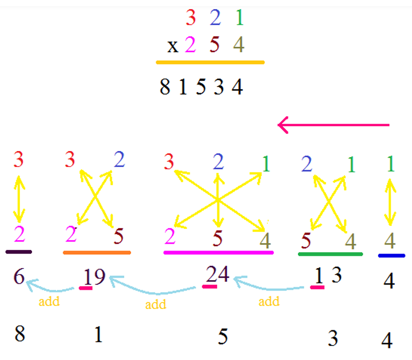

# <u>Chapter 1</u>: NUMBER SYSTEM

## **Topic - 1: Simplification & Approximation**

### <u>Vedic Multiplication</u>

#### $2\times2$ multiplication:

$$ 36 \; \times \; 48 $$
$$ = \; \_\;\_\;\_\;\_ $$
$$ $$
$$ = \; (3 \; \times \; 4)(6 \; \times \; 8) $$
$$ + \;\;\; 10 \; \times \; (3 \; \times \; 8) $$
$$ + \;\;\; 10 \; \times \; (6 \; \times \; 4) $$
$$ $$
$$ = \; 1248 $$
$$ + \; 240 $$
$$ + \; 240 $$
$$ $$
$$ 1728 $$

#### $3\times3$ multiplication:

>**<u>NOTE</u>:**
>In last line, we are adding the tens places to next number.

---
