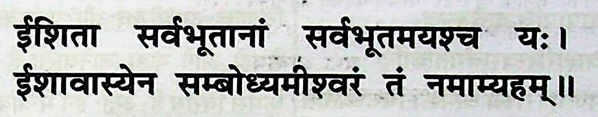

# $\fbox{Chapter 1: ISHAVASYA UPANISHAD}$

## **Topic - 1: Mantra**

## **Topic - 2: Peace Prayer**

- The seed giving God (Brahma) & the maintaining God, both are fully content.
- This is because what's derived from content, is also content.
- At the time of destruction of the world, the maintaining God merges back to the seed giving God.

## **Topic - 3: Related Lecture**

- The prayer we saw previously is only applicable for spiritual purposes & not to any physical world purpose.
- This is because spirit is associated with positive attributes, while physical body might have negative attributes.
- This mantra was for eternal purpose & the physical body won't be deriving its current attributes, but spirit will.
- All this is because the great Upanishads are all about promoting welfare of the spirit i.e. criticize physical body with negative attributes.
